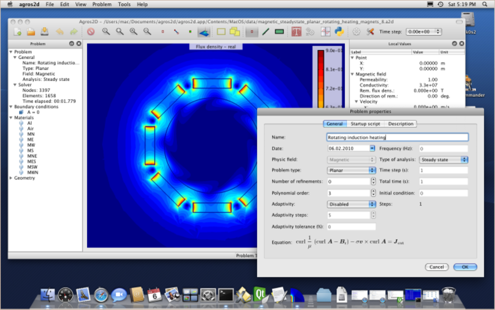

============
About Hermes
============

Hermes is a free C++ library for rapid development of
adaptive *hp*-FEM and *hp*-DG solvers for partial differential equations (PDE)
and multiphysics PDE systems. The development team includes the 
`hp-FEM group <http://hpfem.org/>`_ at the `University of Nevada, Reno <http://www.unr.edu>`_ 
and their `collaborators <http://git.hpfem.org/hermes.git/blob/HEAD:/AUTHORS>`_ 
from numerous places around the globe.

A standard way to use Hermes is to write short C++ user programs 
that use the functionality provided by the library, but for 
those who prefer to use a graphical interface, the group located at the 
University of West Bohemia develops a graphical Engineering tool based on Hermes2D: 
`Agros2D <http://hpfem.org/agros2d/>`_. 

Hermes is loaded with modern finite element technology. We hope that you will enjoy 
the software and that you will find this documentation useful. 
In any case please let us know if you find mistakes 
or if you can suggest improvements to this documentation or to Hermes itself.

Free use of this software is granted under the terms of the GNU Lesser General
Public License (LGPL). For details see the files `COPYING` and `COPYING.LESSER`.

