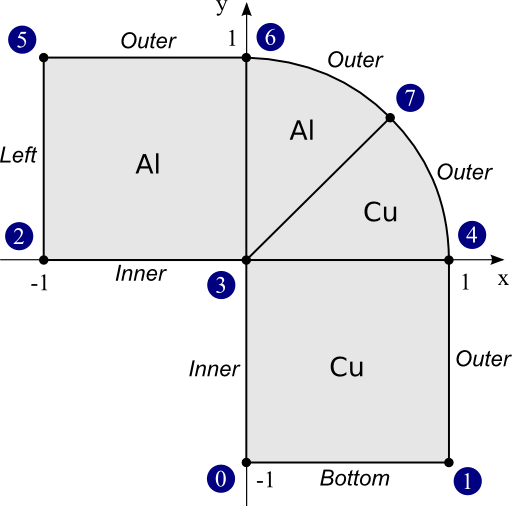
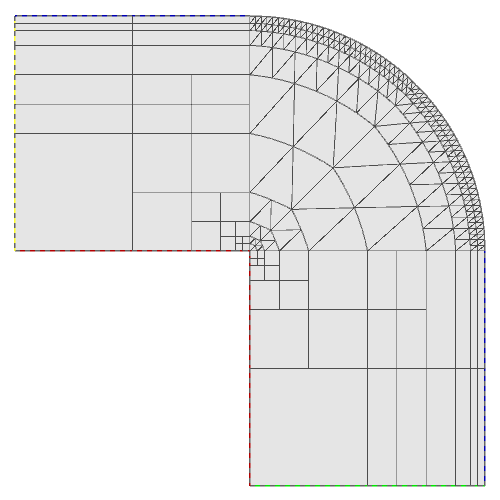

Finite Element Mesh (01-mesh)
-----------------------------

**Git reference:** Tutorial example `01-mesh <http://git.hpfem.org/hermes.git/tree/HEAD:/hermes2d/tutorial/P01-linear/01-mesh>`_. 

Every finite element computation starts with partitioning the domain
into a finite element mesh. Hermes uses (possibly curvilinear) triangles and 
quadrilaterals that can be combined. This is very useful since 
triangular elements are best for approximating isotropic solutions (solutions 
that have similar behavior in all spatial directions) while quads are much 
better at approximating anisotropies such as boundary layers.
 
In contrast to traditional non-adaptive low-order finite element codes 
that require fine initial meshes, in Hermes it often suffices to create 
an extremely coarse initial mesh by hand and use a variety of built-in 
functions for a-priori mesh refinement. In most cases, automatic adaptivity 
then takes care of the rest successfully. Of course, Hermes can also accept 
fine meshes created automatically by external mesh generation packages. 

Hermes2D mesh file format
~~~~~~~~~~~~~~~~~~~~~~~~~

This tutorial example assumes an L-shaped domain consisting of two materials (Copper and Aluminum),
that is initially split into four elements - two quadrilaterals and two curvilinear triangles:

The mesh file `domain.mesh <http://git.hpfem.org/hermes.git/blob/HEAD:/hermes2d/tutorial/P01-linear/01-mesh/domain.mesh>`_ 
looks as follows::

    a = 1.0
    b = sqrt(2)/2

    vertices = [
      [ 0,  -a],    # vertex 0
      [ a, -a ],    # vertex 1
      [ -a, 0 ],    # vertex 2
      [ 0, 0 ],     # vertex 3
      [ a, 0 ],     # vertex 4
      [ -a, a ],    # vertex 5
      [ 0, a ],     # vertex 6
      [ a*b, a*b ]  # vertex 7
    ]

    elements = [
      [ 0, 1, 4, 3, "Copper"  ],   # quad 0
      [ 3, 4, 7,    "Copper"  ],   # tri 1
      [ 3, 7, 6,    "Aluminum" ],  # tri 2
      [ 2, 3, 6, 5, "Aluminum" ]   # quad 3
    ]

    boundaries = [
      [ 0, 1, "Bottom" ],
      [ 1, 4, "Outer" ],
      [ 3, 0, "Inner" ],
      [ 4, 7, "Outer" ],
      [ 7, 6, "Outer" ],
      [ 2, 3, "Inner" ],
      [ 6, 5, "Outer" ],
      [ 5, 2, "Left" ]
    ]

    curves = [
      [ 4, 7, 45 ],  # circular arc with central angle of 45 degrees
      [ 7, 6, 45 ]   # circular arc with central angle of 45 degrees
    ]

In the following we will use this example to explain the structure of
Hermes mesh files.

Variables
~~~~~~~~~

Hermes mesh file consists of variables. Each variable can hold a real 
number, list of real numbers, or list of lists. The following are all 
valid definitions::

    # comments (starting with a hash)
    var = 5.0 + cos(pi)                      # number
    list = [ 1, 2, 3, 4, var ]               # list
    pairs = [ [1, 2], [1, var], [0, list] ]  # list of lists

Vertices 
~~~~~~~~

The variable ``vertices`` defines the coordinates of all mesh vertices 
(in any order). 

Elements
~~~~~~~~

The variable ``elements`` defines all elements in the mesh via zero-based indices 
of their vertices in counter-clockwise order, plus an extra string (or nonnegative integer) 
denoting the element's material marker. Material markers make it possible to use
different weak forms in subdomains. This is useful when the domain consists of 
multiple materials, but it is also possible to assign completely different physical 
processes to subdomains in this way. The user can access the element and boundary 
markers from inside of weak forms. Integer markers do not have to be in apostrophes.

Boundaries
~~~~~~~~~~

The last mandatory variable, ``boundaries``, defines boundary markers for all
boundary edges. An edge is identified by a triplet: two vertex indices and 
a marker (either string or a positive integer).

Note: boundary markers cannot be zeros or negative integers. Negative
integers can be used to identify internal edges for the purpose of 
making them curved. However, it is recommended not to overuse curved edges
since this increases the cost of numerical integration, and thus curved
elements add to computing time.

For historical reasons, some (mostly older) Hermes examples still use 
integer markers, but the trend is to use strings that make the mesh files 
easier to read. String markers are converted to integers by Hermes 
internally. 

Curves (Circular arcs and general NURBS)
~~~~~~~~~~~~~~~~~~~~~~~~~~~~~~~~~~~~~~~~

The mesh file can also include the variable ``curves`` that lists all
curved edges. Each curved edge is described by one Non-Uniform Rational 
B-Spline (NURBS) defined via its degree, control points and knot vector. 
For an explanation of NURBS see, e.g., the `Wikipedia NURBS page 
<http://en.wikipedia.org/wiki/Non-uniform_rational_B-spline>`_

The most common type of curved boundary is a circular arc which is defined
via two vertex indices and central angle. For the treatment of full-featured 
NURBS boundaries see example `P10-miscellaneous/35-nurbs <http://hpfem.org/hermes/doc/src/hermes2d/P10-miscellaneous/35-nurbs.html>`_. 

Initial refinements
~~~~~~~~~~~~~~~~~~~

Finally, the mesh file can also contain the variable ``refinements`` where 
the user can specify initial mesh refinements. The following code snippet
is not relevant for this example but let us show it for illustration 
purposes anyway::

    refinements = [
      [ 4,  0 ],
      [ 5,  0 ],
      [ 7,  1 ],
      [ 10, 1 ],
      [ 15, 2 ]
    ]

Based on this list, Hermes would refine elements 4 and 5 uniformly, elements 7 and 10 
in the horizontal direction (with respect to the reference coordinate system), and element 
15 vertically. Multiple nested refinements can be done to an element, but one has to 
be careful to have the element IDs of the newly generated elements right. The MeshView
class is a great help for this.

Loading meshes in Hermes2D format
~~~~~~~~~~~~~~~~~~~~~~~~~~~~~~~~~

As a ''Hello world'' example, let us load the mesh we have just created, and display it in a window. 
Every main.cpp file in the git repository contains lots of comments and instructions. Skipping those, 
the `main.cpp <http://git.hpfem.org/hermes.git/blob/HEAD:/hermes2d/tutorial/P01-linear/01-mesh/main.cpp>`_ 
file for this example begins with creating an instance of the class Mesh. In order to load
the mesh file, you have to create a mesh loader class (in our case that is ``H2DReader``) and
call the method ``load()``::

    #include "hermes2d.h"

    int main(int argc, char* argv[])
    {
      // Load the mesh file.
      Mesh mesh;
      H2DReader mloader;
      mloader.load("domain.mesh", &mesh);

Loading meshes in ExodusII format
~~~~~~~~~~~~~~~~~~~~~~~~~~~~~~~~~

Hermes can read meshes in the `ExodusII <http://sourceforge.net/projects/exodusii/>`_ format.
This is a widely used format that can be generated, for example, 
with `Cubit <http://cubit.sandia.gov/>`_. To load an ExodusII mesh file, 
one has to use the ``ExodusIIReader`` class instead of the ``H2DReader`` class above.
We will use meshes in the ExodusII format in example 
`iron-water <http://hpfem.org/hermes/doc/src/hermes2d/examples/neutronics/neutronics-iron-water.html>`_
and others. 

Geometry rescaling
~~~~~~~~~~~~~~~~~~

In some situations, such as when using dimensionless form of the governing equations, 
it may be useful to rescale the domain in the x- and y-directions. This is done 
as follows::

    // Optional rescaling of mesh (all vertex x- and y-coordinates are 
    // divided by x_ref and y_ref, respectively). Mesh with curved edges 
    // cannot be rescaled. So to try this feature, comment out the "curves" 
    // section in the mesh file.
    double x_ref = 2.0, y_ref = 3.0;
    if(!mesh.rescale(x_ref, y_ref)) info("Mesh was not rescaled.");
    else {
      info("Mesh scaled by the factors of %g and %g in the x- and y- direction, respectively.", x_ref, y_ref);
    }

Manual mesh refinements
~~~~~~~~~~~~~~~~~~~~~~~

Below are examples of manual mesh refinements that the user can do after loading the mesh.
All of them work for (possibly curved) triangular and quadrilateral elements. 

To begin with, here is how to refine an element with index 'id'. If the element
is a quad, 0 means refine in both directions, 1 means refine
horizontally (with respect to the reference domain), 2 means refine vertically::

    void Mesh::refine_element(int id, int refinement = 0);

The mesh can be refined uniformly (multiple times if needed). The parameter 
'refinement' has the same meaning as in refine_element() above::

    void Mesh::refine_all_elements(int refinement = 0);

The mesh can be refined 'depth' times towards a vertex with index 'vertex_id'. In this
way a graded mesh towards the vertex is created::

    void Mesh::refine_towards_vertex(int vertex_id, int depth);

The following function performs repeated refinements of elements adjacent
to the boundary with boundary marker 'marker'. Elements whose edge or vertex 
lie on the boundary are refined. The flag 'aniso' allows or disables 
anisotropic refinements (ignored for triangles)::

    void refine_towards_boundary(std::string marker, int depth, bool aniso = true);

The following will convert all quadrilateral elements in a triangular or 
triangular-quadrilateral mesh into triangles::

    void Mesh::convert_quads_to_triangles();

This will convert all triangular elements into quadrilaterals::

    void Mesh::convert_triangles_to_quads();

The following function selects elements to refine according to a given criterion and
performs 'depth' levels of refinements. The criterion function
receives a pointer to an element to be considered.
It must return -1 if the element is not to be refined, 0 if it
should be refined uniformly, 1 if it is a quad and should be split
horizontally or 2 if it is a quad and should be split vertically::

    void Mesh::refine_by_criterion(int (*criterion)(Element* e), int depth);

Meshes in Hermes can be arbitrarily irregular. The following function 
regularizes the mesh by refining elements with hanging nodes of
degree more than 'n'. As a result, n-irregular mesh is obtained.
If n = 0, completely regular mesh is created. In this case, however,
due to incompatible refinements, the element refinement hierarchy
is removed and all elements become top-level elements. Also, total
regularization does not work on curved elements. Returns an array of 
new element parents which can be passed to
Space::distribute_orders()::

    int* Mesh::regularize(int n);

The following function recursively removes all son elements 
of the given element and makes it active:: 

    Mesh::unrefine_element(int id);

All elements in the mesh can be unrefined using::

    Mesh::unrefine_all_elements();

See the file `src/mesh/mesh.cpp <http://git.hpfem.org/hermes.git/blob/HEAD:/hermes2d/src/mesh/mesh.cpp>`_ for more details. 

Visualizing the mesh
~~~~~~~~~~~~~~~~~~~~

The following code illustrates how to visualize the mesh using the MeshView class::

    // Display the mesh.
    // (0, 0) is the upper left corner position
    // 350 x 350 is the window size
    MeshView mview("Hello world!", new WinGeom(0, 0, 350, 350));
    mview.show(&mesh);

The class MeshView provides the method show() that displays a window showing the mesh:

To see the graphical output, the main.cpp file should be finished with::

    // Wait for the view to be closed.
    View::wait();
    return 0;
  }
