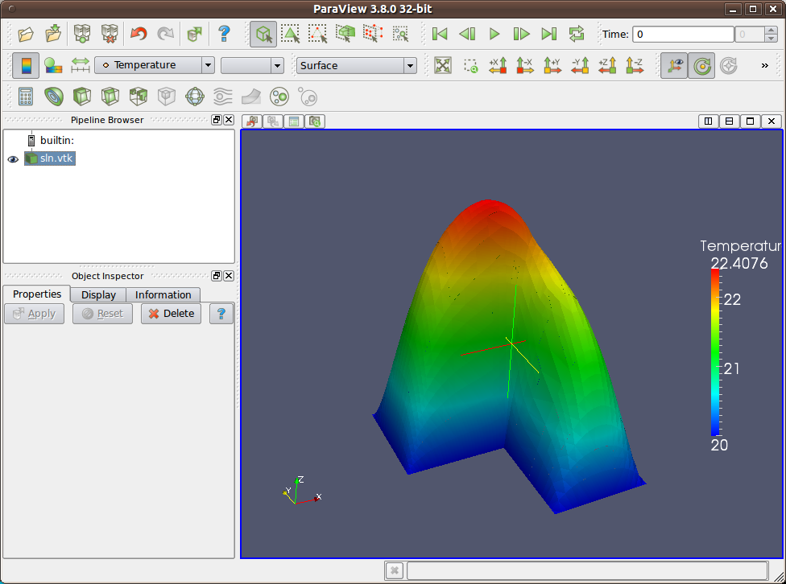
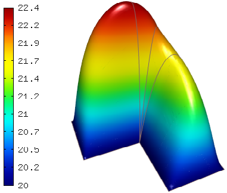

Poisson Equation (03-poisson)
-----------------------------

**Git reference:** Tutorial example `03-poisson <http://git.hpfem.org/hermes.git/tree/HEAD:/hermes2d/tutorial/P01-linear/03-poisson>`_. 

This example shows how to solve a simple PDE that describes stationary 
heat transfer in an object consisting of two materials (aluminum and 
copper). The object is heated by constant volumetric heat sources
(generated, for example, by a DC electric current). The temperature 
on the boundary is fixed. We will learn how to:

 * Define a weak formulation.
 * Initialize matrix solver.
 * Solve the discrete problem.
 * Output the solution and element orders in VTK format 
   (to be visualized, e.g., using Paraview).
 * Visualize the solution using Hermes' native OpenGL-based functionality.

Model problem
~~~~~~~~~~~~~

Let us solve the Poisson equation

.. math::
    :label: poisson1

       -\mbox{div}(\lambda \nabla u) = C

in the L-shaped domain $\Omega$ from the previous examples.
The equation is equipped with zero Dirichlet boundary conditions

.. math::
    :label: poisson2

       u = 0\ \ \  \mbox{on}\  \partial \Omega.

Here $u$ is an unknown temperature distribution, 
$C$ a real number representing volumetric heat sources/losses, and $\lambda > 0$ is thermal conductivity.

The weak formulation is derived as usual, first by multiplying equation :eq:`poisson1` 
with a test function $v$, then integrating over the domain $\Omega$, and then applying 
the Green's theorem (integration by parts) to the second derivatives.
Because of the homogeneous Dirichlet condition :eq:`poisson2`,
there are no surface integrals. Since the product of the two gradients 
in the volumetric weak form needs to be integrable for all $u$ and $v$ in $V$, 
the proper space for the solution is $V = H^1_0(\Omega)$. The weak formulation 
reads: Find $u \in V$ such that

.. math::
    :label: poissonweak01

         \int_\Omega \lambda \nabla u \cdot \nabla v \;\mbox{d\bfx} = C \int_\Omega v \;\mbox{d\bfx}\ \ \ \mbox{for all}\ v \in V.

Equation :eq:`poissonweak` can be written in the form $a(u,v) = l(v)$ where
$a$ is a matrix form 

.. math::
    :label: poissonweak02

         a(u, v) = \int_\Omega \lambda \nabla u \cdot \nabla v \;\mbox{d\bfx}

and $l$ is a linear vector form

.. math::
    :label: poissonweak03

         l(v) = C \int_\Omega v \;\mbox{d\bfx}.

Hermes however requires that the equation is rewritten as $a(u,v) - l(v) = 0$. Let us 
explain why.

Jacobian-residual formulation
~~~~~~~~~~~~~~~~~~~~~~~~~~~~~

Hermes always assumes that the problem is nonlinear, and by default it uses the 
Newton's method to solve it. Other methods for the solution of nonlinear problems 
are available as well (to be discussed later). For linear problems, the Newton's
method converges in one step - usually. If the matrix solver has problems, even
for linear equations the Newton's method may take more than one step to make 
sure that the problem is solved correctly. This is a good reason to use the 
Newton's method even for problems that are linear. In addition, a consistent 
approach to linear and nonlinear problems allows Hermes users to first formulate 
and solve a simplified linear version of the problem, and then extend it to 
nonlinear easily, with almost no changes in the code. Let us show how this works.

First, let's say that $\lambda$ is constant both for aluminum and copper. The 
code for the weak form looks as follows::

    class CustomWeakFormPoisson : public WeakForm
    {
    public:
      CustomWeakFormPoisson(std::string marker_al, double lambda_al,
			    std::string marker_cu, double lambda_cu,
			    double vol_heat_src) : WeakForm(1)
      {
	// Jacobian forms - volumetric.
	add_matrix_form(new DefaultLinearDiffusion(0, 0, marker_al, lambda_al));
	add_matrix_form(new DefaultLinearDiffusion(0, 0, marker_cu, lambda_cu));

	// Residual forms - volumetric.
	add_vector_form(new DefaultResidualLinearDiffusion(0, marker_al, lambda_al));
	add_vector_form(new DefaultResidualLinearDiffusion(0, marker_cu, lambda_cu));
	add_vector_form(new DefaultVectorFormConst(0, HERMES_ANY, -vol_heat_src));
      };
    };

Next, let's say that $\lambda$ is a nonlinear function approximated with
a cubic spline::

    class CustomWeakFormPoisson : public WeakForm
    {
    public:
      CustomWeakFormPoisson(std::string marker_al, CubicSpline* lambda_al,
			    std::string marker_cu, CubicSpline* lambda_cu,
			    double vol_heat_src) : WeakForm(1)
      {
	// Jacobian forms - volumetric.
	add_matrix_form(new DefaultLinearDiffusion(0, 0, marker_al, 1.0, lambda_al));
	add_matrix_form(new DefaultLinearDiffusion(0, 0, marker_cu, 1.0, lambda_cu));

	// Residual forms - volumetric.
	add_vector_form(new DefaultResidualLinearDiffusion(0, marker_al, 1.0, lambda_al));
	add_vector_form(new DefaultResidualLinearDiffusion(0, marker_cu, 1.0, lambda_cu));
	add_vector_form(new DefaultVectorFormConst(0, HERMES_ANY, -vol_heat_src));
      };
    };

The point being made, in the rest of part P01 we will focus on linear 
problems. Nonlinear problems will be discussed in more detail in part P02. 

Default weak forms
~~~~~~~~~~~~~~~~~~

Weak forms in Hermes have a clean object oriented structure. For many problems they 
are readily available, and for the rest they can be 
extended easily. Let us begin with explaining the parameters of the default 
forms used above.

**MORE DETAILS TO BE ADDED.**

Loading the mesh
~~~~~~~~~~~~~~~~

The main.cpp file typically begins with loading the mesh::

    // Load the mesh.
    Mesh mesh;
    H2DReader mloader;
    mloader.load("domain.mesh", &mesh);

Performing initial mesh refinements
~~~~~~~~~~~~~~~~~~~~~~~~~~~~~~~~~~~

A number of initial refinement operations can be done as 
explained above. In this case we just perform optional 
uniform mesh refinements::

    // Perform initial mesh refinements (optional).
    for (int i=0; i < INIT_REF_NUM; i++) mesh.refine_all_elements();

Initializing the weak formulation
~~~~~~~~~~~~~~~~~~~~~~~~~~~~~~~~~

Next, an instance of the corresponding weak form class is created::

    // Initialize the weak formulation.
    CustomWeakFormPoisson wf("Aluminum", LAMBDA_AL, "Copper", LAMBDA_CU, VOLUME_HEAT_SRC);

Setting zero Dirichlet boundary conditions
~~~~~~~~~~~~~~~~~~~~~~~~~~~~~~~~~~~~~~~~~~

Zero Dirichlet boundary conditions are assigned to the boundary markers 
BDY_BOTTOM, BDY_OUTER, BDY_LEFT, and BDY_INNER as follows::

    // Initialize essential boundary conditions.
    DefaultEssentialBCConst bc_essential(Hermes::vector<std::string>("Bottom", "Inner", "Outer", "Left"), FIXED_BDY_TEMP);
    EssentialBCs bcs(&bc_essential);

Do not worry about the complicated-looking Hermes::vector, this is just std::vector enhanced 
with a few extra constructors. It is used to avoid using variable-length arrays.

The treatment of nonzero Dirichlet and other boundary conditions 
will be explained in more detail, and illustrated on examples, in 
the following examples. For the moment, let's proceed to the finite 
element space. 

Initializing finite element space
~~~~~~~~~~~~~~~~~~~~~~~~~~~~~~~~~

As a next step, we initialize the FE space in the same way as in the previous tutorial 
example 02::

    // Create an H1 space with default shapeset.
    H1Space space(&mesh, &bcs, P_INIT);
    int ndof = space.get_num_dofs();
    info("ndof = %d", ndof);

Here P_INIT is a uniform polynomial degree of mesh elements (an integer number 
between 1 and 10).

Initializing discrete problem
~~~~~~~~~~~~~~~~~~~~~~~~~~~~~

The weak formulation and finite element space(s) constitute a finite element 
problem. To define it, one needs to create an instance of the DiscreteProblem 
class::

    // Initialize the FE problem.
    DiscreteProblem dp(&wf, &space);

Initializing matrix solver
~~~~~~~~~~~~~~~~~~~~~~~~~~

Next one needs to choose a matrix solver::

    MatrixSolverType matrix_solver = SOLVER_UMFPACK;  

Besides UMFPACK, one can use SOLVER_AMESOS, SOLVER_MUMPS, SOLVER_PETSC, and
SOLVER_SUPERLU (and matrix-free SOLVER_NOX for nonlinear problems - to be discussed
later). 

After that one needs to create instances of a matrix, vector, and matrix solver 
as follows:: 

    // Set up the solver, matrix, and rhs according to the solver selection.
    SparseMatrix* matrix = create_matrix(matrix_solver);
    Vector* rhs = create_vector(matrix_solver);
    Solver* solver = create_linear_solver(matrix_solver, matrix, rhs);

Solving the discrete problem
~~~~~~~~~~~~~~~~~~~~~~~~~~~~

Before solving the discrete problem, one has to create a coefficient 
vector:: 

    // Initial coefficient vector for the Newton's method.  
    scalar* coeff_vec = new scalar[ndof];
    memset(coeff_vec, 0, ndof*sizeof(scalar));

The discrete problem is solved via the Newton's method::

    // Perform Newton's iteration.
    if (!hermes2d.solve_newton(coeff_vec, &dp, solver, matrix, rhs)) error("Newton's iteration failed.");

This function comes with a number of optional parameters, see the file 
`hermes2d/src/h2d_common.h <https://github.com/hpfem/hermes/blob/master/hermes2d/src/h2d_common.h>`_
for more details.

Translating the coefficient vector into a solution
~~~~~~~~~~~~~~~~~~~~~~~~~~~~~~~~~~~~~~~~~~~~~~~~~~

The coefficient vector can be converted into a piecewise-polynomial 
Solution via the function Solution::vector_to_solution()::

    // Translate the resulting coefficient vector into a Solution.
    Solution sln;
    Solution::vector_to_solution(coeff_vec, &space, &sln);

Saving solution in VTK format
~~~~~~~~~~~~~~~~~~~~~~~~~~~~~

The solution can be saved in the VTK format to be visualized, for example,
using `Paraview <http://www.paraview.org/>`_. To do this, one uses the 
Linearizer class that has the ability to approximate adaptively a higher-order
polynomial solution using linear triangles::

    // Output solution in VTK format.
    Linearizer lin;
    bool mode_3D = true;
    lin.save_solution_vtk(&sln, "sln.vtk", "Temperature", mode_3D);
    info("Solution in VTK format saved to file %s.", "sln.vtk");

The function save_solution_vtk() can be found in hermes2d/src/linearizer/ and its 
complete header is::

    // Saves a MeshFunction (Solution, Filter) in VTK format.
    virtual void save_solution_vtk(MeshFunction* meshfn, const char* file_name, const char* quantity_name,
                                   bool mode_3D = true, int item = H2D_FN_VAL_0, 
                                   double eps = HERMES_EPS_NORMAL, double max_abs = -1.0,
                                   MeshFunction* xdisp = NULL, MeshFunction* ydisp = NULL,
                                   double dmult = 1.0);

Only the first three arguments are mandatory, the remaining ones are optional.
Their meaning is as follows:

 * mode_3D ... select either 2D or 3D rendering (default is 3D).
 * item:
   H2D_FN_VAL_0 ... show function values, 
   H2D_FN_DX_0  ... show x-derivative,
   H2D_FN_DY_0  ... show y-derivative,
   H2D_FN_DXX_0 ... show xx-derivative,
   H2D_FN_DXY_0 ... show xy-derivative,
   H2D_FN_DYY_0 ... show yy-derivative,
 * eps:
   HERMES_EPS_LOW      ... low resolution (small output file),
   HERMES_EPS_NORMAL   ... normal resolution (medium output file),
   HERMES_EPS_HIGH     ... high resolution (large output file),
   HERMES_EPS_VERYHIGH ... high resolution (very large output file).
 * max_abs: technical parameter, see file src/linearizer/linear.h.
 * xdisp, ydisp, dmult: Can be used to deform the domain. Typical applications are elasticity, plasticity, etc.
 
The following figure shows the corresponding Paraview visualization:

Visualizing the solution using OpenGL (optional)
~~~~~~~~~~~~~~~~~~~~~~~~~~~~~~~~~~~~~~~~~~~~~~~~

The solution can also be visualized via the ScalarView class::

    // Visualize the solution.
    ScalarView view("Solution", new WinGeom(0, 0, 440, 350));
    view.show(&sln);
    View::wait();

Hermes' built-in OpenGL visualization looks as follows:

Cleaning up
~~~~~~~~~~~

We finish the main.cpp file with::

    // Clean up.
    delete [] coeff_vec;
    delete solver;
    delete matrix;
    delete rhs;

