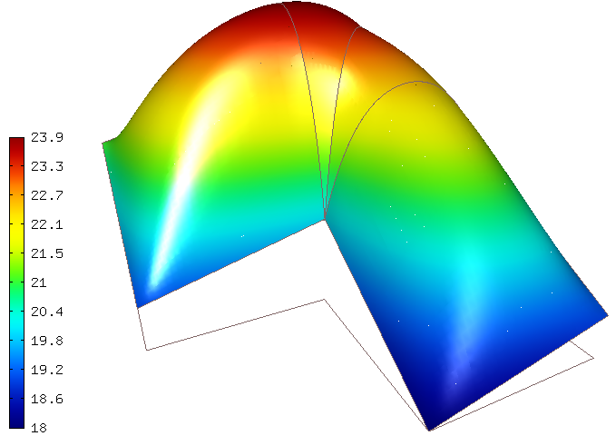

Essential and Natural Boundary Conditions
-----------------------------------------

Hermes distinguishes between **essential** and **natural** boundary conditions. 
The former type eliminates degrees of freedom from the domain's boundary.
Examples of essential boundary conditions are Dirichlet conditions for 
$H^1$ problems and perfect conductor conditions in the space $H(curl)$.
Natural boundary conditions, on the other hand, leave the solution on
the boundary unknown, and they are incorporated into surface integrals 
of the weak formulation. Examples of natural boundary conditions are
Neumann or Newton (Robin) boundary conditions for $H^1$ problems and 
impedance conditions in the space $H(curl)$.

Default constant essential boundary conditions
~~~~~~~~~~~~~~~~~~~~~~~~~~~~~~~~~~~~~~~~~~~~~~

We have already seen a default essential boundary condition, it was a constant 
Dirichlet condition in the previous example 03-poisson::

    // Initialize essential boundary conditions.
    DefaultEssentialBCConst bc_essential(Hermes::vector<std::string>("Bottom", "Inner", "Outer", "Left"), 
                                         FIXED_BDY_TEMP);

We used it to assign the value FIXED_BDY_TEMP to all boundary edges with the markers 
"Bottom", "Inner", "Outer" and "Left". After creating one or more essential boundary 
conditions, they are passed into a container EssentialBCs::

    EssentialBCs bcs(&bc_essential);

The constructor of the EssentialBCs class can accept a Hermes::vector of
essential boundary conditions. 

Default nonconstant essential boundary conditions
~~~~~~~~~~~~~~~~~~~~~~~~~~~~~~~~~~~~~~~~~~~~~~~~~

Another default essential boundary condition reads boundary values from a given 
function. This is useful mainly in benchmarks with known exact solution. A typical
usage is as follows (taken from benchmarks-nist/01-analytic-solution)::

    // Set exact solution.
    CustomExactSolution exact(&mesh, EXACT_SOL_P);

    // Initialize boundary conditions
    DefaultEssentialBCNonConst bc_essential("Bdy", &exact);
    EssentialBCs bcs(&bc_essential);

This will be discussed in more detail in the benchmarks section.

Custom essential boundary conditions
~~~~~~~~~~~~~~~~~~~~~~~~~~~~~~~~~~~~

Custom essential conditions can be created by subclassing the abstract class
EssentialBoundaryCondition::

    class HERMES_API EssentialBoundaryCondition
    {
    public:
      /// Default constructor.
      EssentialBoundaryCondition(Hermes::vector<std::string> markers);
      EssentialBoundaryCondition(std::string marker);

      /// Virtual destructor.
      virtual ~EssentialBoundaryCondition();

      /// Types of description of boundary values, either a function (callback), or a constant.
      enum EssentialBCValueType {
	BC_FUNCTION,
	BC_CONST
      };

      /// Pure virtual function reporting the type of the essential boundary condition.
      virtual EssentialBCValueType get_value_type() const = 0;

      /// Represents a function prescribed on the boundary. Gets the boundary point coordinate as well as the 
      /// normal and tangential vectors.
      virtual scalar value(double x, double y, double n_x, double n_y, double t_x, double t_y) const = 0;

      /// Special case of a constant function.
      scalar value_const;

      /// Sets the current time for time-dependent boundary conditions.
      void set_current_time(double time);
      double get_current_time() const;

    protected:
      /// Current time.
      double current_time;

      // Markers.
      Hermes::vector<std::string> markers;

      // Friend class.
      friend class EssentialBCs;
      friend class Space;
    };

This class can represent arbitrary essential boundary conditions that depend 
on space and time. Every descendant of this class must redefine the purely 
virtual functions get_value_type() and value(). This will be explained in
more detail in the following example 04-bc-dirichlet.  

Nonzero Dirichlet BC (04-bc-dirichlet)
--------------------------------------

**Git reference:** Tutorial example `04-bc-dirichlet 
<http://git.hpfem.org/hermes.git/tree/HEAD:/hermes2d/tutorial/P01-linear/04-bc-dirichlet>`_. 

Suppose that we would like to modify the boundary conditions for 
example 03-poisson as follows:

.. math::
         u(x, y) = Ax + By + C.

Subclassing EssentialBoundaryCondition
~~~~~~~~~~~~~~~~~~~~~~~~~~~~~~~~~~~~~~

This is done by defining a descendant of the EssentialBoundaryCondition class
(see `definitions.h <http://git.hpfem.org/hermes.git/blob/HEAD:/hermes2d/tutorial/P01-linear/04-bc-dirichlet/definitions.h>`_)::

    class CustomDirichletCondition : public EssentialBoundaryCondition {
    public:
      CustomDirichletCondition(Hermes::vector<std::string> markers, double A, double B, double C);

      virtual EssentialBoundaryCondition::EssentialBCValueType get_value_type() const; 

      virtual scalar value(double x, double y, double n_x, double n_y, double t_x, double t_y) const; 

      protected:
        double A, B, C;
    };

The methods are defined in `definitions.cpp <http://git.hpfem.org/hermes.git/blob/HEAD:/hermes2d/tutorial/P01-linear/04-bc-dirichlet/definitions.cpp>`_ as follows::

    CustomDirichletCondition::CustomDirichletCondition(Hermes::vector<std::string> markers, 
                                                       double A, double B, double C)
      : EssentialBoundaryCondition(markers), A(A), B(B), C(C) { }

    EssentialBoundaryCondition::EssentialBCValueType CustomDirichletCondition::get_value_type() const
    { 
      return EssentialBoundaryCondition::BC_FUNCTION; 
    }

    scalar CustomDirichletCondition::value(double x, double y, double n_x, double n_y, 
                                           double t_x, double t_y) const 
    {
      return A*x + B*y + C;
    }

The custom boundary condition class is used in `main.cpp <http://git.hpfem.org/hermes.git/blob/HEAD:/hermes2d/tutorial/P01-linear/04-bc-dirichlet/main.cpp>`_ as follows::

    // Initialize boundary conditions.
    CustomDirichletCondition bc_essential(Hermes::vector<std::string>("Bottom", "Inner", "Outer", "Left"),
                                          BDY_A_PARAM, BDY_B_PARAM, BDY_C_PARAM);
    EssentialBCs bcs(&bc_essential);

Sample results
~~~~~~~~~~~~~~

The output for the parameters A = 1.0, B = 1,0 and C = 20.0 is shown below:

Neumann BC (05-bc-newton)
-------------------------

**Git reference:** Tutorial example `05-bc-neumann 
<http://git.hpfem.org/hermes.git/tree/HEAD:/hermes2d/tutorial/P01-linear/05-bc-neumann>`_. 

Next, let us consider Neumann boundary conditions. The new model problem
will have the form

.. math::
    :nowrap:

    \begin{eqnarray*}   -\Delta u = C,\ \ \ \ \ &&u = 0\,\ \mbox{on}\,\ \Gamma_4,\\                            &&\dd{u}{n} = C_1\,\ \mbox{on}\,\ \Gamma_1,\\                            &&\dd{u}{n} = C_2\,\ \mbox{on}\,\ \Gamma_2,\\                            &&\dd{u}{n} = C_3\,\ \mbox{on}\,\ \Gamma_3. \end{eqnarray*}

where $\Gamma_1 \dots \Gamma_4$ correspond to the edges marked $1 \dots 4$. Now, the weak formulation contains some surface integrals:

.. math::

    \int_\Omega \nabla u \cdot \nabla v \;\mbox{d\bfx} =   C\int_\Omega v \;\mbox{d\bfx}   + C_1\int_{\Gamma_1} \!v \;\mbox{d}l   + C_2\int_{\Gamma_2} \!v \;\mbox{d}l   + C_3\int_{\Gamma_3} \!v \;\mbox{d}l

In Hermes, all forms in the standard weak formulation $a(u,v) = l(v)$
are in fact defined as a sum of contributions from volume integrals and from
surface integrals. In the case of the linear form $l(v)$, this means

.. math::

    l(v) = \sum_m l_m^{\,\rm vol}(v) + \sum_n l_n^{\,\rm surf}(v).

We have already seen volumetric linear forms in example 
`03-poisson <http://hpfem.org/hermes2d/doc/src/hermes2d/linear/poisson.html>`_. 
Surface linear forms are implemented similarly. Our new right-hand side is
represented by two functions with the following prototypes::

    template<typename Real, typename Scalar>
    Scalar linear_form(int n, double *wt, Func<Scalar> *u_ext[], Func<Real> *v, Geom<Real> *e, ExtData<Scalar> *ext)
    
    template<typename Real, typename Scalar>
    Scalar linear_form_surf(int n, double *wt, Func<Scalar> *u_ext[], Func<Real> *v, Geom<Real> *e, ExtData<Scalar> *ext);

and registered as follows::

    // Initialize the weak formulation
    WeakForm wf();
    wf.add_matrix_form(callback(bilinear_form));
    wf.add_vector_form(callback(linear_form));
    wf.add_vector_form_surf(callback(linear_form_surf));

The surface linear form is defined as::

    template<typename Real, typename Scalar>
    Scalar linear_form_surf(int n, double *wt, Func<Scalar> *u_ext[], Func<Real> *v, Geom<Real> *e, ExtData<Scalar> *ext)
    {
      return CONST_GAMMA[e->marker - 1] * int_v<Real, Scalar>(n, wt, v);
    }

Here, we have used the predefined surface integral int_v (see the
file `src/integrals/h1.h <http://git.hpfem.org/hermes.git/blob/HEAD:/hermes2d/src/integrals/h1.h>`_). 
If the boundary conditions were more complicated, we could also
have used int_F_v, where F stands for an arbitrary user-supplied
function returning the value $\partial u/\partial n$.

Note that in this example, the mesh is a-priori refined towards the re-entrant corner 
to capture the singular gradient::

    mesh.refine_towards_vertex(3, CORNER_REF_LEVEL);  // '3' is the vertex index from the mesh file.

Visualizing solution gradient
~~~~~~~~~~~~~~~~~~~~~~~~~~~~~ 

The gradient magnitude can be visualized via a MagFilter::

    // Compute and show gradient magnitude
    // (note that the infinite gradient at the re-entrant
    // corner will be truncated for visualization purposes)
    ScalarView gradview("Gradient", grad_win_geom);
    MagFilter grad(Tuple<MeshFunction>(&sln, &sln), Tuple<int>(H2D_FN_DX, H2D_FN_DY));
    gradview.show(&grad);

The approximate solution for the values $C_1 = -1/2$, $C_2 = 1$, $C_3 = -1/2$,
along with the singularity of gradient at the re-entrant corner are
shown in the following figures:

.. image:: 04-05-06-bc/neumann2.png
   :align: left
   :width: 530
   :height: 400
   :alt: Solution of the Neumann problem.

.. image:: 04-05-06-bc/neumann3.png
   :align: right
   :width: 400
   :height: 400
   :alt: Detail of gradient singularity at the re-entrant corner.

.. raw:: html

   

Newton BC (06-bc-newton)
------------------------

**Git reference:** Tutorial example `06-bc-newton 
<http://git.hpfem.org/hermes.git/tree/HEAD:/hermes2d/tutorial/P01-linear/06-bc-newton>`_. 

Another common natural boundary condition is the Newton (sometimes called Robin) condition
of the form

.. math::

    \dd{u}{n} + c_1 u = c_2, \ \ \ \ c_1 \ne 0.

Analogously to Neumann conditions, also Newton conditions yield surface integrals. However,
this time they are both in the bilinear form and in the linear form,
The bilinear form is
a sum of volume and surface forms that can be added to the weak formulation using the methods
add_matrix_form() and add_matrix_form_surf(). 
The surface bilinear form must have the following prototype:
::

    template<typename Real, typename Scalar>
    Scalar bilinear_form_surf(int n, double *wt, Func<Scalar> *u_ext[], Func<Real> *u, Func<Real> *v, Geom<Real> *e, ExtData<Scalar> *ext);

Inside this function you can use predefined
forms such as int_u_v, int_F_u_v (see the
file `src/integrals/h1.h <http://git.hpfem.org/hermes.git/blob/HEAD:/hermes2d/src/integrals/h1.h>`_) or your custom forms.

The following code snippet contains the linear and bilinear forms:
::

    template<typename Real, typename Scalar>
    Scalar bilinear_form(int n, double *wt, Func<Scalar> *u_ext[], Func<Real> *u, Func<Real> *v, Geom<Real> *e, ExtData<Scalar> *ext)
    {
      return int_grad_u_grad_v<Real, Scalar>(n, wt, u, v);
    }

    template<typename Real, typename Scalar>
    Scalar bilinear_form_surf(int n, double *wt, Func<Scalar> *u_ext[], Func<Real> *u, Func<Real> *v, Geom<Real> *e, ExtData<Scalar> *ext)
    {
      return H * int_u_v<Real, Scalar>(n, wt, u, v);
    }

    template<typename Real, typename Scalar>
    Scalar linear_form_surf(int n, double *wt, Func<Scalar> *u_ext[], Func<Real> *v, Geom<Real> *e, ExtData<Scalar> *ext)
    {
      return T0 * H * int_v<Real, Scalar>(n, wt, v);
    }

Here, $T_0$ is the exterior temperature, and $H$ is the heat flux.
The above forms are registered using::

    // Initialize the weak formulation.
    WeakForm wf;
    wf.add_matrix_form(callback(bilinear_form));
    wf.add_matrix_form_surf(callback(bilinear_form_surf), NEWTON_BDY);
    wf.add_vector_form_surf(callback(linear_form_surf), NEWTON_BDY);

Here NEWTON_BDY is the boundary marker for the Newton boundary. The following figures 
show the solution and singularity of gradient at the re-entrant corner:

.. image:: 04-05-06-bc/newton1.png
   :align: left
   :width: 530
   :height: 400
   :alt: Solution of the Newton problem.

.. image:: 04-05-06-bc/newton2.png
   :align: right
   :width: 400
   :height: 400
   :alt: Detail of gradient singularity at the re-entrant corner.

.. raw:: html

   

