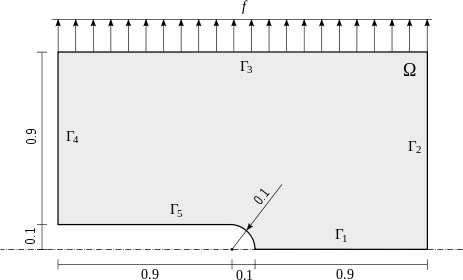

Systems of Equations (08-system)
--------------------------------

**Git reference:** Tutorial example `08-system <http://git.hpfem.org/hermes.git/tree/HEAD:/hermes2d/tutorial/P01-linear/08-system>`_. 

So far we have solved single PDEs with a weak formulation
of the form $a(u,v) = l(v)$, where $u$ was a continuous approximation in the
$H^1$ space. Hermes can also solve equations whose solutions lie in the spaces
$Hcurl$, $Hdiv$ or $L^2$, and one can combine these spaces for PDE systems
arbitrarily.

General scheme
~~~~~~~~~~~~~~

First let us understand how Hermes handles systems of linear PDE whose weak formulation 
is written as

.. math::
    :label: weaksystem

      a_{11}(u_1,v_1)\,+ a_{12}(u_2,v_1)\,+ \cdots\,+ a_{1n}(u_n,v_1) = l_1(v_1),

      a_{21}(u_1,v_2)\,+ a_{22}(u_2,v_2)\,+ \cdots\,+ a_{2n}(u_n,v_2) = l_2(v_2),

                                                          \vdots

      a_{n1}(u_1,v_n) + a_{n2}(u_2,v_n) + \cdots + a_{nn}(u_n,v_n) = l_n(v_n).

The solution $u = (u_1, u_2, \dots, u_n)$ and test functions $v =
(v_1, v_2, \dots, v_n)$ belong to the space $W = V_1 \times V_2 \times \dots
\times V_n$, where each $V_i$ is one of the available function spaces $H^1$, 
$H(curl)$, $H(div)$ or $L^2$. The resulting discrete matrix problem will have 
an $n \times n$ block structure.

Model problem of linear elasticity
~~~~~~~~~~~~~~~~~~~~~~~~~~~~~~~~~~

Let us illustrate this by solving a simple problem of linear elasticity. Consider a
two-dimensional elastic body shown in the following figure. The lower edge has
fixed displacements and the body is loaded with both an external force acting 
on the upper edge, and volumetric gravity force. 

In the plane-strain model of linear elasticity the goal is to determine the
deformation of the elastic body. The deformation is sought as a vector 
function $u(x) = (u_1, u_2)^T$, describing the displacement of each point
$x \in \Omega$.

Boundary conditions
~~~~~~~~~~~~~~~~~~~

The boundary conditions are

.. math::
    :nowrap:

    \begin{eqnarray*}
    \frac{\partial u_1}{\partial n} &=& f_1 \ \text{on $\Gamma_3$,} \\
    \frac{\partial u_1}{\partial n} &=& 0 \ \text{on $\Gamma_2$, $\Gamma_4$, $\Gamma_5$,} \\
    \frac{\partial u_2}{\partial n} &=& f_2 \ \text{on $\Gamma_3$,} \\
    \frac{\partial u_2}{\partial n} &=& 0 \ \text{on $\Gamma_2$, $\Gamma_4$, $\Gamma_5$,} \\
    u_1 &=& u_2 = 0 \ \mbox{on} \ \Gamma_1. 
    \end{eqnarray*}

The zero displacements are implemented as follows::

    // Initialize boundary conditions.
    DirichletConstant zero_disp(BDY_1, 0.0);
    BoundaryConditions bcs(&zero_disp);

The surface force is a Neumann boundary conditions that will be incorporated into the 
weak formulation.

Displacement spaces
~~~~~~~~~~~~~~~~~~~

Next let us define function spaces for the two solution
components, $u_1$ and $u_2$::

    // Create x- and y- displacement space using the default H1 shapeset.
    H1Space u1_space(&mesh, &bcs, P_INIT);
    H1Space u2_space(&mesh, &bcs, P_INIT);
    info("ndof = %d.", Space::get_num_dofs(Hermes::vector<Space *>(&u1_space, &u2_space)));

Weak formulation
~~~~~~~~~~~~~~~~

Applying the standard procedure to the elastostatic equilibrium equations, we 
arrive at the following weak formulation:

.. math::
    :nowrap:

    \begin{eqnarray*}   \int_\Omega     (2\mu\!+\!\lambda)\dd{u_1}{x_1}\dd{v_1}{x_1} + \mu\dd{u_1}{x_2}\dd{v_1}{x_2} +     \mu\dd{u_2}{x_1}\dd{v_1}{x_2} + \lambda\dd{u_2}{x_2}\dd{v_1}{x_1}     \,\mbox{d}\bfx \!\!&=&\!\!\!     \int_{\Gamma_3} \!\!f_1 v_1 \,\mbox{d}S, \\ \smallskip   \int_\Omega     \mu\dd{u_1}{x_2}\dd{v_2}{x_1} + \lambda\dd{u_1}{x_1}\dd{v_2}{x_2} +     (2\mu\!+\!\lambda)\dd{u_2}{x_2}\dd{v_2}{x_2} + \mu\dd{u_2}{x_1}\dd{v_2}{x_1} \,\mbox{d}\bfx \!\!&=&\!\!\!  \int_{\Gamma_3} \!\!f_2 v_2 \,\mbox{d}S - \int_{\Omega} \!\!\rho g v_2 \,\mbox{d}\bfx. \end{eqnarray*}

(the gravitational acceleration $g$ is considered negative).
We see that the weak formulation can be written in the form :eq:`weaksystem`:

.. math::
    :nowrap:

    \begin{eqnarray*}
      a_{11}(u_1, v_1) \!&=&\! \int_\Omega (2\mu+\lambda)\dd{u_1}{x_1}\dd{v_1}{x_1} + \mu\dd{u_1}{x_2}\dd{v_1}{x_2} \,\mbox{d}\bfx,  \\
      a_{12}(u_2, v_1) \!&=&\! \int_\Omega \mu\dd{u_2}{x_1}\dd{v_1}{x_2} + \lambda\dd{u_2}{x_2}\dd{v_1}{x_1} \,\mbox{d}\bfx,\\
      a_{21}(u_1, v_2) \!&=&\! \int_\Omega \mu\dd{u_1}{x_2}\dd{v_2}{x_1} + \lambda\dd{u_1}{x_1}\dd{v_2}{x_2} \,\mbox{d}\bfx,\\
      a_{22}(u_2, v_2) \!&=&\! \int_\Omega (2\mu+\lambda)\dd{u_2}{x_2}\dd{v_2}{x_2} + \mu\dd{u_2}{x_1}\dd{v_2}{x_1} \,\mbox{d}\bfx,  \\
      l_{1}(v_1) \!&=&\!
      \int_{\Gamma_3} \!\!f_1 v_1 \,\mbox{d}S, \\
      l_{2}(v_2) \!&=&\!
      \int_{\Gamma_3} \!\!f_2 v_2 \,\mbox{d}S - \int_{\Omega} \!\!\rho g v_2 \,\mbox{d}\bfx.
    \end{eqnarray*}

Here, $\mu$ and $\lambda$ are material constants (Lame coefficients) defined as

.. math::

    \mu = \frac{E}{2(1+\nu)}, \ \ \ \ \  \lambda = \frac{E\nu}{(1+\nu)(1-2\nu)},

where $E$ is the Young modulus and $\nu$ the Poisson ratio of the material. For
steel, we have $E = 200$ GPa and $\nu = 0.3$. The load force is $f = (0, 8\cdot 10^4)^T$ N.

Definition of weak forms
~~~~~~~~~~~~~~~~~~~~~~~~

Hermes provides a generic class WeakFormLinearElasticity in the file 
`src/weakform/sample_weak_forms.h <http://git.hpfem.org/hermes.git/blob/HEAD:/hermes2d/src/weakform/sample_weak_forms.h>`_.
These are volumetric forms that can be used for problems with Dirichlet and/or zero Neumann
boundary conditions::

    /* Linear elasticity (Lame equations)  
       with Dirichlet and/or zero Neumann BC (just volumetric forms).

       Nonzero Neumann and Newton boundary conditions can be enabled 
       by creating a descendant and adding surface forms to it. 
    */

    class WeakFormLinearElasticity : public WeakForm
    {
    public:
      WeakFormLinearElasticity(double E, double nu, double rho_g) : WeakForm(2)
      {
	double lambda = (E * nu) / ((1 + nu) * (1 - 2*nu));
	double mu = E / (2*(1 + nu));

	add_matrix_form(new MatrixFormVolLinearElasticity_0_0(lambda, mu));
	add_matrix_form(new MatrixFormVolLinearElasticity_0_1(lambda, mu)); 
	add_matrix_form(new MatrixFormVolLinearElasticity_1_1(lambda, mu));
	add_vector_form(new VectorFormGravity(rho_g));                   // gravity loading
      }

    private:
      class MatrixFormVolLinearElasticity_0_0 : public WeakForm::MatrixFormVol
      {
      public:
	MatrixFormVolLinearElasticity_0_0(double lambda, double mu) 
	  : WeakForm::MatrixFormVol(0, 0, HERMES_SYM), lambda(lambda), mu(mu) {}

	template<typename Real, typename Scalar>
	Scalar matrix_form(int n, double *wt, Func<Scalar> *u_ext[], Func<Real> *u, 
			   Func<Real> *v, Geom<Real> *e, ExtData<Scalar> *ext)
	{
	  return (lambda + 2*mu) * int_dudx_dvdx<Real, Scalar>(n, wt, u, v) +
			      mu * int_dudy_dvdy<Real, Scalar>(n, wt, u, v);
	}

	scalar value(int n, double *wt, Func<scalar> *u_ext[], Func<double> *u, 
		     Func<double> *v, Geom<double> *e, ExtData<scalar> *ext)
	{
	  return matrix_form<scalar, scalar>(n, wt, u_ext, u, v, e, ext);
	}

	Ord ord(int n, double *wt, Func<Ord> *u_ext[], Func<Ord> *u, Func<Ord> *v, 
		Geom<Ord> *e, ExtData<Ord> *ext)
	{
	   return matrix_form<Ord, Ord>(n, wt, u_ext, u, v, e, ext);
	}

	// Members.
	double lambda, mu;
      };

      class MatrixFormVolLinearElasticity_0_1 : public WeakForm::MatrixFormVol
      {
      public:
	MatrixFormVolLinearElasticity_0_1(double lambda, double mu) 
		: WeakForm::MatrixFormVol(0, 1, HERMES_SYM), lambda(lambda), mu(mu) {}

	template<typename Real, typename Scalar>
	Scalar matrix_form(int n, double *wt, Func<Scalar> *u_ext[], Func<Real> *u, 
			   Func<Real> *v, Geom<Real> *e, ExtData<Scalar> *ext)
	{
	  return lambda * int_dudy_dvdx<Real, Scalar>(n, wt, u, v) +
		     mu * int_dudx_dvdy<Real, Scalar>(n, wt, u, v);
	}

	scalar value(int n, double *wt, Func<scalar> *u_ext[], Func<double> *u, 
		     Func<double> *v, Geom<double> *e, ExtData<scalar> *ext)
	{
	  return matrix_form<scalar, scalar>(n, wt, u_ext, u, v, e, ext);
	}

	Ord ord(int n, double *wt, Func<Ord> *u_ext[], Func<Ord> *u, 
		Func<Ord> *v, Geom<Ord> *e, ExtData<Ord> *ext)
	{
	   return matrix_form<Ord, Ord>(n, wt, u_ext, u, v, e, ext);
	}

	// Members.
	double lambda, mu;
      };

      class MatrixFormVolLinearElasticity_1_1 : public WeakForm::MatrixFormVol
      {
      public:
	MatrixFormVolLinearElasticity_1_1(double lambda, double mu) 
		: WeakForm::MatrixFormVol(1, 1, HERMES_SYM), lambda(lambda), mu(mu) {}

	template<typename Real, typename Scalar>
	Scalar matrix_form(int n, double *wt, Func<Scalar> *u_ext[], Func<Real> *u, 
			   Func<Real> *v, Geom<Real> *e, ExtData<Scalar> *ext)
	{
	  return              mu * int_dudx_dvdx<Real, Scalar>(n, wt, u, v) +
		 (lambda + 2*mu) * int_dudy_dvdy<Real, Scalar>(n, wt, u, v);
	}

	scalar value(int n, double *wt, Func<scalar> *u_ext[], Func<double> *u, 
		     Func<double> *v, Geom<double> *e, ExtData<scalar> *ext)
	{
	  return matrix_form<scalar, scalar>(n, wt, u_ext, u, v, e, ext);
	}

	Ord ord(int n, double *wt, Func<Ord> *u_ext[], Func<Ord> *u, Func<Ord> *v, 
		Geom<Ord> *e, ExtData<Ord> *ext)
	{
	   return matrix_form<Ord, Ord>(n, wt, u_ext, u, v, e, ext);
	}

	// Members.
	double lambda, mu;
      };

      class VectorFormGravity : public WeakForm::VectorFormVol
      {
      public:
	VectorFormGravity(double rho_g) : WeakForm::VectorFormVol(1), rho_g(rho_g) { }

	template<typename Real, typename Scalar>
	Scalar vector_form(int n, double *wt, Func<Scalar> *u_ext[], Func<Real> *v, 
			   Geom<Real> *e, ExtData<Scalar> *ext) {
	  return rho_g * int_v<Real, Scalar>(n, wt, v);
	}

	scalar value(int n, double *wt, Func<scalar> *u_ext[], Func<double> *v, 
		     Geom<double> *e, ExtData<scalar> *ext) {
	  return vector_form<scalar, scalar>(n, wt, u_ext, v, e, ext);
	}

	Ord ord(int n, double *wt, Func<Ord> *u_ext[], Func<Ord> *v, Geom<Ord> *e, 
		ExtData<Ord> *ext) {
	  return vector_form<Ord, Ord>(n, wt, u_ext, v, e, ext);;
	}

	// Member.
	double rho_g;
      };
    };

In our example, we need to add nonzero Neumann conditions. This is done 
by creating a descendant of the WeakFormLinearElasticity class and adding 
surface forms there::

    class MyWeakForm : public WeakFormLinearElasticity
    {
    public:
      MyWeakForm(double E, double nu, double rho_g, std::string non_zero_neumann_bnd, double f0, double f1) 
                : WeakFormLinearElasticity(E, nu, rho_g) {
        double lambda = (E * nu) / ((1 + nu) * (1 - 2*nu));  // First Lame constant.
        double mu = E / (2*(1 + nu));                        // Second Lame constant.

        add_vector_form_surf(new VectorFormSurfForce_0(non_zero_neumann_bnd, f0));
        add_vector_form_surf(new VectorFormSurfForce_1(non_zero_neumann_bnd, f1));
      };

    private:
      class VectorFormSurfForce_0 : public WeakForm::VectorFormSurf
      {
      public:
        VectorFormSurfForce_0(std::string marker, double f0) : WeakForm::VectorFormSurf(0, marker), f0(f0) {}

        template<typename Real, typename Scalar>
        Scalar vector_form(int n, double *wt, Func<Scalar> *u_ext[], Func<Real> *v, Geom<Real> *e, ExtData<Scalar> *ext) {
          return f0 * int_v<Real, Scalar>(n, wt, v);
        }

        scalar value(int n, double *wt, Func<scalar> *u_ext[], Func<double> *v, Geom<double> *e, ExtData<scalar> *ext) {
          return vector_form<scalar, scalar>(n, wt, u_ext, v, e, ext);
        }

        Ord ord(int n, double *wt, Func<Ord> *u_ext[], Func<Ord> *v, Geom<Ord> *e, ExtData<Ord> *ext) {
          return vector_form<Ord, Ord>(n, wt, u_ext, v, e, ext);
        }

        // Member.
        double f0;
      };

      class VectorFormSurfForce_1 : public WeakForm::VectorFormSurf
      {
      public:
        VectorFormSurfForce_1(std::string marker, double f1) : WeakForm::VectorFormSurf(1, marker), f1(f1) {}

        template<typename Real, typename Scalar>
        Scalar vector_form(int n, double *wt, Func<Scalar> *u_ext[], Func<Real> *v, Geom<Real> *e, ExtData<Scalar> *ext) {
          return f1 * int_v<Real, Scalar>(n, wt, v);
        }

        scalar value(int n, double *wt, Func<scalar> *u_ext[], Func<double> *v, Geom<double> *e, ExtData<scalar> *ext) {
          return vector_form<scalar, scalar>(n, wt, u_ext, v, e, ext);
        }

        Ord ord(int n, double *wt, Func<Ord> *u_ext[], Func<Ord> *v, Geom<Ord> *e, ExtData<Ord> *ext) {
          return vector_form<Ord, Ord>(n, wt, u_ext, v, e, ext);
        }

        // Member.
        double f1;
      };
    };

Note that the block index 0, 0 means that bilinear_form_0_0() takes basis functions from 
space 0 (x-displacement space) and test functions from space 0. The block index 
0, 1 means that bilinear_form_0_1 takes basis functions from space 0 and test functions 
from space 1 (y-displacement space), etc. This yields a 2x2 block structure in the 
resulting matrix system.

Flags HERMES_SYM, HERMES_NONSYM, HERMES_ANTISYM
~~~~~~~~~~~~~~~~~~~~~~~~~~~~~~~~~~~~~~~~~~~~~~ 

If the reader looks at the definition of the class WeakFormLinearElasticity,
he/she will see that not all four blocks are actually defined. Therefore, 
an explanation of the extra parameter HERMES_SYM is in order.
Since the two diagonal forms $a_{11}$ and $a_{22}$ are symmetric, i.e.,
$a_{ii}(u,v) = a_{ii}(v,u)$, Hermes can be told to only evaluate them once for the
two cases $a_{ii}(u,v)$ and $a_{ii}(v,u)$ to speed up assembly. In fact, we should have
used the HERMES_SYM flag already in the previous sections, since the form
$a(u,v) = \nabla u \cdot \nabla v$ was symmetric. Of course this is not the case
for all forms and so the default value of the fourth parameter of add_matrix_form() 
is HERMES_NONSYM.

The off-diagonal forms $a_{12}(u_2, v_1)$ and $a_{21}(u_1, v_2)$ are not
(and cannot) be symmetric, since their arguments come from different spaces in general.
However, we can see that $a_{12}(u, v) = a_{21}(v, u)$, i.e., the corresponding blocks
of the local stiffness matrix are transposes of each other. Here, the HERMES_SYM flag
has a different effect: it tells Hermes to take the block of the local stiffness
matrix corresponding to the form $a_{12}$, transpose it and copy it where a block
corresponding to $a_{21}$ would belong, without evaluating $a_{21}$ at all (this is why
we don't add bilinear_form_1_0). This again speeds up the matrix assembly.
You can also use the flag HERMES_ANTISYM, which moreover inverts the sign of the block.
This makes sense in the case where $a_{ij}(u, v) = -a_{ji}(v, u)$.

It is recommended that you start with the default (and safe) HERMES_NONSYM flag for all
forms when developing your project, and only optimize the evaluation of the forms when
the code works well.

Assembling and solving the discrete problem
~~~~~~~~~~~~~~~~~~~~~~~~~~~~~~~~~~~~~~~~~~~

When the spaces and weak forms are ready, one can initialize the 
discrete problem::

    // Initialize the FE problem.
    bool is_linear = true;
    DiscreteProblem dp(&wf, Tuple<Space *>(&u1_space, &u2_space), is_linear);

Next we initialize the matrix solver::

    // Set up the solver, matrix, and rhs according to the solver selection.
    SparseMatrix* matrix = create_matrix(matrix_solver);
    Vector* rhs = create_vector(matrix_solver);
    Solver* solver = create_linear_solver(matrix_solver, matrix, rhs);

And assemble and solve the matrix problem::

    // Assemble the stiffness matrix and right-hand side vector.
    info("Assembling the stiffness matrix and right-hand side vector.");
    dp.assemble(matrix, rhs);

    // Solve the linear system and if successful, obtain the solutions.
    info("Solving the matrix problem.");
    if(solver->solve()) Solution::vector_to_solutions(solver->get_solution(), Tuple<Space *>(&u1_space, &u2_space), 
                                                      Tuple<Solution *>(&u_sln, &v_sln));
    else error ("Matrix solver failed.\n");

Visualizing Von Mises stress
~~~~~~~~~~~~~~~~~~~~~~~~~~~~

Von Mises stress can be visualized via the VonMises filter as follows::

    // Visualize the solution.
    WinGeom* sln_win_geom = new WinGeom(0, 0, 800, 400);
    ScalarView view("Von Mises stress [Pa]", sln_win_geom);
    VonMisesFilter stress(Tuple<MeshFunction*>(&u1_sln, &u2_sln), lambda, mu);
    view.show_mesh(false);
    view.show(&stress, HERMES_EPS_HIGH, HERMES_FN_VAL_0, &u1_sln, &u2_sln, 1.5e5);

More about visualization and Filters will be said in the following section,
where we will also show sample results for the present model problem.
