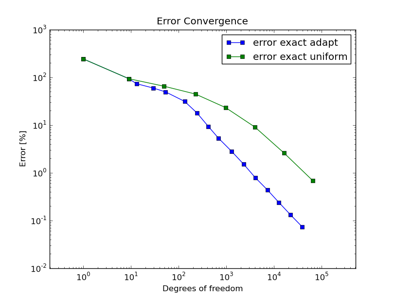

Understanding Convergence Rates
-------------------------------

Hermes provides convergence graphs for every adaptive computation. Therefore,
let us spend a short moment explaining their meaning.
The classical notion of $O(h^p)$ convergence rate is related to sequences of 
uniform meshes with a gradually decreasing diameter $h$. In $d$ spatial dimensions, 
the diameter $h$ of a uniform mesh is related to the number of degrees of freedom $N$
through the relation 

.. math::

    h = O(N^{-p/d}).

Therefore a slope of $-p/d$ on the log-log scale means that $err \approx O(N^{-p/d})$
or $err \approx O(h^p)$. When local refinements are enabled, the meaning of $O(h^p)$
convergence rate loses its meaning, and one should switch to convergence in terms of 
the number of degrees of freedom (DOF) or CPU time - Hermes provides both. 

Algebraic convergence of adaptive h-FEM
~~~~~~~~~~~~~~~~~~~~~~~~~~~~~~~~~~~~~~~~~~~~~~~

When using elements of degree $p$, the convergence rate of adaptive $h$-FEM will not exceed the 
one predicted for uniformly refined meshes (this can be explained using 
mathematical analysis). Nevertheless, the convergence may be faster due to a different 
constant in front of the $h^p$ term. This is illustrated in the following two figures,
both of which are related to a 2D problem with known exact solution. The first pair of 
graphs corresponds to adaptive $h$-FEM with linear elements. The slope on the log-log
graph is -1/2 which means first-order convergence, as predicted by theory. 

.. image:: intro/layer_h1.png
   :align: center
   :width: 600
   :height: 450
   :alt: Convergence graph.

The next pair of convergence graphs corresponds to adaptive $h$-FEM with quadratic elements. 
The slope on the log-log graph is -1, which means that the convergence is quadratic as 
predicted by theory.

Note that one always should look at the end of the convergence curve, not at the 
beginning. The automatic adaptivity in Hermes is guided with the so-called 
*reference solution*, which is an approximation on a globally-refined mesh.
In early stages of adaptivity, the reference solution and in turn also the error 
estimate usually are not sufficiently accurate to deliver the expected convergence 
rates. 

Exponential convergence of adaptive hp-FEM
~~~~~~~~~~~~~~~~~~~~~~~~~~~~~~~~~~~~~~~~~~~~~~~~~~

It is predicted by theory that adaptive $hp$-FEM should attain 
exponential convergence rate. This means that the slope of the
convergence graph is the steeper the more one goes to the right:

.. image:: intro/aniso-hp.png
   :align: center
   :width: 600
   :height: 450
   :alt: Convergence graph.

While this is often the case with adaptive $hp$-FEM, there are 
problems whose difficulty is such that the convergence is not 
exponential. Or at least not during a long pre-asymptotic 
stage of adaptivity. This may happen, for example, when the solution 
contains an extremely strong singularity. Then basically all error 
is concentrated there, and all adaptive methods will do the same, 
which is to throw into the singularity as many small low-order 
elements as possible. Then the convergence of adaptive $h$-FEM 
and $hp$-FEM may be very similar (usually quite poor).

Estimated vs. exact convergence rates
~~~~~~~~~~~~~~~~~~~~~~~~~~~~~~~~~~~~~

Whenever exact solution is available, Hermes provides both 
estimated error (via the reference solution) as well as the 
exact error. Thus the user can see the quality of the 
error estimate. Note that the estimated error usually is 
slightly less than the exact one, but during adaptivity 
they quickly converge together and become virtually identical. 
This is shown in the figure below.

.. image:: intro/layer-hp.png
   :align: center
   :width: 600
   :height: 450
   :alt: Convergence graph to the Layer benchmark.

In problems with extremely strong singularities the difference between the 
exact and estimated error can be significant. This is illustrated in the 
following graph that belongs to the benchmark 
`nist-11 <http://hpfem.org/hermes/doc/src/hermes2d/nist/nist-11.html>`_.

 .. image:: intro/kellogg-conv.png
   :align: center
   :width: 600
   :height: 450
   :alt: Convergence graph to the Kellogg benchmark.
