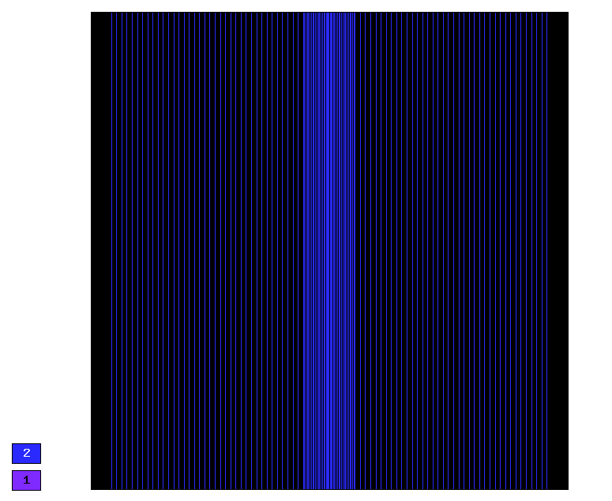
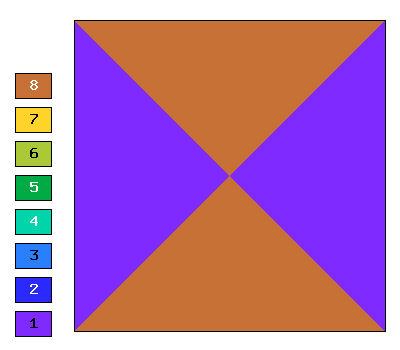
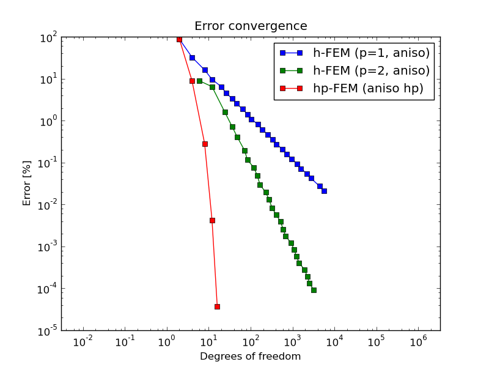
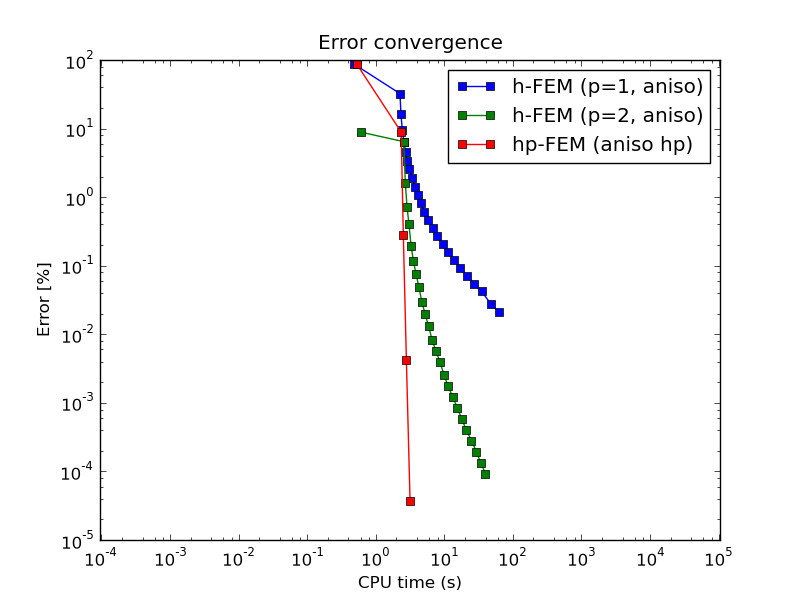

Non-symmetric (Elliptic)
------------------------

**Git reference:** Benchmark `nonsym-check <http://git.hpfem.org/hermes.git/tree/HEAD:/hermes2d/benchmarks/nonsym-check>`_.

This example uses a nonsymmetric equation and its purpose is to 
check that nonsymmetric problems are solved correctly.

Model problem
~~~~~~~~~~~~~

Equation solved: 

.. math::
    :label: nonsym-check

       -\Delta u + \frac{\partial u}{\partial x} = f.

Domain of interest: Square domain $(0, \pi) x (0, \pi)$.

Right-hand side:

.. math::
    :label: nonsym-check-rhs
 
    f(x, y) = sin(x) + cos(x). 

Exact solution
~~~~~~~~~~~~~~

.. math::
    :label: nonsym-check-exact

    u(x,y) = sin(x).

In the code::

    // Exact solution.
    static double fn(double x, double y)
    {
      return sin(x);
    }
    static double fndd(double x, double y, double& dx, double& dy)
    {
      dx = cos(x);
      dy = 0;
      return fn(x, y);
    }
    
Boundary conditions: Zero Dirichlet on left edge, zero Neumann on top and bottom edges,
nonzero Neumann on the right edge (all matching exact solution).

Sample solution
~~~~~~~~~~~~~~~

.. image:: nonsym-check/solution.png
   :align: center
   :width: 600
   :height: 400
   :alt: Solution.

Convergence comparison
~~~~~~~~~~~~~~~~~~~~~~

Final mesh (h-FEM with linear elements):

.. image:: nonsym-check/mesh_h1_aniso.png
   :align: center
   :width: 500
   :height: 400
   :alt: Final mesh (h-FEM with linear elements).

Final mesh (h-FEM with quadratic elements):

Final mesh (hp-FEM):

DOF convergence graphs:

CPU time convergence graphs:

