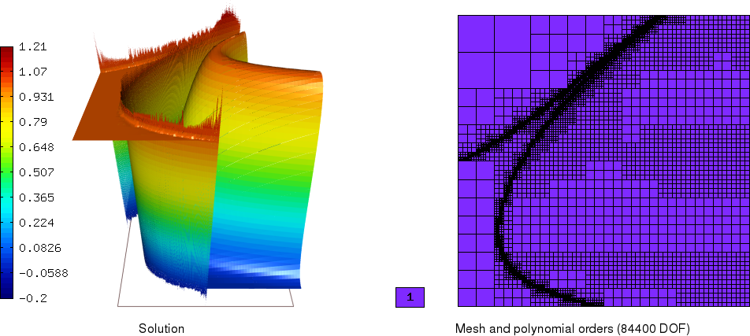

Advection-reaction (Hyperbolic)
-------------------------------

**Git reference:** Benchmark `stabilized-advection-reaction <http://git.hpfem.org/hermes.git/tree/HEAD:/hermes2d/benchmarks/stabilized-advection-reaction>`_.

This benchmark shows how to solve a steady-state `1`\ :sup:`st` order hyperbolic PDE with discontinuous boundary conditions.

Model problem
~~~~~~~~~~~~~

Equation solved: Steady-state advection-reaction equation

.. math::
    :label: eq-adv-rea

    \vec\beta\cdot\nabla u + cu = f,
   
    \vec\beta = ( 10y^2 - 12x + 1, 1 + y ),\quad c = f = 0.

Domain of interest: Square $[0, 1]\times [0, 1]$.

Boundary conditions: Dirichlet, prescribed on the inflow parts of the domain boundary (i.e. where $\vec\beta\cdot\vec{n} < 0$)

.. math:: 
    :label: bc-adv-rea
    :nowrap:

    $$
    \begin{cases}
    0 & \mbox{ for } (x = 0 \land 0.5 < y \leq 1)\,\lor\,(0.5<x\leq 1 \land y = 0),\\
    1 & \mbox{ for } (x = 0 \land 0 < y \leq 0.5)\,\lor\,(0 \leq x\leq 0.5 \land y = 0),\\
    \sin^2(\pi y) & \mbox{ for } x = 1 \land 0\leq y \leq 1.
    \end{cases}
    $$

Exact solution
~~~~~~~~~~~~~~

Exact solution has been obtained by the method of characteristics, but it cannot be stated in a fully analytic form. Using Mathematica 7.0, the expression for the solution has been derived symbolically without any numerical approximation and its numerical evaluation at any point :math:`(x,y)\in\Omega` only amounts to calulating roots of `14`\ :sup:`th` order polynomials with coefficients defined by :math:`x,y`, evaluating standard analytical functions (exponential, sine) and performing standard algebraic operations. All these operations can be realized by Mathematica in machine precision and hence the solution may be considered exact for the purposes of comparison with the approximate results of Hermes. The `source notebook <http://git.hpfem.org/hermes.git/blob/HEAD:/hermes2d/benchmarks/stabilized-advection-reaction/exact/hyper_moc.nb>`_ is included [1]_.

For illustration purposes, the plots below were produced by the Matlab script `plotu.m <http://git.hpfem.org/hermes.git/blob/HEAD:/hermes2d/benchmarks/stabilized-advection-reaction/exact/plotu.m>`_ from file `sol_101x101.map <http://git.hpfem.org/hermes.git/blob/HEAD:/hermes2d/benchmarks/stabilized-advection-reaction/exact/sol_100x100.map>`_, which contains the solution values on a uniform grid of :math:`101\times101` points in :math:`\Omega`. 

.. image:: benchmark-stabilized-advection-reaction/exact_complete.png
   :align: center
   :width: 1000
   :alt: Exact solution.

 
Methods overview
~~~~~~~~~~~~~~~~

According to the classical theory, the advection term in eq. :eq:`eq-adv-rea` propagates boundary data into the domain along the *characteristics*, i.e. curves :math:`\vec x(s)` satisfying :math:`\mathrm d\vec x/\mathrm ds = \vec\beta`. Hence,  :eq:`eq-adv-rea` with jump-discontinuous boundary conditions :eq:`bc-adv-rea` has a unique solution with jump-discontinuities normal to the characteristics passing through the point of discontinuity at the boundary. It is well known that the classical conforming FEM solution realized by globally continuous basis functions is not likely to produce satisfactory results -- unlike the problems with steep but continuous solution gradients, which could be resolved by sufficiently high h-refinement, spurious *Gibbs* oscillations will be introduced in the vicinity of the jumps and spread to the more distant parts of the domain -- see the figure below. 

.. figure:: benchmark-stabilized-advection-reaction/cg1/sln_and_mesh.png
   :align: center
   :width: 1000
   :alt: Continuous Galerkin approximation.
   
   Solution by the continuous Galerkin method without stabilization.

The two mostly used Galerkin methods which circumvent these stability issues will be briefly introduced now.

-   **Stabilized continuous Galerkin methods.**
    These methods effectively add artificial diffusion to the equation, changing its behavior to that of an advection-reaction-diffusion equation with a globally continuous solution. Typical methods from this category include the *Streamline upwind Petrov-Galerkin (SUPG)*, *Galerkin least squares (GLS)* or *Subgrid scale (SGS)* methods (see e.g. [C98]_ and the references therein). The discretization procedure (carried out in the standard :math:`H^1(\Omega)` space) leads to much smaller linear algebraic systems comparing to the methods from the other category. However, it is usually very difficult to tune the amount of added diffusion so that the solution does not diverge too much from that of the original `1`\ :sup:`st` order problem, particularly for the higher-order multidimensional schemes.
    
-   **Discontinuous Galerkin (DG) methods.**
    In the DG methods, discretization is carried out in the :math:`L^2(\Omega)` space, using basis functions which are smooth inside each element but discontinuous across element interfaces. Relaxation of the interelement continuity allows for capturing the solution jumps and results in a stable scheme without the need for additional tuning, but at the expense of a bigger algebraic system to solve and more difficult assembling.
    
This benchmark implements the SUPG and DG methods (and the classical continuous FEM for comparison). Note that both methods may be used to ensure stability, i.e. that numerical oscillations will be fully contained in a close vicinity of the point where they appear, but they do not *per se* prevent the oscillations from actually occuring. In order to do so, monotonicity of the scheme has to be ensured as well by proper discontinuity capturing techniques, which are however not implemented in this benchmark. 

Weak forms
~~~~~~~~~~

Streamline upwind Petrov-Galerkin
^^^^^^^^^^^^^^^^^^^^^^^^^^^^^^^^^

The bilinear form for the SUPG discretization of problem :eq:`eq-adv-rea`, :eq:`bc-adv-rea` is composed of three parts. The first one is formally obtained by multiplying eq. :eq:`eq-adv-rea` by an :math:`L^2`-integrable test function and integrating over the whole domain:

.. math::

    \int_\Omega (\vec\beta\cdot\nabla u + c)v \,\mathrm{d}x.

Note that we do not apply the Green's theorem and seek the *strong* solution, which lies in :math:`L^2(\Omega)` together with its *streamline derivative* :math:`\vec\beta\cdot\nabla u` [2]_. Space of such functions contains :math:`H^1(\Omega)` and in particular its finite-dimensional subspace of piecewise continuous polynomials up to a specified order, which we use for the practical implementation. Code for the first part of the SUPG bilinear form is below::

    template<typename Real, typename Scalar>
    Scalar cg_biform(int n, double *wt, Func<Scalar> *u_ext[], Func<Real> *u, Func<Real> *v, Geom<Real> *e, ExtData<Scalar> *ext)
    {
      Scalar result = 0;
      for (int i=0; i < n; i++)
      {
        Real a = fn_a<Real>(e->x[i], e->y[i]);
        Real b = fn_b<Real>(e->x[i], e->y[i]);
        Real c = fn_c<Real>(e->x[i], e->y[i]);
        result += wt[i] * v->val[i] * (dot2<Real>(a, b, u->dx[i], u->dy[i]) + c * u->val[i]);
      }
      return result;
    }
 
The second part reads

.. math::
    :label: eq-supg-stab

    \int_\Omega (\vec\beta\cdot\nabla u + cu - f)\, \tau \,\vec\beta\cdot\nabla v \,\mathrm{d}x,
    
where :math:`\tau` must be judiciously chosen to ensure the stability. Note that since :eq:`eq-supg-stab` contains the whole residual of :eq:`eq-adv-rea`, consistency is not broken by this additional contribution to the whole SUPG bilinear form.  

Appropriate choice of parameter :math:`\tau`, so that the scheme is neither over-stabilized nor under-stabilized, is the major concern when implementing the SUPG method. Theoretically justified rules are known mostly for first order accurate, one dimensional, advection-reaction-diffusion problems. Therefore, for our isotropic finite element grid, the classical expression (see e.g. [C98]_) is extended by letting the diffusion coefficient vanish and taking a square of the result, with the 1D advection coefficient replaced in each element :math:`K` by :math:`||\vec\beta||_{L^2(K)\times L^2(K)}`. The result is 

.. math::

    \tau = \frac{\mathrm{diam}(K)^2}{4 ||\vec\beta||^2_{L^2(K)\times L^2(K)}}
    
and is working reasonably well for the current problem. Nevertheless, the reader is encouraged to derive and experiment with his own expressions. 

Code for this part of the SUPG bilinear form is then

::

    template<typename Real, typename Scalar>
    Scalar stabilization_biform_supg(int n, double *wt, Func<Scalar> *u_ext[], Func<Real> *u, Func<Real> *v, Geom<Real> *e, ExtData<Scalar> *ext)
    {
      Real h_e = e->diam;
      Scalar result = 0;
      Real norm_a_sq = 0.;
      Real norm_b_sq = 0.;
      for (int i=0; i < n; i++) 
      {
        Real a = fn_a<Real>(e->x[i], e->y[i]);
        Real b = fn_b<Real>(e->x[i], e->y[i]);
        Real c = fn_c<Real>(e->x[i], e->y[i]);
        Real f = F<Real>(e->x[i], e->y[i]);
        
        Real R = dot2<Real>(a, b, u->dx[i], u->dy[i]) + c * u->val[i] - f;    
        result += wt[i] * dot2<Real>(a, b, v->dx[i], v->dy[i]) * R;
        norm_a_sq += 0.5 * wt[i] * sqr(a);
        norm_b_sq += 0.5 * wt[i] * sqr(b);
      }
      
      return result * sqr(h_e)/(4*(norm_a_sq + norm_b_sq));
    }

The final part of the SUPG bilinear form, together with the corresponding linear form, enforces the Dirichlet boundary conditions on the inflow boundaries in an :math:`L^2`-integral sense. Although this form has been traditionally used in literature rather for mathematical analysis than for practical computation, we have found it advantageous for the latter purpose as well since with open quadrature rules currently used in Hermes, the problematic evaluation of the boundary condition and approximate solution at the vertices of discontinuity is hence avoided.

::   

    template<typename Real, typename Scalar>
    Scalar cg_boundary_biform(int n, double *wt, Func<Scalar> *u_ext[], Func<Real> *u, Func<Real> *v, Geom<Real> *e, ExtData<Scalar> *ext)
    {
      Scalar result = 0;
      for (int i=0; i < n; i++)
      {
        Real a = fn_a<Real>(e->x[i], e->y[i]);
        Real b = fn_b<Real>(e->x[i], e->y[i]);
        Real beta_dot_n = dot2<Real>(a, b, e->nx[i], e->ny[i]);
        
        if (beta_dot_n < 0)     // inflow
          result += -wt[i] * u->val[i] * v->val[i] * beta_dot_n;
      }
      return result;
    }

    template<typename Real, typename Scalar>
    Scalar cg_boundary_liform(int n, double *wt, Func<Real> *u_ext[], Func<Real> *v, Geom<Real> *e, ExtData<Scalar> *ext)
    {
      Scalar result = 0;
      
      for (int i = 0; i < n; i++) 
      {
        Real x = e->x[i], y = e->y[i];
        Real a = fn_a<Real>(x, y);
        Real b = fn_b<Real>(x, y);
        Real beta_dot_n = dot2<Real>(a, b, e->nx[i], e->ny[i]);
        
        if (beta_dot_n < 0)    // inflow
        {
          Scalar g = essential_bc_values<Real, Scalar>(e->edge_marker, x, y);
          result += -wt[i] * beta_dot_n * g * v->val[i];
        }
      }
      
      return result;
    }

    
Discontinuous Galerkin
^^^^^^^^^^^^^^^^^^^^^^

There are several possibilities how to formulate the DGM. We choose that presented and analysed in [BMS04]_ and define the bilinear and linear forms for the weak formulation of problem :eq:`eq-adv-rea`, :eq:`bc-adv-rea` as follows::

    // Scalar average, vector jump.

    #define AVG(w)      ( 0.5 * (w->get_val_central(i) + w->get_val_neighbor(i)) )

    #define JUMP(w)     w->get_val_central(i)*e->nx[i] - w->get_val_neighbor(i)*e->nx[i],\
                        w->get_val_central(i)*e->ny[i] - w->get_val_neighbor(i)*e->ny[i] 

    // Weak forms:

    template<typename Real, typename Scalar>
    Scalar dg_volumetric_biform(int n, double *wt, Func<Real> *u_ext[], Func<Real> *u, Func<Real> *v, Geom<Real> *e, ExtData<Scalar> *ext)
    {
      Scalar result = 0;
      for (int i = 0; i < n; i++)
      {
        Real a = fn_a<Real>(e->x[i], e->y[i]);
        Real b = fn_b<Real>(e->x[i], e->y[i]);
        Real c = fn_c<Real>(e->x[i], e->y[i]);
        result += wt[i] * u->val[i] * ( c * v->val[i] - dot2<Real>(a, b, v->dx[i], v->dy[i]) );
      }
      return result;
    }

    template<typename Real, typename Scalar>
    Scalar dg_interface_biform(int n, double *wt, Func<Real> *u_ext[], Func<Real> *u, Func<Real> *v, Geom<Real> *e, ExtData<Scalar> *ext)
    {
      Scalar result = 0;
      Real theta = 0.5;   // Stabilization parameter. Standard upwind scheme is obtained for theta = 0.5.
        
      for (int i = 0; i < n; i++) 
      {
        Real a = fn_a<Real>(e->x[i], e->y[i]);
        Real b = fn_b<Real>(e->x[i], e->y[i]);
        Real beta_dot_n = dot2<Real>(a, b, e->nx[i], e->ny[i]);
        result += wt[i] * AVG(u) * dot2<Real>(a, b, JUMP(v));
        result += wt[i] * theta * abs(beta_dot_n) * dot2<Real>(JUMP(u), JUMP(v));
      }
      
      return result;
    }

    template<typename Real, typename Scalar>
    Scalar dg_boundary_biform(int n, double *wt, Func<Real> *u_ext[], Func<Real> *u, Func<Real> *v, Geom<Real> *e, ExtData<Scalar> *ext)
    {
      Scalar result = 0;
      
      for (int i = 0; i < n; i++) 
      {
        Real a = fn_a<Real>(e->x[i], e->y[i]);
        Real b = fn_b<Real>(e->x[i], e->y[i]);
        Real beta_dot_n = dot2<Real>(a, b, e->nx[i], e->ny[i]);
        if (beta_dot_n >= 0)   // outflow
          result += wt[i] * u->val[i] * beta_dot_n * v->val[i];
      }
      
      return result;
    }

    template<typename Real, typename Scalar>
    Scalar dg_boundary_liform(int n, double *wt, Func<Real> *u_ext[], Func<Real> *v, Geom<Real> *e, ExtData<Scalar> *ext)
    {
      Scalar result = 0;
      
      for (int i = 0; i < n; i++) 
      {
        Real x = e->x[i], y = e->y[i];
        Real a = fn_a<Real>(x, y);
        Real b = fn_b<Real>(x, y);
        Real beta_dot_n = dot2<Real>(a, b, e->nx[i], e->ny[i]);
        
        if (beta_dot_n < 0)    // inflow
        {
          Scalar g = essential_bc_values<Real, Scalar>(e->edge_marker, x, y);
          result += -wt[i] * beta_dot_n * g * v->val[i];
        }
      }
      
      return result;
    }

The weak solution is well defined in the *broken Sobolev space* of functions :math:`u\in L^2(\Omega)` such that :math:`u\in H^1(K)` for every element :math:`K`,
whose finite-dimensional subspace suitable for the FE discretization is represented in Hermes by class ``L2Space``. Since :math:`u` is not expected to be continuous across element interfaces, the Green's theorem has been applied element-wise. The consequence is the presence of surface integrals of basis and test functions, or more precisely of their arithmetic averages and jumps across element interfaces. If the surface form representing these integrals is added with the special marker ``H2D_DG_INNER_EDGE``, as in

::

    wf.add_matrix_form_surf(callback(dg_interface_biform), H2D_DG_INNER_EDGE);
    
the values of the traces of the shape functions from both sides of an interface may then be obtained at the quadrature points along the interface using methods like

::

    u->get_val_central(i), u->get_val_neighbor(i),
    u->get_dx_central(i), u->get_dx_neighbor(i),
    etc.

and the jump and average operators defined as in the macros ``AVG`` and ``JUMP`` above. Note that in order to apply the Green's theorem, a transition to the conservative form of :eq:`eq-adv-rea` has been performed using the product rule for derivatives (utilizing differentiability of :math:`\vec\beta`), eventually leading to the term :math:`-\nabla\cdot\vec\beta` added to the reaction term :math:`c` in the final weak form. Hence the code for the function defining the reaction term writes as follows::

    template<typename Real>
    inline Real fn_c(Real x, Real y) 
    {
      if (method == DG)
        return 11.; // -div(beta)
      else
        return 0.; 
    }

Computed solutions
~~~~~~~~~~~~~~~~~~

In this section, we present graphs of the solutions we obtained using the various adaptivity schemes. All approaches started
from the unrefined, 4-element mesh, used the following heuristic setting 

::

    STRATEGY = 0;
    THRESHOLD = 0.20;
    CONV_EXP = 1.0;
    
and were ended when the refined finite element mesh contained more than 90000 dof. Manual setting of the error weighting applied during refinement also proved to be neccessary in order to prioritize h-refinement and hence better resolve the discontinuity regions.

Streamline upwind Petrov-Galerkin
^^^^^^^^^^^^^^^^^^^^^^^^^^^^^^^^^

h-adaptivity, P = 1 uniformly
'''''''''''''''''''''''''''''

.. image:: benchmark-stabilized-advection-reaction/supgh1/sln_and_mesh.png
   :align: center
   :width: 1000
   :alt: Final solution and mesh.
   
h-adaptivity, P = 2 uniformly
'''''''''''''''''''''''''''''

.. image:: benchmark-stabilized-advection-reaction/supgh2/sln_and_mesh.png
   :align: center
   :width: 1000
   :alt: Final solution and mesh.
   
hp-adaptivity
'''''''''''''''''''''''''''''

.. image:: benchmark-stabilized-advection-reaction/supghp/sln_and_mesh.png
   :align: center
   :width: 1000
   :alt: Final solution and mesh.

Discontinuous Galerkin
^^^^^^^^^^^^^^^^^^^^^^

h-adaptivity, P = 0 uniformly
'''''''''''''''''''''''''''''

.. image:: benchmark-stabilized-advection-reaction/dgh0/sln_and_mesh.png
   :align: center
   :width: 1000
   :alt: Final solution and mesh.
   
h-adaptivity, P = 1 uniformly
'''''''''''''''''''''''''''''

   
hp-adaptivity
'''''''''''''''''''''''''''''

.. image:: benchmark-stabilized-advection-reaction/dghp/sln_and_mesh.png
   :align: center
   :width: 1000
   :alt: Final solution and mesh.

Convergence comparisons
~~~~~~~~~~~~~~~~~~~~~~~

Below we compare the convergence of the various adaptive methods using two metrics. 

* Integral value of the weighted flux at the outflow boundary (the top edge of the square :math:`\Omega`):

  .. math::

     \int_{\Gamma_\mathrm{out}} \vec\beta\cdot\vec n uw\,\mathrm{d}s,\quad \Gamma_\mathrm{out} = \{(x,y):\,\vec\beta(x,y)\cdot\vec n(x,y) > 0\},
    
  where the weighting function has been chosen as in [HRS00]_: :math:`w(x,y) = \sin(\pi x/2)\;` for :math:`\;(x,y)\in [0,1]\times {1}`.
  
  .. image:: benchmark-stabilized-advection-reaction/conv_outfl_dof.png
     :align: center
     :width: 912
     :alt: Convergence comparison - DOF. 
                             
  .. image:: benchmark-stabilized-advection-reaction/conv_outfl_cpu.png
     :align: center
     :width: 912
     :alt: Convergence comparison - CPU.
  
* Relative :math:`L^2(\Omega)` error w.r.t. the exact (semi-analytic) solution:

  .. math::
    
     \frac{||u_{\mathrm{ex}} - u_h||_{L^2(\Omega)}}{||u_\mathrm{ex}||_{L^2(\Omega)}}

  In order to calculate this quantity, the exact solution has been evaluated at the :math:`(50+51)\times (50+51)` nodal points of the two-dimensional `50`\ :sup:`th`-order Gauss quadrature rule with Kronrod extension and saved together with the corresponding quadrature weights to file `sol_GaussKronrod50.map <http://git.hpfem.org/hermes.git/blob/HEAD:/hermes2d/benchmarks/stabilized-advection-reaction/exact/sol_GaussKronrod50.map>`_. There is a class ``SemiAnalyticSolution`` responsible for loading the file and repeatedly calculating the norm, but be warned that since the latter operation involves a call to ``Solution::get_pt_value``, computation of this metric considerably prolongates each adaptation step (particularly when there are many small low-order elements).
  
  .. image:: benchmark-stabilized-advection-reaction/conv_ex_dof.png
     :align: center
     :width: 912
     :alt: Convergence comparison - DOF.
     
  .. image:: benchmark-stabilized-advection-reaction/conv_ex_cpu.png
     :align: center
     :width: 912
     :alt: Convergence comparison - CPU.

References
~~~~~~~~~~

.. [BMS04] F. Brezzi, L. D. Marini, and E. Suli: 
           Discontinuous Galerkin methods for first-order hyperbolic problems.
           `<http://citeseerx.ist.psu.edu/viewdoc/summary?doi=10.1.1.4.333>`_
.. [HRS00] P. Houston, R. Rannacher, E. Süli:
           A posteriori error analysis for stabilised finite element approximations of transport problems.
           Comput. Meth. Appl. Mech. Engrg. 190 (2000), pp. 1483-1508.
.. [C98]   R. Codina:
           Comparison of some finite element methods for solving the diffusion-convection-reaction equation.
           Comput. Meth. Appl. Mech. Engrg. 156 (1998), pp. 185-210.

.. rubric:: Footnotes   
.. [1] If you do not have Mathematica installed, a limited view is possible by the free `Mathematica player <http://www.wolfram.com/products/player/>`_.
.. [2] This expresses the fact that the solution may be possibly discontinuous across certain characteristic curves.

