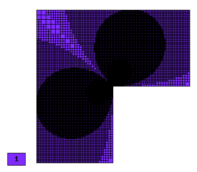

NIST-02 (Reentrant Corner)
--------------------------

**Git reference:** Benchmark `nist-02 <http://git.hpfem.org/hermes.git/tree/HEAD:/hermes2d/benchmarks/nist-02>`_.

This is a reentrant corner problem causing a singularity in the solution. 

Model problem
~~~~~~~~~~~~~

Equation solved: Laplace equation 

.. math::
    :label: NIST-2

       -\Delta u = 0.

Domain of interest: $(-1, 1)^2$ with a section removed from the clockwise side of the positive $x$ axis.

Boundary conditions: Dirichlet, given by exact solution.

Exact solution
~~~~~~~~~~~~~~

.. math::

    u(x, y) = r^{\alpha}\sin(\alpha \theta)

where $\alpha = \pi / \omega$, $r = \sqrt{x^2+y^2}$, and $\theta = tan^{-1}(y/x)$. Here $\omega$ determines 
the angle of the re-entrant corner. 

Material parameters
~~~~~~~~~~~~~~~~~~~
This benchmark has four different versions, we use the global variable PARAM (below) to switch among them.

::

    int PARAM = 1;     // PARAM determines which parameter values you wish to use for the strength of the singularity in
                       // the current (nist-2) Reentrant Corner problem.
                       // PARAM      strength         OMEGA            ALPHA
                       // 0:            1             5*Pi/4           4/5
                       // 1:            2             3*Pi/2           2/3
                       // 2:            3             7*Pi/4           4/7
                       // 3:            4             2*Pi             1/2

Sample solution
~~~~~~~~~~~~~~~

Solution for $\omega = 3\pi / 2$:

.. image:: nist-02/solution.png
   :align: center
   :width: 600
   :height: 400
   :alt: Solution.

Comparison of h-FEM (p=1), h-FEM (p=2) and hp-FEM with anisotropic refinements
~~~~~~~~~~~~~~~~~~~~~~~~~~~~~~~~~~~~~~~~~~~~~~~~~~~~~~~~~~~~~~~~~~~~~~~~~~~~~~

Final mesh (h-FEM, p=1, anisotropic refinements):

Final mesh (h-FEM, p=2, anisotropic refinements):

.. image:: nist-02/mesh_h2_aniso.png
   :align: center
   :width: 450
   :alt: Final mesh.

Final mesh (hp-FEM, h-anisotropic refinements):

.. image:: nist-02/mesh_hp_anisoh.png
   :align: center
   :width: 450
   :alt: Final mesh.

DOF convergence graphs:

.. image:: nist-02/conv_dof_aniso.png
   :align: center
   :width: 600
   :height: 400
   :alt: DOF convergence graph.

CPU convergence graphs:

.. image:: nist-02/conv_cpu_aniso.png
   :align: center
   :width: 600
   :height: 400
   :alt: CPU convergence graph.

hp-FEM with iso, h-aniso and hp-aniso refinements
~~~~~~~~~~~~~~~~~~~~~~~~~~~~~~~~~~~~~~~~~~~~~~~~~

Final mesh (hp-FEM, isotropic refinements):

.. image:: nist-02/mesh_hp_iso.png
   :align: center
   :width: 450
   :alt: Final mesh.

Final mesh (hp-FEM, h-anisotropic refinements):

.. image:: nist-02/mesh_hp_anisoh.png
   :align: center
   :width: 450
   :alt: Final mesh.

Final mesh (hp-FEM, hp-anisotropic refinements):

.. image:: nist-02/mesh_hp_aniso.png
   :align: center
   :width: 450
   :alt: Final mesh.

DOF convergence graphs:

.. image:: nist-02/conv_dof_hp.png
   :align: center
   :width: 600
   :height: 400
   :alt: DOF convergence graph.

CPU convergence graphs:

.. image:: nist-02/conv_cpu_hp.png
   :align: center
   :width: 600
   :height: 400
   :alt: CPU convergence graph.

