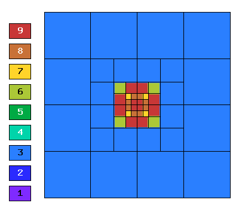

NIST-04 (Peak)
------------------

**Git reference:** Benchmark `nist-04 <http://git.hpfem.org/hermes.git/tree/HEAD:/hermes2d/benchmarks/nist-04>`_.

This problem has an exponential peak in the interior of the domain. 

Model problem
~~~~~~~~~~~~~

Equation solved: Poisson equation 

.. math::
    :label: Poisson

       -\Delta u = f.

Domain of interest: Unit Square $(0, 1)^2$.

Boundary conditions: Dirichlet, given by exact solution.

Exact solution
~~~~~~~~~~~~~~

.. math::

    u(x,y) = e^{-\alpha ((x - x_{loc})^{2} + (y - y_{loc})^{2})}

where $(x_{loc}, y_{loc})$ is the location of the peak, and 
$\alpha$ determines the strength of the peak. 

Right-hand side: Obtained by inserting the exact solution into the latter equation.
The corresponding code snippet is shown below::

    {
    public:
      CustomRightHandSide(double alpha, double x_loc, double y_loc)
        : DefaultNonConstRightHandSide(), alpha(alpha), x_loc(x_loc), y_loc(y_loc) {};

      virtual double value(double x, double y) const {
        double a_P = (-alpha * pow((x - x_loc), 2) - alpha * pow((y - y_loc), 2));

        return -(4 * exp(a_P) * alpha * (alpha * (x - x_loc) * (x - x_loc)
                                      + alpha * (y - y_loc) * (y - y_loc) - 1));
    }

Sample solution
~~~~~~~~~~~~~~~

Solution for $\alpha = 1000$, $(x_{loc}, y_{loc}) = (0.5, 0.5)$:

.. image:: nist-04/solution.png
   :align: center
   :width: 600
   :height: 400
   :alt: Solution.

Comparison of h-FEM (p=1), h-FEM (p=2) and hp-FEM with anisotropic refinements
~~~~~~~~~~~~~~~~~~~~~~~~~~~~~~~~~~~~~~~~~~~~~~~~~~~~~~~~~~~~~~~~~~~~~~~~~~~~~~

Final mesh (h-FEM, p=1, anisotropic refinements):

.. image:: nist-04/mesh_h1_aniso.png
   :align: center
   :width: 450
   :alt: Final mesh.

Final mesh (h-FEM, p=2, anisotropic refinements):

.. image:: nist-04/mesh_h2_aniso.png
   :align: center
   :width: 450
   :alt: Final mesh.

Final mesh (hp-FEM, h-anisotropic refinements):

.. image:: nist-04/mesh_hp_anisoh.png
   :align: center
   :width: 450
   :alt: Final mesh.

DOF convergence graphs:

.. image:: nist-04/conv_dof_aniso.png
   :align: center
   :width: 600
   :height: 400
   :alt: DOF convergence graph.

CPU convergence graphs:

.. image:: nist-04/conv_cpu_aniso.png
   :align: center
   :width: 600
   :height: 400
   :alt: CPU convergence graph.

hp-FEM with iso, h-aniso and hp-aniso refinements
~~~~~~~~~~~~~~~~~~~~~~~~~~~~~~~~~~~~~~~~~~~~~~~~~

Final mesh (hp-FEM, isotropic refinements):

Final mesh (hp-FEM, h-anisotropic refinements):

.. image:: nist-04/mesh_hp_anisoh.png
   :align: center
   :width: 450
   :alt: Final mesh.

Final mesh (hp-FEM, hp-anisotropic refinements):

.. image:: nist-04/mesh_hp_aniso.png
   :align: center
   :width: 450
   :alt: Final mesh.

DOF convergence graphs:

.. image:: nist-04/conv_dof_hp.png
   :align: center
   :width: 600
   :height: 400
   :alt: DOF convergence graph.

CPU convergence graphs:

.. image:: nist-04/conv_cpu_hp.png
   :align: center
   :width: 600
   :height: 400
   :alt: CPU convergence graph.

