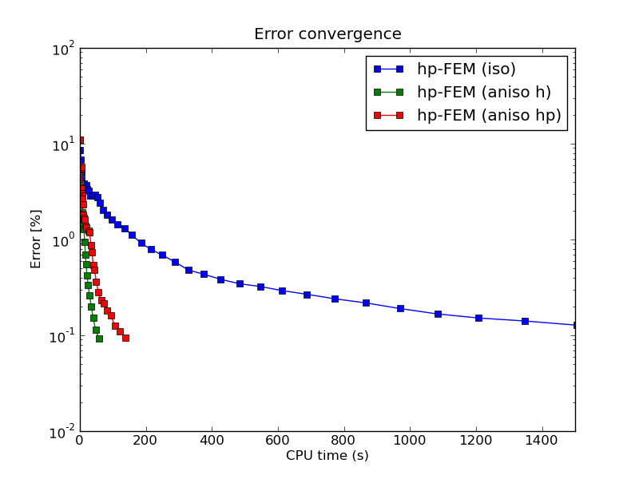

NIST-05 (Battery)
------------------

**Git reference:** Benchmark `nist-05 <http://git.hpfem.org/hermes.git/tree/HEAD:/hermes2d/benchmarks/nist-05>`_.

Model problem
~~~~~~~~~~~~~

This is a heat conduction problem in a nonhomogeneous material. It comes with an anisotropic solution and
multiple singularities. The following sketch shows the geometry and different materials:

.. image:: nist-05/battery_domain.png
   :align: center
   :width: 250
   :alt: Domain.

Equation solved: 

.. math::

    -\frac{\partial }{\partial x}\left(p(x, y)\frac{\partial u}{\partial x}\right)
    -\frac{\partial }{\partial y}\left(q(x, y)\frac{\partial u}{\partial y}\right) = f(x, y).

Boundary conditions are zero Neumann on left edge, Newton on the rest of the boundary:

.. math::

    p(x, y)\frac{\partial u}{\partial x}\nu_1 + q(x, y)\frac{\partial u}{\partial y}\nu_2 = g_{left}(x, y) \ \mbox{on} \  \Gamma_{left},

.. math::

    p(x, y)\frac{\partial u}{\partial x}\nu_1 + q(x, y)\frac{\partial u}{\partial y}\nu_2 + c(x, y)u = g_{right}(x, y) \ \mbox{on} \ \Gamma_{right},

.. math::

    p(x, y)\frac{\partial u}{\partial x}\nu_1 + q(x, y)\frac{\partial u}{\partial y}\nu_2 + c(x, y)u = g_{top}(x, y) \ \mbox{on} \ \Gamma_{top},

.. math::

    p(x, y)\frac{\partial u}{\partial x}\nu_1 + q(x, y)\frac{\partial u}{\partial y}\nu_2 + c(x, y)u = g_{bottom}(x, y) \ \mbox{on} \ \Gamma_{bottom}.

Here $p(x, y)$, $q(x, y)$ and the right hand side $f(x, y)$ are constant coefficient functions in different materials.

Domain of interest: Square $(0, 8.4) \times (0, 24)$.

Exact solution: Unknown. 

Material parameters
~~~~~~~~~~~~~~~~~~~

::

    // Problem parameters.
    const int OMEGA_1 = 1;
    const int OMEGA_2 = 2;
    const int OMEGA_3 = 3;
    const int OMEGA_4 = 4;
    const int OMEGA_5 = 5;

    const double P_1 = 25.0;
    const double P_2 = 7.0;
    const double P_3 = 5.0;
    const double P_4 = 0.2;
    const double P_5 = 0.05;

    const double Q_1 = 25.0;
    const double Q_2 = 0.8;
    const double Q_3 = 0.0001;
    const double Q_4 = 0.2;
    const double Q_5 = 0.05;

    const double F_1 = 0.0;
    const double F_2 = 1.0;
    const double F_3 = 1.0;
    const double F_4 = 0.0;
    const double F_5 = 0.0;

Boundary condition parameters
~~~~~~~~~~~~~~~~~~~~~~~~~~~~~

::

    // Boundary condition coefficients for the four sides.
    const double C_LEFT = 0.0;
    const double C_TOP = 1.0;
    const double C_RIGHT = 2.0;
    const double C_BOTTOM = 3.0;

    const double G_N_LEFT = 0.0;
    const double G_N_TOP = 3.0;
    const double G_N_RIGHT = 2.0;
    const double G_N_BOTTOM = 1.0;

Weak forms - bilinear volumetric
~~~~~~~~~~~~~~~~~~~~~~~~~~~~~~~~

Here biformN() refers to the material N::

    // Weak forms
    template<typename Real, typename Scalar>
    Scalar biform1(int n, double *wt, Func<Real> *u_ext[], Func<Real> *u, Func<Real> *v,
               Geom<Real> *e, ExtData<Scalar> *ext)
    {
      Scalar result = 0;
      for (int i = 0; i < n; i++)
        result += wt[i] * (P_1 * u->dx[i] * v->dx[i] + Q_1 * u->dy[i] * v->dy[i]);
      return result;
    }

    template<typename Real, typename Scalar>
    Scalar biform2(int n, double *wt, Func<Real> *u_ext[], Func<Real> *u, Func<Real> *v,
                   Geom<Real> *e, ExtData<Scalar> *ext)
    {
      Scalar result = 0;
      for (int i = 0; i < n; i++)
        result += wt[i] * (P_2 * u->dx[i] * v->dx[i] + Q_2 * u->dy[i] * v->dy[i]);
      return result;
    }

    template<typename Real, typename Scalar>
    Scalar biform3(int n, double *wt, Func<Real> *u_ext[], Func<Real> *u, Func<Real> *v,
                   Geom<Real> *e, ExtData<Scalar> *ext)
    {
      Scalar result = 0;
      for (int i = 0; i < n; i++)
        result += wt[i] * (P_3 * u->dx[i] * v->dx[i] + Q_3 * u->dy[i] * v->dy[i]);
      return result;
    }

    template<typename Real, typename Scalar>
    Scalar biform4(int n, double *wt, Func<Real> *u_ext[], Func<Real> *u, Func<Real> *v,
                   Geom<Real> *e, ExtData<Scalar> *ext)
    {
      Scalar result = 0;
      for (int i = 0; i < n; i++)
        result += wt[i] * (P_4 * u->dx[i] * v->dx[i] + Q_4 * u->dy[i] * v->dy[i]);
      return result;
    }

    template<typename Real, typename Scalar>
    Scalar biform5(int n, double *wt, Func<Real> *u_ext[], Func<Real> *u, Func<Real> *v,
                   Geom<Real> *e, ExtData<Scalar> *ext)
    {
      Scalar result = 0;
      for (int i = 0; i < n; i++)
        result += wt[i] * (P_5 * u->dx[i] * v->dx[i] + Q_5 * u->dy[i] * v->dy[i]);
      return result;
    }

Weak forms - linear volumetric
~~~~~~~~~~~~~~~~~~~~~~~~~~~~~~

::

    template<typename Real, typename Scalar>
    Scalar linear_form_1(int n, double *wt, Func<Scalar> *u_ext[], Func<Real> *v, Geom<Real> *e, ExtData<Scalar> *ext)
    {
      return F_1 * int_v<Real, Scalar>(n, wt, v);
    }

    template<typename Real, typename Scalar>
    Scalar linear_form_2(int n, double *wt, Func<Scalar> *u_ext[], Func<Real> *v, Geom<Real> *e, ExtData<Scalar> *ext)
    {
      return F_2 * int_v<Real, Scalar>(n, wt, v);
    }

    template<typename Real, typename Scalar>
    Scalar linear_form_3(int n, double *wt, Func<Scalar> *u_ext[], Func<Real> *v, Geom<Real> *e, ExtData<Scalar> *ext)
    {
      return F_3 * int_v<Real, Scalar>(n, wt, v);
    }

    template<typename Real, typename Scalar>
    Scalar linear_form_4(int n, double *wt, Func<Scalar> *u_ext[], Func<Real> *v, Geom<Real> *e, ExtData<Scalar> *ext)
    {
      return F_4 * int_v<Real, Scalar>(n, wt, v);
    }

    template<typename Real, typename Scalar>
    Scalar linear_form_5(int n, double *wt, Func<Scalar> *u_ext[], Func<Real> *v, Geom<Real> *e, ExtData<Scalar> *ext)
    {
      return F_5 * int_v<Real, Scalar>(n, wt, v);
    }

Weak forms - bilinear surface
~~~~~~~~~~~~~~~~~~~~~~~~~~~~~

There is one surface bilinear form per Newton boundary, their names should be 
self-explanatory::

    template<typename Real, typename Scalar>
    Scalar bilinear_form_surf_right(int n, double *wt, Func<Real> *u_ext[], Func<Real> *u, Func<Real> *v,
                                    Geom<Real> *e, ExtData<Scalar> *ext)
    {
      Scalar result = 0;
      for (int i = 0; i < n; i++)
      {
        double P = 25.0;
        double Q = 25.0;
        result += wt[i] * (P * u->dx[i] * v->val[i] - Q * u->dy[i] * v->val[i] + C_RIGHT * u->val[i] * v->val[i]);
      }
      return result;
    }

    template<typename Real, typename Scalar>
    Scalar bilinear_form_surf_top(int n, double *wt, Func<Real> *u_ext[], Func<Real> *u, Func<Real> *v,
                                  Geom<Real> *e, ExtData<Scalar> *ext)
    {
      Scalar result = 0;
      for (int i = 0; i < n; i++)
      {
        double P = 25.0;
        double Q = 25.0;
        result += wt[i] * (P * u->dx[i] * v->val[i] - Q * u->dy[i] * v->val[i] + C_TOP * u->val[i] * v->val[i]);
      }
      return result;
    }

    template<typename Real, typename Scalar>
    Scalar bilinear_form_surf_bottom(int n, double *wt, Func<Real> *u_ext[], Func<Real> *u, Func<Real> *v,
                                     Geom<Real> *e, ExtData<Scalar> *ext)
    {
      Scalar result = 0;
      for (int i = 0; i < n; i++)
      {
        double P = 25.0;
        double Q = 25.0;
        result += wt[i] * (P * u->dx[i] * v->val[i] - Q * u->dy[i] * v->val[i] + C_BOTTOM * u->val[i] * v->val[i]);
      }
      return result;
    }

Weak forms - linear surface
~~~~~~~~~~~~~~~~~~~~~~~~~~~

::

    template<typename Real, typename Scalar>
    Scalar linear_form_surf_left(int n, double *wt, Func<Real> *u_ext[], Func<Real> *v, Geom<Real> *e, ExtData<Scalar> *ext)
    {
      return G_N_LEFT * int_v<Real, Scalar>(n, wt, v);
    }

    template<typename Real, typename Scalar>
    Scalar linear_form_surf_right(int n, double *wt, Func<Real> *u_ext[], Func<Real> *v, Geom<Real> *e, ExtData<Scalar> *ext)
    {
      return G_N_RIGHT * int_v<Real, Scalar>(n, wt, v);
    }

    template<typename Real, typename Scalar>
    Scalar linear_form_surf_top(int n, double *wt, Func<Real> *u_ext[], Func<Real> *v, Geom<Real> *e, ExtData<Scalar> *ext)
    {
      return G_N_TOP * int_v<Real, Scalar>(n, wt, v);
    }

    template<typename Real, typename Scalar>
    Scalar linear_form_surf_bottom(int n, double *wt, Func<Real> *u_ext[], Func<Real> *v, Geom<Real> *e, ExtData<Scalar> *ext)
    {
      return G_N_BOTTOM * int_v<Real, Scalar>(n, wt, v);
    }

Sample solution
~~~~~~~~~~~~~~~

.. image:: nist-05/solution-3d.png
   :align: center
   :width: 600
   :height: 400
   :alt: Solution.

Comparison of h-FEM (p=1), h-FEM (p=2) and hp-FEM with anisotropic refinements
~~~~~~~~~~~~~~~~~~~~~~~~~~~~~~~~~~~~~~~~~~~~~~~~~~~~~~~~~~~~~~~~~~~~~~~~~~~~~~

Final mesh (h-FEM, p=1, anisotropic refinements):

.. image:: nist-05/mesh_h1_aniso.png
   :align: center
   :width: 450
   :alt: Final mesh.

Final mesh (h-FEM, p=2, anisotropic refinements):

.. image:: nist-05/mesh_h2_aniso.png
   :align: center
   :width: 450
   :alt: Final mesh.

Final mesh (hp-FEM, h-anisotropic refinements):

.. image:: nist-05/mesh_hp_anisoh.png
   :align: center
   :width: 450
   :alt: Final mesh.

DOF convergence graphs:

.. image:: nist-05/conv_dof_aniso.png
   :align: center
   :width: 600
   :height: 400
   :alt: DOF convergence graph.

CPU convergence graphs:

.. image:: nist-05/conv_cpu_aniso.png
   :align: center
   :width: 600
   :height: 400
   :alt: CPU convergence graph.

hp-FEM with iso, h-aniso and hp-aniso refinements
~~~~~~~~~~~~~~~~~~~~~~~~~~~~~~~~~~~~~~~~~~~~~~~~~

Final mesh (hp-FEM, isotropic refinements):

.. image:: nist-05/mesh_hp_iso.png
   :align: center
   :width: 450
   :alt: Final mesh.

Final mesh (hp-FEM, h-anisotropic refinements):

.. image:: nist-05/mesh_hp_anisoh.png
   :align: center
   :width: 450
   :alt: Final mesh.

Final mesh (hp-FEM, hp-anisotropic refinements):

.. image:: nist-05/mesh_hp_aniso.png
   :align: center
   :width: 450
   :alt: Final mesh.

DOF convergence graphs:

.. image:: nist-05/conv_dof_hp.png
   :align: center
   :width: 600
   :height: 400
   :alt: DOF convergence graph.

CPU convergence graphs:

