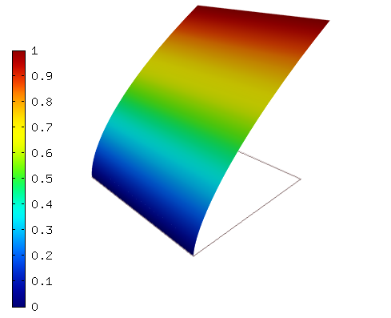
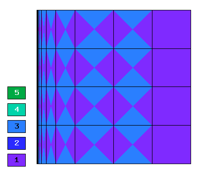
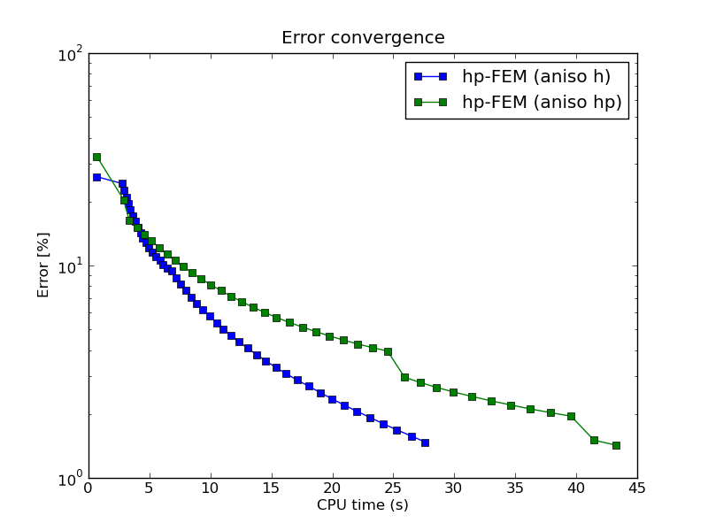

NIST-07 (Boundary Line Singularity)
------------------

**Git reference:** Benchmark `nist-07 <http://git.hpfem.org/hermes.git/tree/HEAD:/hermes2d/benchmarks/nist-07>`_.

This is a singularity problem with a solution that is singular along the left boundary.

Model problem
~~~~~~~~~~~~~

Equation solved: Poisson equation 

.. math::
    :label: line-sing

       -\Delta u = f.

Domain of interest: Square $(0, 1)^2$.

Boundary conditions: Dirichlet given by the exact solution.

Exact solution
~~~~~~~~~~~~~~

.. math::

    u(x,y) = x^{\alpha} 

where $\alpha \geq 0.5$ determines the strength of the singularity.

Right-hand side: Obtained by inserting the exact solution into the equation.
The corresponding code snippet is shown below::

    template<typename Real>
    Real rhs(Real x, Real y)
    {
      return (-0.24/(pow(x, 1.4)));
    }

Sample solution
~~~~~~~~~~~~~~~

Solution for $\alpha = 0.6$:

Comparison of h-FEM (p=1), h-FEM (p=2) and hp-FEM with anisotropic refinements
~~~~~~~~~~~~~~~~~~~~~~~~~~~~~~~~~~~~~~~~~~~~~~~~~~~~~~~~~~~~~~~~~~~~~~~~~~~~~~

Final mesh (h-FEM, p=1, anisotropic refinements):

.. image:: nist-07/mesh_h1_aniso.png
   :align: center
   :width: 450
   :alt: Final mesh.

Final mesh (h-FEM, p=2, anisotropic refinements):

.. image:: nist-07/mesh_h2_aniso.png
   :align: center
   :width: 450
   :alt: Final mesh.

Final mesh (hp-FEM, h-anisotropic refinements):

.. image:: nist-07/mesh_hp_anisoh.png
   :align: center
   :width: 450
   :alt: Final mesh.

DOF convergence graphs:

.. image:: nist-07/conv_dof_aniso.png
   :align: center
   :width: 600
   :height: 400
   :alt: DOF convergence graph.

CPU convergence graphs:

.. image:: nist-07/conv_cpu_aniso.png
   :align: center
   :width: 600
   :height: 400
   :alt: CPU convergence graph.

hp-FEM with h-aniso and hp-aniso refinements
~~~~~~~~~~~~~~~~~~~~~~~~~~~~~~~~~~~~~~~~~~~~~~~~~

Final mesh (hp-FEM, h-anisotropic refinements):

.. image:: nist-07/mesh_hp_anisoh.png
   :align: center
   :width: 450
   :alt: Final mesh.

Final mesh (hp-FEM, hp-anisotropic refinements):

DOF convergence graphs:

.. image:: nist-07/conv_dof_hp.png
   :align: center
   :width: 600
   :height: 400
   :alt: DOF convergence graph.

CPU convergence graphs:

