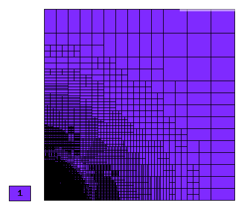
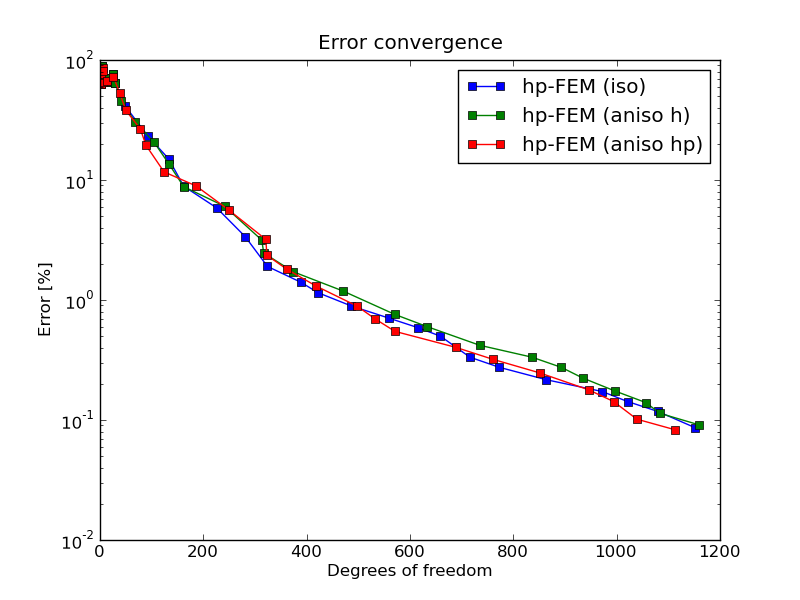

NIST-08 (Oscillatory)
---------------------

**Git reference:** Benchmark `nist-08 <http://git.hpfem.org/hermes.git/tree/HEAD:/hermes2d/benchmarks/nist-08>`_.

This problem is inspired by the wave function that satisfies a Shrodinger equation model of two
interacting atoms. It is highly oscillatory near the origin, with the wavelength decreasing closer
to the origin. 

Model problem
~~~~~~~~~~~~~

Equation solved: Hemholtz equation

.. math::

       -\nabla^{2} u - \frac{1}{(\alpha + r)^{4}} u = f.

where $r = \sqrt{x^{2} + y^{2}}$. The number of oscillations, $N$, is determined by the parameter $\alpha = \frac{1}{N \pi}$ 

Domain of interest: Unit Square $(0, 1)^2$.

Boundary conditions: Dirichlet, given by exact solution.

Exact solution
~~~~~~~~~~~~~~

.. math::

    u(x,y) = sin(\frac{1}{\alpha + r})

Right-hand side: Obtained by inserting the exact solution into the equation.
The corresponding code snippet is shown below::

    {
    public:
      CustomRightHandSide(double alpha) : DefaultNonConstRightHandSide(), alpha(alpha) {};

      virtual scalar value(double x, double y) const {
          return -sin(1.0/(alpha + pow((pow(x,2) + pow(y,2)),(1.0/2.0))))/pow((alpha
                 + pow((pow(x,2) + pow(y,2)),(1.0/2.0))),4)
                 + 2*cos(1.0/(alpha + pow((pow(x,2) + pow(y,2)),(1.0/2.0))))/(pow((alpha
                 + pow((pow(x,2) + pow(y,2)),(1.0/2.0))),2)*pow((pow(x,2) + pow(y,2)),(1.0/2.0)))
                 + pow(x,2)*sin(1.0/(alpha + pow((pow(x,2) + pow(y,2)),(1.0/2.0))))/(pow((alpha
                 + pow((pow(x,2) + pow(y,2)),(1.0/2.0))),4)*(pow(x,2) + pow(y,2)))
                 + pow(y,2)*sin(1.0/(alpha + pow((pow(x,2) + pow(y,2)),(1.0/2.0))))/(pow((alpha
                 + pow((pow(x,2) + pow(y,2)),(1.0/2.0))),4)*(pow(x,2) + pow(y,2)))
                 - pow(x,2)*cos(1.0/(alpha + pow((pow(x,2) + pow(y,2)),(1.0/2.0))))/(pow((alpha
                 + pow((pow(x,2) + pow(y,2)),(1.0/2.0))),2)*pow((pow(x,2) + pow(y,2)),(3.0/2.0)))
                 - pow(y,2)*cos(1.0/(alpha + pow((pow(x,2) + pow(y,2)),(1.0/2.0))))/(pow((alpha
                 + pow((pow(x,2) + pow(y,2)),(1.0/2.0))),2)*pow((pow(x,2) + pow(y,2)),(3.0/2.0)))
                 - 2*pow(x,2)*cos(1.0/(alpha + pow((pow(x,2) + pow(y,2)),(1.0/2.0))))/(pow((alpha
                 + pow((pow(x,2) + pow(y,2)),(1.0/2.0))),3)*(pow(x,2) + pow(y,2)))
                 - 2*pow(y,2)*cos(1.0/(alpha + pow((pow(x,2) + pow(y,2)),(1.0/2.0))))/(pow((alpha
                 + pow((pow(x,2) + pow(y,2)),(1.0/2.0))),3)*(pow(x,2) + pow(y,2)));
      }

Sample solution
~~~~~~~~~~~~~~~

Solution for $\alpha = \frac{1}{10 \pi}$:

.. image:: nist-08/solution.png
   :align: center
   :width: 600
   :height: 400
   :alt: Solution.

Comparison of h-FEM (p=1), h-FEM (p=2) and hp-FEM with anisotropic refinements
~~~~~~~~~~~~~~~~~~~~~~~~~~~~~~~~~~~~~~~~~~~~~~~~~~~~~~~~~~~~~~~~~~~~~~~~~~~~~~

Final mesh (h-FEM, p=1, anisotropic refinements):

Final mesh (h-FEM, p=2, anisotropic refinements):

.. image:: nist-08/mesh_h2_aniso.png
   :align: center
   :width: 450
   :alt: Final mesh.

Final mesh (hp-FEM, h-anisotropic refinements):

.. image:: nist-08/mesh_hp_anisoh.png
   :align: center
   :width: 450
   :alt: Final mesh.

DOF convergence graphs:

.. image:: nist-08/conv_dof_aniso.png
   :align: center
   :width: 600
   :height: 400
   :alt: DOF convergence graph.

CPU convergence graphs:

.. image:: nist-08/conv_cpu_aniso.png
   :align: center
   :width: 600
   :height: 400
   :alt: CPU convergence graph.

hp-FEM with iso, h-aniso and hp-aniso refinements
~~~~~~~~~~~~~~~~~~~~~~~~~~~~~~~~~~~~~~~~~~~~~~~~~

Final mesh (hp-FEM, isotropic refinements):

.. image:: nist-08/mesh_hp_iso.png
   :align: center
   :width: 450
   :alt: Final mesh.

Final mesh (hp-FEM, h-anisotropic refinements):

.. image:: nist-08/mesh_hp_anisoh.png
   :align: center
   :width: 450
   :alt: Final mesh.

Final mesh (hp-FEM, hp-anisotropic refinements):

.. image:: nist-08/mesh_hp_aniso.png
   :align: center
   :width: 450
   :alt: Final mesh.

DOF convergence graphs:

CPU convergence graphs:

.. image:: nist-08/conv_cpu_hp.png
   :align: center
   :width: 600
   :height: 400
   :alt: CPU convergence graph.

