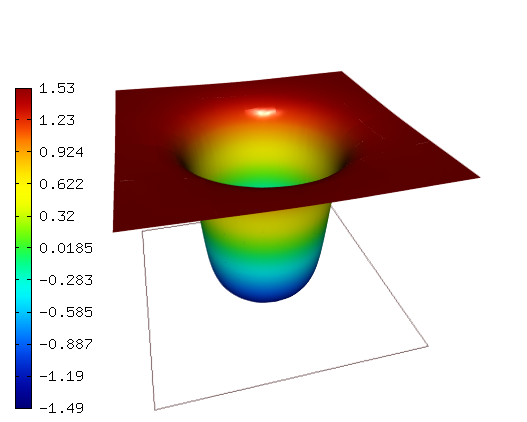

NIST-09 (Wave Front)
------------------

**Git reference:** Benchmark `nist-09 <http://git.hpfem.org/hermes.git/tree/HEAD:/hermes2d/benchmarks/nist-09>`_.

This is a commonly used example for testing the performance of adaptive refinement algorithms using a wave front and a singularity.

Model problem
~~~~~~~~~~~~~

Equation solved: Poisson equation 

.. math::
    :label: nist-9

       -\Delta u = f.

Domain of interest: Square $(0, 1)^2$ with a section removed from the clockwise side of positive $x$ axis.

Boundary conditions: Dirichlet given by the exact solution.

Exact solution
~~~~~~~~~~~~~~

.. math::

    u(x, y) = tan^{-1}(\alpha (r - r_{0}))

where $r = \sqrt{(x - x_{loc})^{2} + (y - y_{loc})^{2}}$, here $(x_{loc}, y_{loc})$ is the center of the circular wave front,
$r_{0}$ is the distance from the wave front to the center of the circle, and $\alpha$ gives the steepness of the wave front.

Material parameters
~~~~~~~~~~~~~~~~~~~
This benchmark has four different versions, use the global variable PROB_PARAM below to switch among them.

::

    // PROB_PARAM determines which parameter values you wish to use for the 
    // steepness and location of the wave front. 
    // PROB_PARAM     name         ALPHA    X_LOC   Y_LOC   R_ZERO
    //     0          mild          20      -0.05   -0.05    0.7
    //     1          steep        1000     -0.05   -0.05    0.7
    //     2         asymmetric    1000      1.5     0.25    0.92
    //     3          well          50       0.5     0.5     0.25
    int PROB_PARAM = 3;      

Sample solution
~~~~~~~~~~~~~~~

Solution for $\alpha = 50$, $(x_{loc}, y_{loc}) = (0.5, 0.5)$, $r_{0} = 0.25$:

Comparison of h-FEM (p=1), h-FEM (p=2) and hp-FEM with anisotropic refinements
~~~~~~~~~~~~~~~~~~~~~~~~~~~~~~~~~~~~~~~~~~~~~~~~~~~~~~~~~~~~~~~~~~~~~~~~~~~~~~

Final mesh (h-FEM, p=1, anisotropic refinements):

.. image:: nist-09/mesh_h1_aniso.png
   :align: center
   :width: 450
   :alt: Final mesh.

Final mesh (h-FEM, p=2, anisotropic refinements):

.. image:: nist-09/mesh_h2_aniso.png
   :align: center
   :width: 450
   :alt: Final mesh.

Final mesh (hp-FEM, h-anisotropic refinements):

.. image:: nist-09/mesh_hp_anisoh.png
   :align: center
   :width: 450
   :alt: Final mesh.

DOF convergence graphs:

.. image:: nist-09/conv_dof_aniso.png
   :align: center
   :width: 600
   :height: 400
   :alt: DOF convergence graph.

CPU convergence graphs:

.. image:: nist-09/conv_cpu_aniso.png
   :align: center
   :width: 600
   :height: 400
   :alt: CPU convergence graph.

hp-FEM with iso, h-aniso and hp-aniso refinements
~~~~~~~~~~~~~~~~~~~~~~~~~~~~~~~~~~~~~~~~~~~~~~~~~

Final mesh (hp-FEM, isotropic refinements):

.. image:: nist-09/mesh_hp_iso.png
   :align: center
   :width: 450
   :alt: Final mesh.

Final mesh (hp-FEM, h-anisotropic refinements):

.. image:: nist-09/mesh_hp_anisoh.png
   :align: center
   :width: 450
   :alt: Final mesh.

Final mesh (hp-FEM, hp-anisotropic refinements):

.. image:: nist-09/mesh_hp_aniso.png
   :align: center
   :width: 450
   :alt: Final mesh.

DOF convergence graphs:

.. image:: nist-09/conv_dof_hp.png
   :align: center
   :width: 600
   :height: 400
   :alt: DOF convergence graph.

CPU convergence graphs:

.. image:: nist-09/conv_cpu_hp.png
   :align: center
   :width: 600
   :height: 400
   :alt: CPU convergence graph.

