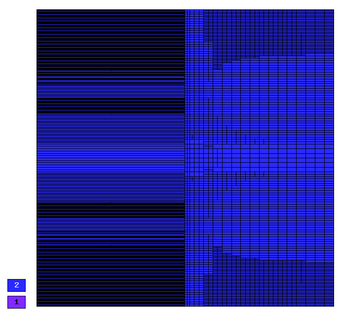
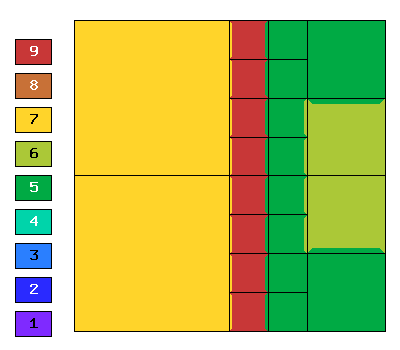
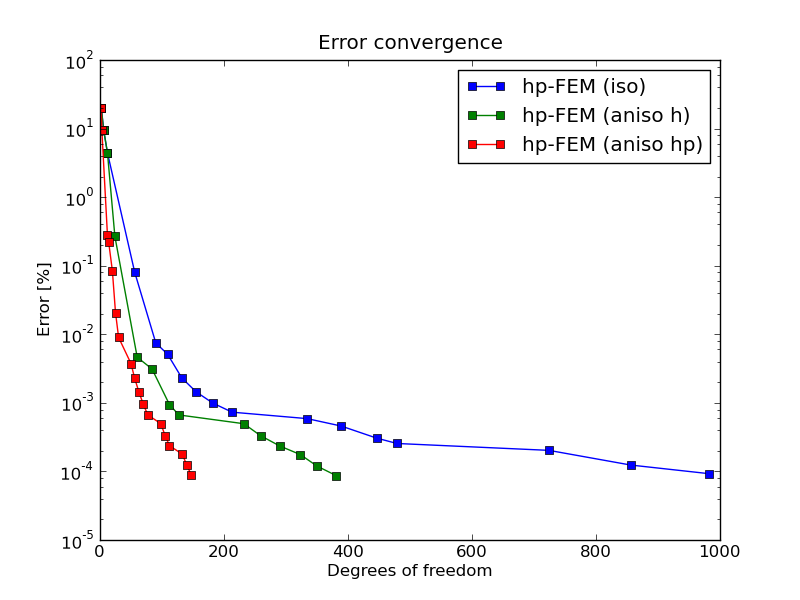

NIST-10 (Interior Line Singularity)
------------------

**Git reference:** Benchmark `nist-10 <http://git.hpfem.org/hermes.git/tree/HEAD:/hermes2d/benchmarks/nist-10>`_.

This is another example with anisotropic solution that is suitable for testing 
anisotropic element refinements.

Model problem
~~~~~~~~~~~~~

Equation solved: Poisson equation 

.. math::
    :label: line-sing

       -\Delta u = f.

Domain of interest: Square $(-1, 1)^2$.

Boundary conditions: Zero Neumann on left edge, Dirichlet given by the 
exact solution on the rest of the boundary.

Exact solution
~~~~~~~~~~~~~~

.. math::

    u(x,y) = \cos(Ky)\ \ \ \mbox{for}\ x \le 0,\\
    u(x,y) = \cos(Ky) + x^{\alpha}\ \ \ \mbox{for}\ x > 0,

where $K$ and $\alpha$ are real constants. 

Right-hand side: Obtained by inserting the exact solution into the equation.
The corresponding code snippet is shown below::

    scalar rhs(scalar x, scalar y)
    {
      if (x < 0) return fn(x, y)*K*K;
      else return fn(x, y)*K*K-ALPHA*(ALPHA-1)*pow(x, ALPHA - 2.) - K*K*pow(x, ALPHA);
    }

Sample solution
~~~~~~~~~~~~~~~

Solution for $K = \pi/2$ and $\alpha = 2.01$:

.. image:: nist-10/solution.png
   :align: center
   :width: 600
   :height: 400
   :alt: Solution.

Comparison of h-FEM (p=1), h-FEM (p=2) and hp-FEM with anisotropic refinements
~~~~~~~~~~~~~~~~~~~~~~~~~~~~~~~~~~~~~~~~~~~~~~~~~~~~~~~~~~~~~~~~~~~~~~~~~~~~~~

Final mesh (h-FEM, p=1, anisotropic refinements):

.. image:: nist-10/mesh_h1_aniso.png
   :align: center
   :width: 450
   :alt: Final mesh.

Final mesh (h-FEM, p=2, anisotropic refinements):

Final mesh (hp-FEM, h-anisotropic refinements):

.. image:: nist-10/mesh_hp_anisoh.png
   :align: center
   :width: 450
   :alt: Final mesh.

DOF convergence graphs:

.. image:: nist-10/conv_dof_aniso.png
   :align: center
   :width: 600
   :height: 400
   :alt: DOF convergence graph.

CPU convergence graphs:

.. image:: nist-10/conv_cpu_aniso.png
   :align: center
   :width: 600
   :height: 400
   :alt: CPU convergence graph.

hp-FEM with iso, h-aniso and hp-aniso refinements
~~~~~~~~~~~~~~~~~~~~~~~~~~~~~~~~~~~~~~~~~~~~~~~~~

Final mesh (hp-FEM, isotropic refinements):

Final mesh (hp-FEM, h-anisotropic refinements):

.. image:: nist-10/mesh_hp_anisoh.png
   :align: center
   :width: 450
   :alt: Final mesh.

Final mesh (hp-FEM, hp-anisotropic refinements):

.. image:: nist-10/mesh_hp_aniso.png
   :align: center
   :width: 450
   :alt: Final mesh.

DOF convergence graphs:

CPU convergence graphs:

.. image:: nist-10/conv_cpu_hp.png
   :align: center
   :width: 600
   :height: 400
   :alt: CPU convergence graph.

