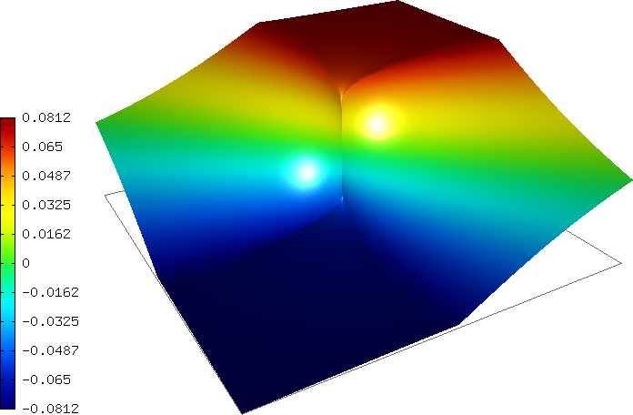
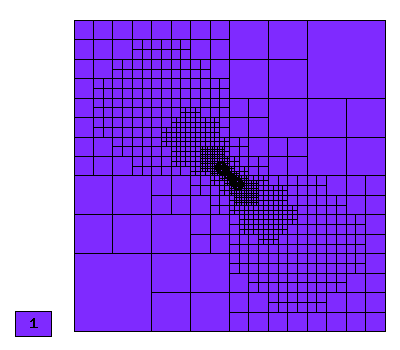
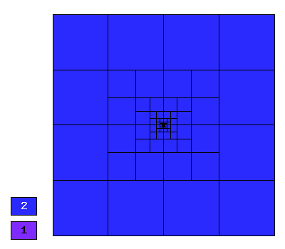

NIST-11 (Intersecting Interfaces)
---------------------------------

**Git reference:** Benchmark `nist-11 <http://git.hpfem.org/hermes.git/tree/HEAD:/hermes2d/benchmarks/nist-11>`_.

The solution to this problem has a discontinuous derivative along the interfaces, and an infinite 
derivative at the origin that posses a challenge to adaptive algorithms. 
 

Model problem
~~~~~~~~~~~~~

Equation solved:

.. math::

       -\nabla \cdot (a(x,y) \nabla u) = 0,

Parameter $a$ is piecewise constant, $a(x,y) = R$ in the first and third quadrants, and $a(x,y) = 1$ 
in the remaining two quadrants. 

Domain of interest: $(-1, 1)^2$.

Boundary conditions: Dirichlet, given by exact solution. 

Exact solution
~~~~~~~~~~~~~~

Quite complicated, see the code below::

    {
    public:
      CustomExactSolution(Mesh* mesh, double sigma, double tau, double rho)
          : ExactSolutionScalar(mesh), sigma(sigma), tau(tau), rho(rho) {
      };

      virtual double value(double x, double y) const {
        double theta = atan2(y,x);
        if (theta < 0) theta = theta + 2.*M_PI;
        double r = sqrt(x*x + y*y);
        double mu;

        if (theta <= M_PI/2.)
        mu = cos((M_PI/2. - sigma)*tau) * cos((theta - M_PI/2. + rho)*tau);
        else if (theta <= M_PI)
        mu = cos(rho*tau) * cos((theta - M_PI + sigma)*tau);
        else if (theta <= 3.*M_PI/2.)
        mu = cos(sigma*tau) * cos((theta - M_PI - rho)*tau);
        else
        mu = cos((M_PI/2. - rho)*tau) * cos((theta - 3.*M_PI/2. - sigma)*tau);

        return pow(r, tau) * mu;
      };

      virtual void derivatives (double x, double y, scalar& dx, scalar& dy) const {
        double theta = atan2(y,x);
        if (theta < 0) theta = theta + 2*M_PI;
        double r = sqrt(x*x + y*y);

        // x-derivative
        if (theta <= M_PI/2.)
        dx = tau*x*pow(r, (2.*(-1 + tau/2.))) * cos((M_PI/2. - sigma)*tau) * cos(tau*(-M_PI/2. + rho + theta))
          + (tau*y*pow(r, tau)*cos((M_PI/2. - sigma)*tau) * sin(tau*(-M_PI/2. + rho + theta))/(r*r));
        else if (theta <= M_PI)
        dx = tau*x * pow(r, (2.*(-1 + tau/2.))) * cos(rho*tau) * cos(tau*(-M_PI + sigma + theta))
          + (tau*y * pow(r, tau) * cos(rho*tau) * sin(tau*(-M_PI + sigma + theta))/(r*r));
        else if (theta <= 3.*M_PI/2.)
        dx = tau*x * pow(r, (2.*(-1 + tau/2.))) * cos(sigma*tau) * cos(tau*(-M_PI - rho + theta))
          + (tau*y * pow(r, tau) * cos(sigma*tau) * sin(tau*(-M_PI - rho + theta))/(r*r));
        else
        dx = tau*x* pow(r, (2*(-1 + tau/2.))) * cos((M_PI/2. - rho)*tau) * cos(tau*(-3.*M_PI/2. - sigma + theta))
          + (tau*y*pow(r, tau) * cos((M_PI/2. - rho)*tau) * sin(tau*(-3.*M_PI/2. - sigma + theta))/(r*r));

        // y-derivative
        if (theta <= M_PI/2.)
        dy = tau*y * pow(r, (2*(-1 + tau/2.))) * cos((M_PI/2. - sigma)*tau) * cos(tau*(-M_PI/2. + rho + theta))
          - (tau * pow(r, tau) * cos((M_PI/2. - sigma)*tau) *sin(tau*(-M_PI/2. + rho + theta))*x/(r*r));
        else if (theta <= M_PI)
        dy = tau*y* pow(r, (2*(-1 + tau/2.))) * cos(rho*tau) * cos(tau*(-M_PI + sigma + theta))
          - (tau * pow(r, tau) * cos(rho*tau) * sin(tau*(-M_PI + sigma + theta))*x/(r*r));
        else if (theta <= 3.*M_PI/2.)
        dy = tau*y * pow(r, (2*(-1 + tau/2.))) * cos(sigma*tau) * cos(tau*(-M_PI - rho + theta))
          - (tau * pow(r, tau) * cos(sigma*tau) * sin(tau*(-M_PI - rho + theta))*x/(r*r));
        else
        dy = tau*y * pow(r, (2*(-1 + tau/2.))) * cos((M_PI/2. - rho)*tau) * cos(tau*(-3.*M_PI/2. - sigma + theta))
           - (tau * pow(r, tau) * cos((M_PI/2. - rho)*tau) * sin(tau*((-3.*M_PI)/2. - sigma + theta))*x/(r*r));

      };

Weak forms
~~~~~~~~~~

::

    {
    public:
      CustomWeakFormPoisson(std::string area_1, double r, std::string area_2) : WeakForm(1)
      {
        add_matrix_form(new DefaultLinearDiffusion(0, 0, area_1, r));
        add_matrix_form(new DefaultLinearDiffusion(0, 0, area_2));
      };
    }

Sample solution
~~~~~~~~~~~~~~~

Comparison of h-FEM (p=1), h-FEM (p=2) and hp-FEM with anisotropic refinements
~~~~~~~~~~~~~~~~~~~~~~~~~~~~~~~~~~~~~~~~~~~~~~~~~~~~~~~~~~~~~~~~~~~~~~~~~~~~~~

Final mesh (h-FEM, p=1, anisotropic refinements):

Final mesh (h-FEM, p=2, anisotropic refinements):

Final mesh (hp-FEM, h-anisotropic refinements):

.. image:: nist-11/mesh_hp_anisoh.png
   :align: center
   :width: 450
   :alt: Final mesh.

DOF convergence graphs:

.. image:: nist-11/conv_dof_aniso.png
   :align: center
   :width: 600
   :height: 400
   :alt: DOF convergence graph.

CPU convergence graphs:

.. image:: nist-11/conv_cpu_aniso.png
   :align: center
   :width: 600
   :height: 400
   :alt: CPU convergence graph.

