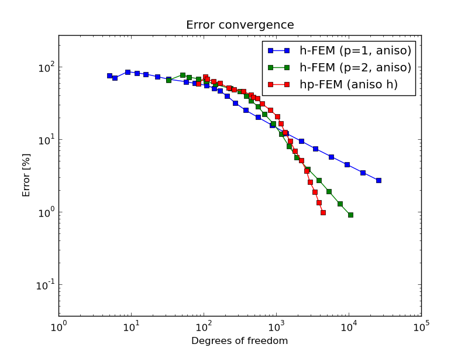
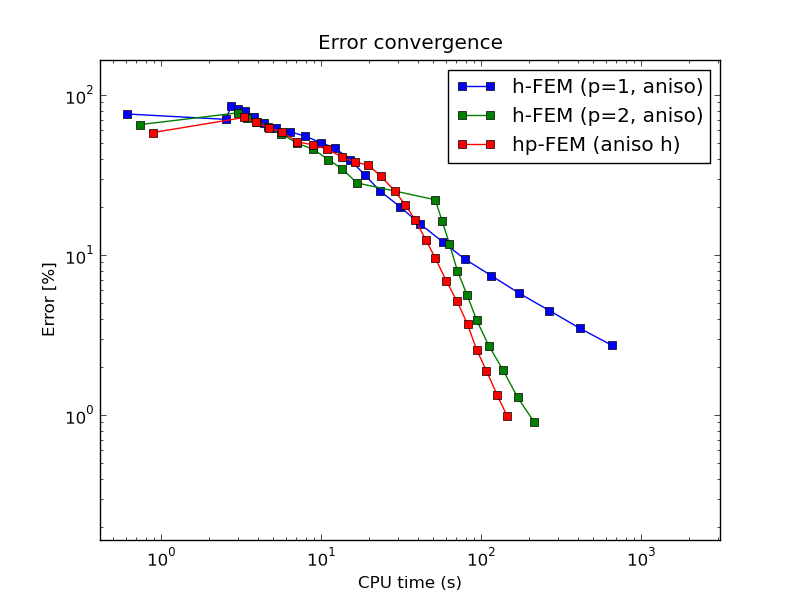
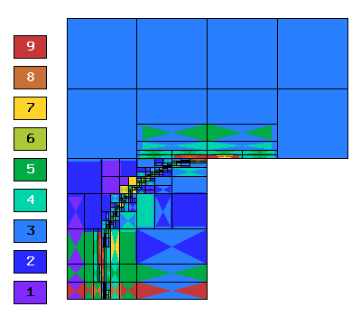
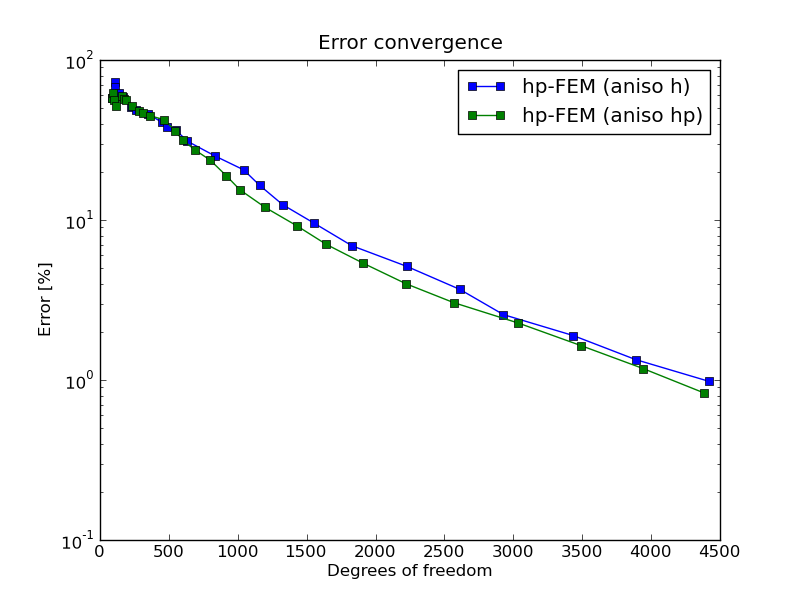

NIST-12 (Multiple Difficulties)
------------------

**Git reference:** Benchmark `nist-12 <http://git.hpfem.org/hermes.git/tree/HEAD:/hermes2d/benchmarks/nist-12>`_.

The solution to this elliptic problems contains four difficulties of different strengths into the same problem
(nist-2, nist-4, nist-6 and nist-9).

Model problem
~~~~~~~~~~~~~

Equation solved:

.. math::
    :label: Poisson

       -\Delta u = f.

Domain of interest: L-shaped domain $(-1,1) \times (-1,1)$ \ $(0,1) \times (-1,0)$.

Right-hand side
~~~~~~~~~~~~~~~

Quite complicated, see the code below::

    // Problem parameters.                      
    const double OMEGA_C = 3.0 * M_PI / 2.0;

    const double X_W = 0.0;
    const double Y_W = -3.0 / 4.0;
    const double R_0 = 3.0 / 4.0;
    const double ALPHA_W = 200.0;

    const double X_P = -sqrt(5.0) / 4.0;
    const double Y_P = -1.0 / 4.0;
    const double ALPHA_P = 1000.0;

    const double EPSILON = 1.0 / 100.0;

    Real a_P = (-ALPHA_P * pow((x - X_P), 2) - ALPHA_P * pow((y - Y_P), 2));

    Real a_W = pow(x - X_W, 2);
    Real b_W = pow(y - Y_W, 2);
    Real c_W = sqrt(a_W + b_W);
    Real d_W = ((ALPHA_W * x - (ALPHA_W * X_W)) * (2 * x - (2 * X_W)));
    Real e_W = ((ALPHA_W * y - (ALPHA_W * Y_W)) * (2 * y - (2 * Y_W)));
    Real f_W = (pow(ALPHA_W * c_W - (ALPHA_W * R_0), 2) + 1.0);
    Real g_W = (ALPHA_W * c_W - (ALPHA_W * R_0));

    return 4 * exp(a_P) * ALPHA_P * (ALPHA_P * (x - X_P) * (x - X_P) + ALPHA_P * (y - Y_P) * (y - Y_P) - 1)
           + ((ALPHA_W/(c_W * f_W)) - (d_W/(2 * pow(a_W + b_W, 1.5) * f_W)) - ((ALPHA_W * d_W * g_W)/((a_W + b_W) * pow(f_W, 2)))
           + (ALPHA_W/(c_W * f_W)) - (e_W/(2 * pow(a_W + b_W, 1.5) * f_W)) - ((ALPHA_W * e_W * g_W)/((a_W + b_W) * pow(f_W, 2))))
           + (1.0 / EPSILON) * (1.0 / EPSILON) * exp(-(1 + y) / EPSILON);

Boundary conditions: Dirichlet given by exact solution. 

Exact solution
~~~~~~~~~~~~~~

.. math::

    u(x,y) =  r^{\alpha_{C} }\sin(\alpha_{C} \theta)
              + e^{-\alpha_{P} ((x - x_{P})^{2} + (y - y_{P})^{2})}
              + tan^{-1}(\alpha_{W} (r_{W} - r_{0}))  
              + e^{-(1 - y) / \epsilon}.

where $\alpha_C = \pi / \omega_C$, $r = \sqrt{x^2+y^2}$ and $\theta = tan^{-1}(y/x)$, here $\omega_C$ determines
the angle of the re-entrant corner. \

$(x_{P}, y_{P})$ is the location of the peak, $\alpha$ determines the strength of the peak. \

$r_{W} = \sqrt{(x - x_{W})^{2} + (y - y_{W})^{2}}$, here $(x_{W}, y_{W})$ is the center of the circular wave front,
$r_{0}$ is the distance from the wave front to the center of the circle, and $\alpha_W$ gives the steepness of the wave front. \

$\epsilon$ determines the strength of the boundary layer, the boundary layer was placed on $y = -1$.

Sample solution
~~~~~~~~~~~~~~~

Solution for $\omega_C = 3 \pi /2$, $(x_{W}, y_{W}) = (0, -3/4)$, $r_{0} = 3/4$, 
$\alpha_{W} = 200$, $(x_{P}, y_{P}) = (\sqrt{5} / 4, -1/4)$, $\epsilon = 1/100$:

.. image:: nist-12/solution.png
   :align: center
   :width: 600
   :alt: Solution.

Comparison of h-FEM (p=1), h-FEM (p=2) and hp-FEM with anisotropic refinements
~~~~~~~~~~~~~~~~~~~~~~~~~~~~~~~~~~~~~~~~~~~~~~~~~~~~~~~~~~~~~~~~~~~~~~~~~~~~~~

Final mesh (h-FEM, p=1, anisotropic refinements):

.. image:: nist-12/mesh_h1_aniso.png
   :align: center
   :width: 450
   :alt: Final mesh.

Final mesh (h-FEM, p=2, anisotropic refinements):

.. image:: nist-12/mesh_h2_aniso.png
   :align: center
   :width: 450
   :alt: Final mesh.

Final mesh (hp-FEM, h-anisotropic refinements):

.. image:: nist-12/mesh_hp_anisoh.png
   :align: center
   :width: 450
   :alt: Final mesh.

DOF convergence graphs:

CPU convergence graphs:

hp-FEM with h-aniso and hp-aniso refinements
~~~~~~~~~~~~~~~~~~~~~~~~~~~~~~~~~~~~~~~~~~~~~~~~~

Final mesh (hp-FEM, h-anisotropic refinements):

.. image:: nist-12/mesh_hp_anisoh.png
   :align: center
   :width: 450
   :alt: Final mesh.

Final mesh (hp-FEM, hp-anisotropic refinements):

DOF convergence graphs:

CPU convergence graphs:

.. image:: nist-12/conv_cpu_hp.png
   :align: center
   :width: 600
   :height: 400
   :alt: CPU convergence graph.

