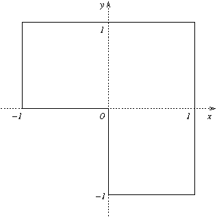
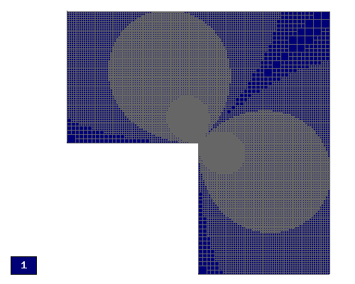
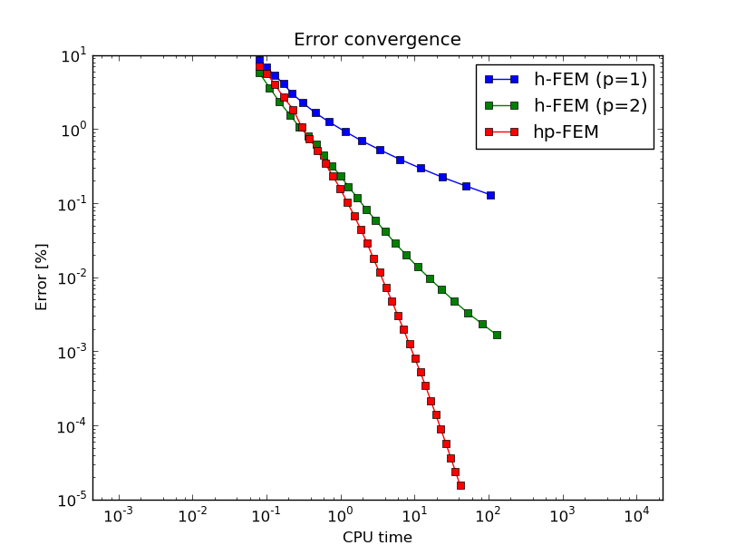

L-Shape (Elliptic)
------------------

**Git reference:** Benchmark `lshape <http://git.hpfem.org/hermes.git/tree/HEAD:/hermes2d/benchmarks/lshape>`_.

This is a standard adaptivity benchmark whose exact solution is smooth but
contains singular gradient in a re-entrant corner. 

Model problem
~~~~~~~~~~~~~

Equation solved: Laplace equation 

.. math::
    :label: lshape

       -\Delta u = 0.

Domain of interest:

Exact solution
~~~~~~~~~~~~~~

.. math::
    :label: lshape-exact

    u(x, y) = r^{2/3}\sin(2a/3 + \pi/3)

where $r(x,y) = \sqrt{x^2 + y^2}$ and $a(x,y) = \mbox{atan}(x/y)$. 

In the code::

    // Exact solution.
    static double fn(double x, double y)
    {
      double r = sqrt(x*x + y*y);
      double a = atan2(x, y);
      return pow(r, 2.0/3.0) * sin(2.0*a/3.0 + M_PI/3);
    }

    static double fndd(double x, double y, double& dx, double& dy)
    {
      double t1 = 2.0/3.0*atan2(x, y) + M_PI/3;
      double t2 = pow(x*x + y*y, 1.0/3.0);
      double t3 = x*x * ((y*y)/(x*x) + 1);
      dx = 2.0/3.0*x*sin(t1)/(t2*t2) + 2.0/3.0*y*t2*cos(t1)/t3;
      dy = 2.0/3.0*y*sin(t1)/(t2*t2) - 2.0/3.0*x*t2*cos(t1)/t3;
      return fn(x, y);
    }

Boundary conditions
~~~~~~~~~~~~~~~~~~~

These are nonconstant Dirichlet, so we first define a callback::  

    // Essential (Dirichlet) boundary condition values.
    scalar essential_bc_values(double x, double y)
    {
      return fn(x, y);
    }

The callback is registered in BCValues::

    // Enter boundary markers.
    BCTypes bc_types;
    bc_types.add_bc_dirichlet(BDY_DIRICHLET);

    // Enter Dirichlet boudnary values.
    BCValues bc_values;
    bc_values.add_function(BDY_DIRICHLET, essential_bc_values);

Weak forms
~~~~~~~~~~

::

    // Bilinear form corresponding to the Laplace equation.
    template<typename Real, typename Scalar>
    Scalar bilinear_form(int n, double *wt, Func<Scalar> *u_ext[], Func<Real> *u, 
                         Func<Real> *v, Geom<Real> *e, ExtData<Scalar> *ext)
    {
      return int_grad_u_grad_v<Real, Scalar>(n, wt, u, v);
    }

Sample solution
~~~~~~~~~~~~~~~

.. image:: benchmark-lshape/sol_3d_view.png
   :align: center
   :width: 600
   :height: 400
   :alt: Solution.

Convergence comparisons
~~~~~~~~~~~~~~~~~~~~~~~

Final mesh (h-FEM with linear elements):

Final mesh (h-FEM with quadratic elements):

.. image:: benchmark-lshape/mesh-h2.png
   :align: center
   :width: 500
   :height: 400
   :alt: Final mesh (h-FEM with quadratic elements).

Final mesh (hp-FEM):

.. image:: benchmark-lshape/mesh-hp.png
   :align: center
   :width: 500
   :height: 400
   :alt: Final mesh (hp-FEM).

DOF convergence graphs:

.. image:: benchmark-lshape/conv_dof.png
   :align: center
   :width: 600
   :height: 400
   :alt: DOF convergence graph.

CPU time convergence graphs:

