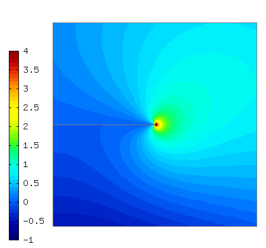
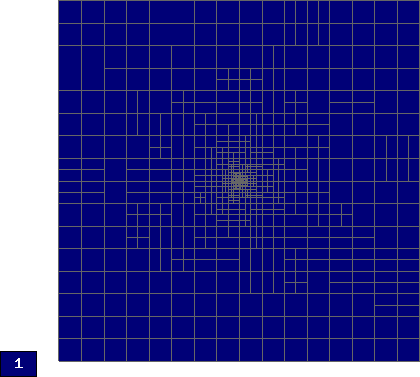
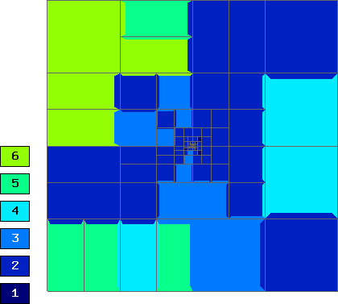

Screen (Maxwell's Equations)
----------------------------

**Git reference:** Benchmark `screen <http://git.hpfem.org/hermes.git/tree/HEAD:/hermes2d/benchmarks/screen>`_.

This example solves time-harmonic Maxwell's equations. It describes an electromagnetic wave that 
hits a thin screen under the angle of 45 degrees, causing a singularity at the tip of the screen.
The strength of the singularity makes this example rather difficult. 

Model problem
~~~~~~~~~~~~~

Equation solved: Time-harmonic Maxwell's equations

.. math::
    :label: screen

    \frac{1}{\mu_r} \nabla \times \nabla \times E - \kappa^2 \epsilon_r E = \Phi.

Domain of interest is the square $(-1,1)^2$ missing the edge that connects the center with 
the midpoint of the left side. It is filled with air:

.. image:: benchmark-screen/domain.png
   :align: center
   :width: 490
   :height: 490
   :alt: Computational domain.

Boundary conditions
~~~~~~~~~~~~~~~~~~~

Tangential component of solution taken from known exact solution 
(essential BC). See the 
`main.cpp <http://git.hpfem.org/hermes.git/blob/HEAD:/hermes2d/benchmarks/screen/main.cpp>`_ file.

Exact solution 
~~~~~~~~~~~~~~

This is rather complicated in this case - please look into the 
corresponding file 
`exact_solution.cpp <http://git.hpfem.org/hermes.git/blob/HEAD:/hermes2d/benchmarks/screen/exact_solution.cpp>`_.

Weak forms
~~~~~~~~~~

::

    template<typename Real, typename Scalar>
    Scalar bilinear_form(int n, double *wt, Func<Scalar> *u_ext[], Func<Real> *u, Func<Real> *v, Geom<Real> *e, ExtData<Scalar> *ext)
    {
      return int_curl_e_curl_f<Real, Scalar>(n, wt, u, v) - int_e_f<Real, Scalar>(n, wt, u, v);
    }

Sample solution
~~~~~~~~~~~~~~~

Real part of $E_1$:

.. image:: benchmark-screen/sol1.png
   :align: center
   :width: 510
   :height: 470
   :alt: Solution.

Real part of $E_2$:

.. image:: benchmark-screen/sol2.png
   :align: center
   :width: 510
   :height: 470
   :alt: Solution.

Imaginary part of $E_1$:

Imaginary part of $E_2$:

.. image:: benchmark-screen/sol4.png
   :align: center
   :width: 510
   :height: 470
   :alt: Solution.

Convergence comparisons
~~~~~~~~~~~~~~~~~~~~~~~

Final mesh (h-FEM with linear elements):

.. image:: benchmark-screen/mesh-h1.png
   :align: center
   :width: 460
   :height: 410
   :alt: Final mesh (h-FEM with linear elements).

Note that the polynomial order indicated corresponds to the tangential components 
of approximation on element interfaces, not to polynomial degrees inside the elements
(those are one higher).

Final mesh (h-FEM with quadratic elements):

Final mesh (hp-FEM):

DOF convergence graphs:

.. image:: benchmark-screen/conv_dof.png
   :align: center
   :width: 600
   :height: 400
   :alt: DOF convergence graph.

CPU time convergence graphs:

.. image:: benchmark-screen/conv_cpu.png
   :align: center
   :width: 600
   :height: 400
   :alt: CPU convergence graph.
   
   
