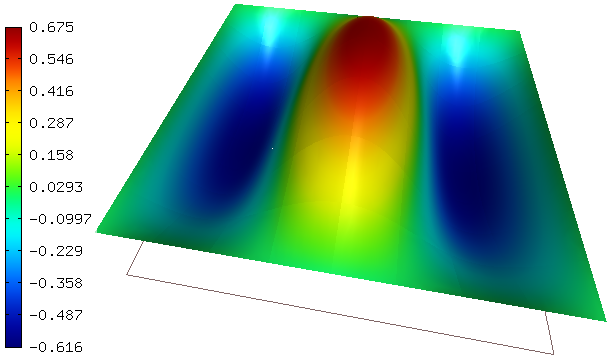

Laplace-Pysparse (01-eigenvalue)
---------------------

**Git reference:** Tutorial example `01-eigenvalue <http://git.hpfem.org/hermes.git/tree/HEAD:/hermes2d/tutorial/P07-eigen/01-eigenvalue>`_. 

This tutorial example shows how to solve generalized eigenproblems using the 
Pysparse library. 

Model problem
~~~~~~~~~~~~~

We will solve a Laplace eigenproblem of the form 

.. math::
    -\Delta u = \lambda u

in a square $\Omega = (0, \pi)^2$ with zero Dirichlet boundary conditions.

Input parameters
~~~~~~~~~~~~~~~~

Most input parameters are self-explanatory, such as::

    const int NUMBER_OF_EIGENVALUES = 50;             // Desired number of eigenvalues.
    const int P_INIT = 4;                             // Uniform polynomial degree of mesh elements.
    const int INIT_REF_NUM = 3;                       // Number of initial mesh refinements.

The parameter TARGET_VALUE is specific to the PySparse library::

    const double TARGET_VALUE = 2.0;                  // PySparse parameter: Eigenvalues in the vicinity of this number will be computed. 

Weak forms
~~~~~~~~~~

The weak forms on the right- and left-hand side are standard::

    template<typename Real, typename Scalar>
    Scalar bilinear_form_left(int n, double *wt, Func<Scalar> *u_ext[], Func<Real> *u, 
                              Func<Real> *v, Geom<Real> *e, ExtData<Scalar> *ext)
    {
      return int_grad_u_grad_v<Real, Scalar>(n, wt, u, v);
    }

    template<typename Real, typename Scalar>
    Scalar bilinear_form_right(int n, double *wt, Func<Scalar> *u_ext[], Func<Real> *u, 
                               Func<Real> *v, Geom<Real> *e, ExtData<Scalar> *ext)
    {
      return int_u_v<Real, Scalar>(n, wt, u, v);
    }

Initialization and assembling of matrices
~~~~~~~~~~~~~~~~~~~~~~~~~~~~~~~~~~~~~~~~~

After defining boundary conditions and initializing the space, we initialize
two matrices (no matrix solver this time)::

  // Initialize matrices.
  SparseMatrix* matrix_left = create_matrix(matrix_solver);
  SparseMatrix* matrix_right = create_matrix(matrix_solver);

They are assembled as follows, each one having its own DiscreteProblem
instance::

  // Assemble the matrices.
  bool is_linear = true;
  DiscreteProblem dp_left(&wf_left, &space, is_linear);
  dp_left.assemble(matrix_left);
  DiscreteProblem dp_right(&wf_right, &space, is_linear);
  dp_right.assemble(matrix_right);

Writing the matrices to the hard disk
~~~~~~~~~~~~~~~~~~~~~~~~~~~~~~~~~~~~~

Perhaps not too elegant, but it works::

  // Write matrix_left in MatrixMarket format.
  write_matrix_mm("mat_left.mtx", matrix_left);

  // Write matrix_left in MatrixMarket format.
  write_matrix_mm("mat_right.mtx", matrix_right);

The function to write the matrices is::

    // Write the matrix in Matrix Market format.
    void write_matrix_mm(const char* filename, Matrix* mat) 
    {
      // Get matrix size.
      int ndof = mat->get_size();
      FILE *out = fopen(filename, "w" );
      if (out == NULL) error("failed to open file for writing.");

      // Calculate the number of nonzeros.
      int nz = 0;
      for (int i = 0; i < ndof; i++) {
        for (int j = 0; j <= i; j++) { 
          double tmp = mat->get(i, j);
          if (fabs(tmp) > 1e-15) nz++;
        }
      }  

      // Write the matrix in MatrixMarket format
      fprintf(out,"%%%%MatrixMarket matrix coordinate real symmetric\n");
      fprintf(out,"%d %d %d\n", ndof, ndof, nz);
      for (int i = 0; i < ndof; i++) {
        for (int j = 0; j <= i; j++) { 
          double tmp = mat->get(i, j);
          if (fabs(tmp) > 1e-15) fprintf(out, "%d %d %24.15e\n", i + 1, j + 1, tmp);
        }
      } 

      fclose(out);
    }

Call to PySparse
~~~~~~~~~~~~~~~~

This is perhaps the most interesting aspect of this example::

  // Calling Python eigensolver. Solution will be written to "eivecs.dat".
  info("Calling Pysparse...");
  char call_cmd[255];
  sprintf(call_cmd, "python solveGenEigenFromMtx.py mat_left.mtx mat_right.mtx %g %d %g %d", 
	  TARGET_VALUE, NUMBER_OF_EIGENVALUES, TOL, MAX_ITER);
  system(call_cmd);
  info("Pysparse finished.");

Here is the Python file solveGenEigenFromMtx.py::

    from numpy import *
    import sys
    from pysparse import jdsym, spmatrix, itsolvers, precon
    matfiles = sys.argv[1:5]
    target_value = eval(sys.argv[3])
    eigenval_num = eval(sys.argv[4])
    jdtol = eval(sys.argv[5])
    max_iter = eval(sys.argv[6])
    mat_left = spmatrix.ll_mat_from_mtx(matfiles[0])
    mat_right = spmatrix.ll_mat_from_mtx(matfiles[1])
    shape = mat_left.shape
    T = mat_left.copy()
    T.shift(-target_value, mat_right)
    K = precon.ssor(T.to_sss(), 1.0, 1) # K is preconditioner.
    A = mat_left.to_sss()
    M = mat_right.to_sss()
    k_conv, lmbd, Q, it, itall = jdsym.jdsym(A, M, K, eigenval_num, target_value, jdtol, max_iter, itsolvers.minres)
    NEIG = len(lmbd)
    #for lam in lmbd:
    #    print "value:", lam
    eivecfile = open("eivecs.dat", "w")
    N = len(Q[:,0])
    print >> eivecfile, N
    print >> eivecfile, NEIG
    for ieig in range(len(lmbd)):
        eivec = Q[:,ieig]
        print >> eivecfile, lmbd[ieig] # printing eigenvalue
        for val in eivec:              # printing eigenvector
            print >> eivecfile, val
    eivecfile.close()

Reading eigenvectors from file 
~~~~~~~~~~~~~~~~~~~~~~~~~~~~~~

Last, we retrieve computed eigenvalues from the hard disk and visualize them. Note
that they are separated with a wait for keypress::

    // Reading solution vectors from file and visualizing.
    double* eigenval = new double[NUMBER_OF_EIGENVALUES];
    FILE *file = fopen("eivecs.dat", "r");
    char line [64];                  // Maximum line size.
    fgets(line, sizeof line, file);  // ndof
    int n = atoi(line);            
    if (n != ndof) error("Mismatched ndof in the eigensolver output file.");  
    fgets(line, sizeof line, file);  // Number of eigenvectors in the file.
    int neig = atoi(line);
    if (neig != NUMBER_OF_EIGENVALUES) error("Mismatched number of eigenvectors in the eigensolver output file.");  
    for (int ieig = 0; ieig < neig; ieig++) {
      // Get next eigenvalue from the file
      fgets(line, sizeof line, file);
      eigenval[ieig] = atof(line);            
      // Get the corresponding eigenvector.
      for (int i = 0; i < ndof; i++) {  
        fgets(line, sizeof line, file);
        coeff_vec[i] = atof(line);
      }

      // Convert coefficient vector into a Solution.
      Solution::vector_to_solution(coeff_vec, &space, &sln);

      // Visualize the solution.
      char title[100];
      sprintf(title, "Solution %d, val = %g", ieig, eigenval[ieig]);
      view.set_title(title);
      view.show(&sln);

      // Wait for keypress.
      View::wait(HERMES_WAIT_KEYPRESS);
    }  

Sample results
~~~~~~~~~~~~~~

Below we show first six eigenvectors along with the corresponding 
eigenvalues:

$\lambda_1 = 2$

.. image:: 50/1.png
   :align: center
   :width: 400
   :alt: Sample result

$\lambda_2 = 5$

.. image:: 50/2.png
   :align: center
   :width: 400
   :alt: Sample result

$\lambda_3 = 5$

.. image:: 50/3.png
   :align: center
   :width: 400
   :alt: Sample result

$\lambda_4 = 8$

.. image:: 50/4.png
   :align: center
   :width: 400
   :alt: Sample result

$\lambda_5 = 10$

$\lambda_6 = 10$

.. image:: 50/6.png
   :align: center
   :width: 400
   :alt: Sample result

