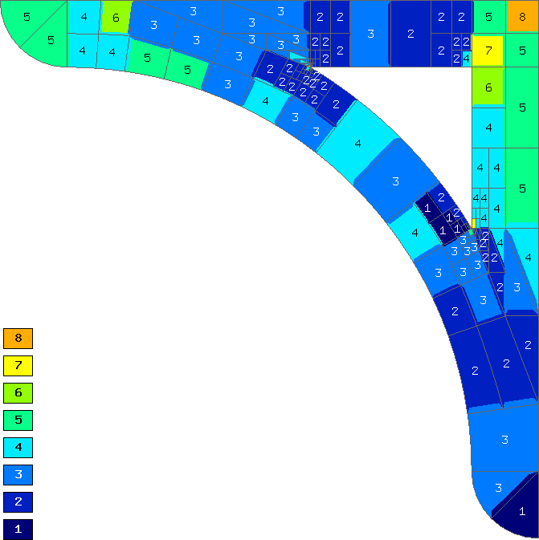
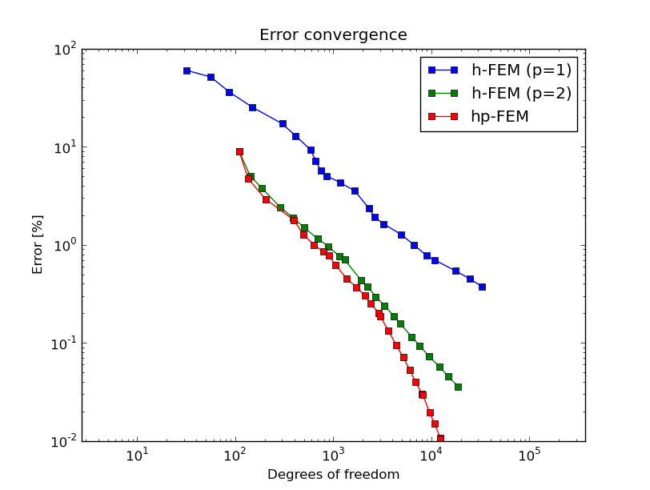
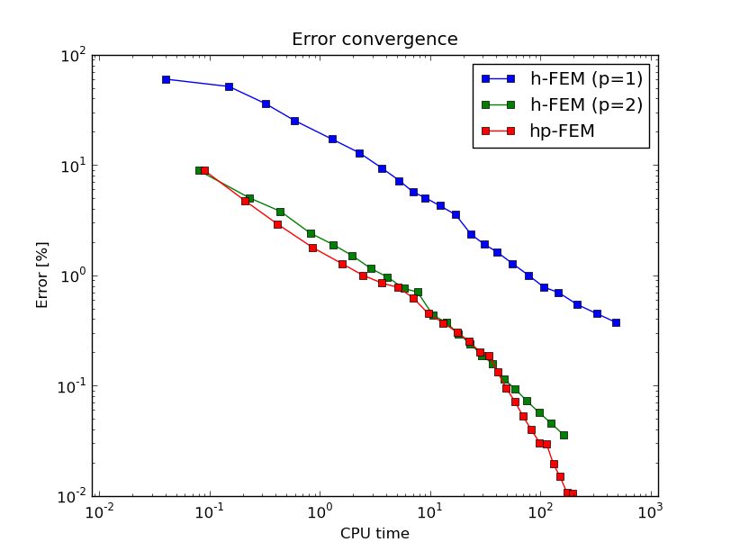

Bracket (Linear Elasticity)
---------------------------

**Git reference:** Example `bracket <http://git.hpfem.org/hermes.git/tree/HEAD:/hermes2d/examples/bracket>`_.

We will use the equations of linear elasticity from example 
`08-system <http://git.hpfem.org/hermes.git/tree/HEAD:/hermes2d/tutorial/08-system>`_, but
now we will view them as a coupled PDE system.
Our domain is a bracket loaded on its top edge and fixed to the wall:

.. math::
    :nowrap:

    \begin{eqnarray*}   \bfu \!&=&\! 0 \ \ \ \ \ \rm{on}\ \Gamma_1  \\   \dd{u_2}{n} \!&=&\! f \ \ \ \ \ \rm{on}\ \Gamma_2 \\   \dd{u_1}{n} = \dd{u_2}{n} \!&=&\! 0 \ \ \ \ \ \rm{elsewhere.} \end{eqnarray*}

The dimensions are L = 0.7 m, T = 0.1 m and the force $f = 10^3$ N.

.. image:: example-bracket/bracket.png
   :align: center
   :width: 400
   :height: 400
   :alt: Computational domain for the elastic bracket problem.

Then we solve on the uniformly refined mesh and either project 
the solution on the coarse mesh, or solve on the coarse mesh,
to obtain the pair of solutions needed for error estimation:

::

    // Assemble and solve the fine mesh problem.
    info("Solving on fine mesh.");
    RefSystem rs(&ls);
    rs.assemble();
    rs.solve(Tuple<Solution*>(&x_sln_fine, &y_sln_fine));

    // Either solve on coarse mesh or project the fine mesh solution 
    // on the coarse mesh.
    if (SOLVE_ON_COARSE_MESH) {
      info("Solving on coarse mesh.");
      ls.assemble();
      ls.solve(Tuple<Solution*>(&x_sln_coarse, &y_sln_coarse));
    }
    else {
      info("Projecting fine mesh solution on coarse mesh.");
      ls.project_global(Tuple<MeshFunction*>(&x_sln_fine, &y_sln_fine), 
                        Tuple<Solution*>(&x_sln_coarse, &y_sln_coarse));
    }

The selector is created outside the adaptivity loop. We have two equations in the system, two meshes, two spaces, etc.:

::

    // Calculate element errors and total error estimate.
    info("Calculating error (est).");
    H1Adapt hp(&ls);
    hp.set_solutions(Tuple<Solution*>(&x_sln_coarse, &y_sln_coarse), Tuple<Solution*>(&x_sln_fine, &y_sln_fine));
    hp.set_error_form(0, 0, bilinear_form_0_0<scalar, scalar>, bilinear_form_0_0<Ord, Ord>);
    hp.set_error_form(0, 1, bilinear_form_0_1<scalar, scalar>, bilinear_form_0_1<Ord, Ord>);
    hp.set_error_form(1, 0, bilinear_form_1_0<scalar, scalar>, bilinear_form_1_0<Ord, Ord>);
    hp.set_error_form(1, 1, bilinear_form_1_1<scalar, scalar>, bilinear_form_1_1<Ord, Ord>);
    double err_est = hp.calc_error(H2D_TOTAL_ERROR_REL | HERMES_ELEMENT_ERROR_REL) * 100;

The following figures show the two meshes and their polynomial
degrees after several adaptive steps: 

.. image:: example-bracket/sys-xorders.png
   :align: left
   :width: 300
   :height: 300
   :alt: $x$ displacement -- mesh and polynomial degrees.

.. raw:: html

   

Note that the meshes are slightly different, not only in
polynomial degrees, but also in element refinements. This is possible in Hermes thanks to
a technique called multi-mesh assembling which allows
all components of the solution to adapt independently. In problems whose components exhibit
substantially different behavior, one may even obtain completely different meshes.

Convergence graphs of adaptive h-FEM with linear elements, h-FEM with quadratic elements
and hp-FEM are shown below.

The following graph shows convergence in terms of CPU time. 

Comparison of the multimesh and single-mesh hp-FEM: 

.. image:: example-bracket/conv_compar_dof.png
   :align: center
   :width: 600
   :height: 400
   :alt: comparison of multimesh and single mesh hp-FEM

.. image:: example-bracket/conv_compar_cpu.png
   :align: center
   :width: 600
   :height: 400
   :alt: comparison of multimesh and single mesh hp-FEM

In this example the difference between the multimesh *hp*-FEM and the single-mesh
version was not extremely large since the two elasticity equations are very 
strongly coupled and have singularities at the same points. 
For other applications of the multimesh hp-FEM see a `linear elasticity model with cracks 
<http://hpfem.org/hermes/doc/src/hermes2d/examples.html#crack>`_, 
a `thermoelasticity example <http://hpfem.org/hermes/doc/src/hermes2d/examples.html#thermoelasticity>`_,
and especially the tutorial 
example `11-adapt-system <http://hpfem.org/hermes/doc/src/hermes2d/tutorial-2.html#adaptivity-for-systems-and-the-multimesh-hp-fem>`_.
