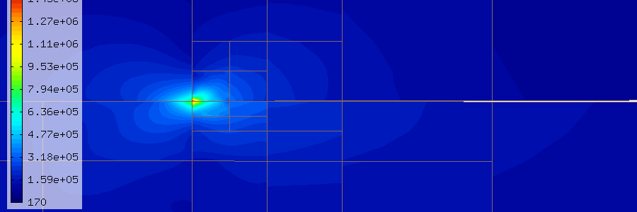
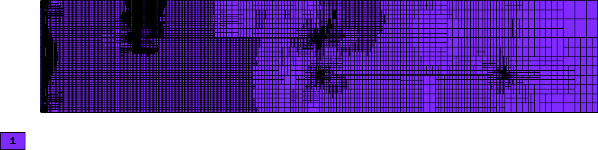
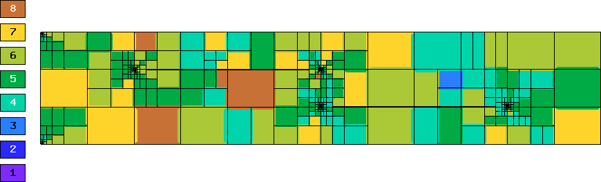
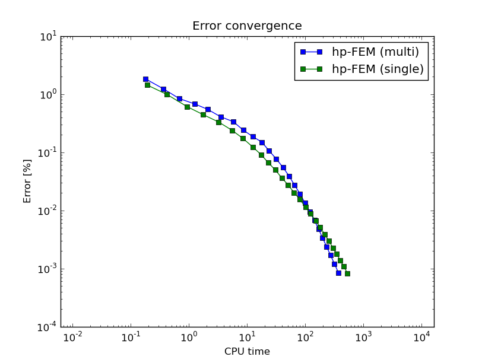

Crack (Linear Elasticity)
-------------------------

**Git reference:** Example `crack <http://git.hpfem.org/hermes.git/tree/HEAD:/hermes2d/examples/crack>`_.

The example employs the adaptive multimesh hp-FEM to solve the 
equations of linear elasticity. The domain contains two horizontal 
cracks causing strong singularities at their corners. Each
displacement component is approximated on an individual mesh.

The computational domain is a $1.5 \times 0.3$ m rectangle containing two horizontal 
cracks, as shown in the following figure:

.. image:: example-crack/domain.png
   :align: center
   :width: 780
   :alt: Domain.

The cracks have a flat diamond-like shape and their width along with some other parameters 
can be changed in the mesh file `crack.mesh 
<http://git.hpfem.org/hermes.git/blob/HEAD:/hermes2d/examples/crack/crack.mesh>`_:

::

    a = 0.25   # horizontal size of an eleemnt
    b = 0.1    # vertical size of an element
    w = 0.001  # width of the cracks

Solved are equations of linear elasticity with the following boundary conditions: 
$u_1 = u_2 = 0$ on the left edge, external force $f$ on the upper edge, and zero Neumann
conditions for $u_1$ and $u_2$ on the right and bottom edges as well as on the crack 
boundaries. Translated into the weak forms, this becomes:

::

    // linear and bilinear forms
    template<typename Real, typename Scalar>
    Scalar bilinear_form_0_0(int n, double *wt, Func<Scalar> *u_ext[], Func<Real> *u, Func<Real> *v, Geom<Real> *e, ExtData<Scalar> *ext)
    {
      return (lambda + 2*mu) * int_dudx_dvdx<Real, Scalar>(n, wt, u, v) +
                          mu * int_dudy_dvdy<Real, Scalar>(n, wt, u, v);
    }

    template<typename Real, typename Scalar>
    Scalar bilinear_form_0_1(int n, double *wt, Func<Scalar> *u_ext[], Func<Real> *u, Func<Real> *v, Geom<Real> *e, ExtData<Scalar> *ext)
    {
      return lambda * int_dudy_dvdx<Real, Scalar>(n, wt, u, v) +
                 mu * int_dudx_dvdy<Real, Scalar>(n, wt, u, v);
    }

    template<typename Real, typename Scalar>
    Scalar bilinear_form_1_0(int n, double *wt, Func<Scalar> *u_ext[], Func<Real> *u, Func<Real> *v, Geom<Real> *e, ExtData<Scalar> *ext)
    {
      return     mu * int_dudy_dvdx<Real, Scalar>(n, wt, u, v) +
             lambda * int_dudx_dvdy<Real, Scalar>(n, wt, u, v);
    }

    template<typename Real, typename Scalar>
    Scalar bilinear_form_1_1(int n, double *wt, Func<Scalar> *u_ext[], Func<Real> *u, Func<Real> *v, Geom<Real> *e, ExtData<Scalar> *ext)
    {
      return              mu * int_dudx_dvdx<Real, Scalar>(n, wt, u, v) +
             (lambda + 2*mu) * int_dudy_dvdy<Real, Scalar>(n, wt, u, v);
    }

    template<typename Real, typename Scalar>
    Scalar linear_form_surf_1(int n, double *wt, Func<Scalar> *u_ext[], Func<Real> *v, Geom<Real> *e, ExtData<Scalar> *ext)
    {
      return -f * int_v<Real, Scalar>(n, wt, v);
    }

The multimesh discretization is activated by creating a common master mesh 
for both displacement components:

::

    // Load the mesh.
    Mesh xmesh, ymesh;
    H2DReader mloader;
    mloader.load("crack.mesh", &xmesh);

    // Perform initial uniform mesh refinement.
    for (int i=0; i < INIT_REF_NUM; i++) xmesh.refine_all_elements();

    // Create initial mesh for the vertical displacement component.
    // This also initializes the multimesh hp-FEM.
    ymesh.copy(&xmesh);

Then we define separate spaces for $u_1$ and $u_2$:

::

    // Create H1 spaces with default shapesets.
    H1Space xdisp(&xmesh, bc_types_xy, essential_bc_values, P_INIT);
    H1Space ydisp(MULTI ? &ymesh : &xmesh, bc_types_xy, essential_bc_values, P_INIT);

The weak forms are registered as usual:

::

    // Initialize the weak formulation.
    WeakForm wf(2);
    wf.add_matrix_form(0, 0, callback(bilinear_form_0_0), HERMES_SYM);
    wf.add_matrix_form(0, 1, callback(bilinear_form_0_1), HERMES_SYM);
    wf.add_matrix_form(1, 1, callback(bilinear_form_1_1), HERMES_SYM);
    wf.add_vector_form_surf(1, callback(linear_form_surf_1), BDY_TOP);

Before entering the adaptivity loop, we create an instance of a selector:

::

    // Initialize refinement selector.
    H1ProjBasedSelector selector(CAND_LIST, CONV_EXP, H2DRS_DEFAULT_ORDER);

Then we solve on the uniformly refined mesh and either project 
the solution on the coarse mesh, or solve on the coarse mesh,
to obtain the pair of solutions needed for error estimation:

::

    // Assemble and solve the fine mesh problem.
    info("Solving on fine mesh.");
    RefSystem rs(&ls);
    rs.assemble();
    rs.solve(Tuple<Solution*>(&x_sln_fine, &y_sln_fine));

    // Either solve on coarse mesh or project the fine mesh solution 
    // on the coarse mesh.
    if (SOLVE_ON_COARSE_MESH) {
      info("Solving on coarse mesh.");
      ls.assemble();
      ls.solve(Tuple<Solution*>(&x_sln_coarse, &y_sln_coarse));
    }
    else {
      info("Projecting fine mesh solution on coarse mesh.");
      ls.project_global(Tuple<MeshFunction*>(&x_sln_fine, &y_sln_fine), 
                        Tuple<Solution*>(&x_sln_coarse, &y_sln_coarse));
    }

Next, we set bilinear forms for the calculation of the global energy norm,
and calculate the error. In this case, we require that the error of elements 
is devided by a corresponding norm:

::

    // Calculate error estimate wrt. fine mesh solution in energy norm.
    info("Calculating error (est).");
    H1Adapt hp(&ls);
    hp.set_solutions(Tuple<Solution*>(&x_sln_coarse, &y_sln_coarse), Tuple<Solution*>(&x_sln_fine, &y_sln_fine));
    hp.set_error_form(0, 0, bilinear_form_0_0<scalar, scalar>, bilinear_form_0_0<Ord, Ord>);
    hp.set_error_form(0, 1, bilinear_form_0_1<scalar, scalar>, bilinear_form_0_1<Ord, Ord>);
    hp.set_error_form(1, 0, bilinear_form_1_0<scalar, scalar>, bilinear_form_1_0<Ord, Ord>);
    hp.set_error_form(1, 1, bilinear_form_1_1<scalar, scalar>, bilinear_form_1_1<Ord, Ord>);
    double err_est = hp.calc_error(H2D_TOTAL_ERROR_REL | HERMES_ELEMENT_ERROR_REL) * 100;

The rest is straightforward and details can be found in the 
`main.cpp <http://git.hpfem.org/hermes.git/blob/HEAD:/hermes2d/examples/crack/main.cpp>`_ file.

Detail of singularity in Von Mises stress at the left end of the left crack:

Final meshes for $u_1$ and $u_2$ (h-FEM with linear elements):

.. image:: example-crack/mesh-x-h1.png
   :align: center
   :width: 800
   :alt: Solution.

Final meshes for $u_1$ and $u_2$ (h-FEM with quadratic elements):

.. image:: example-crack/mesh-x-h2.png
   :align: center
   :width: 800
   :alt: Solution.

.. image:: example-crack/mesh-x-h2.png
   :align: center
   :width: 800
   :alt: Solution.

Final meshes for $u_1$ and $u_2$ (hp-FEM):

.. image:: example-crack/mesh-x-hp.png
   :align: center
   :width: 800
   :alt: Solution.

DOF convergence graphs:

.. image:: example-crack/conv_dof.png
   :align: center
   :width: 600
   :height: 400
   :alt: DOF convergence graph.

CPU time convergence graphs:

.. image:: example-crack/conv_cpu.png
   :align: center
   :width: 600
   :height: 400
   :alt: CPU convergence graph.

Next let us compare the multimesh hp-FEM with the standard (single-mesh) hp-FEM:

.. image:: example-crack/conv_dof_compar.png
   :align: center
   :width: 600
   :height: 400
   :alt: DOF convergence graph.

The same comparison in terms of CPU time:

