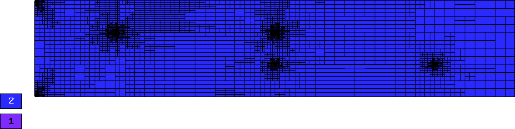
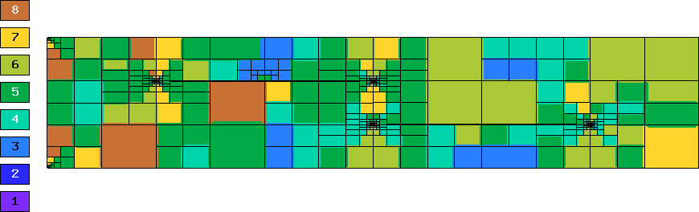
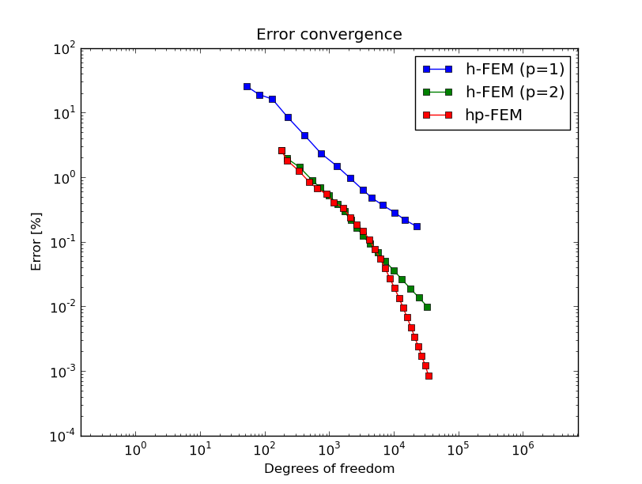

Crack (Linear Elasticity)
-------------------------

**Git reference:** Example `elasticity-crack <http://git.hpfem.org/hermes.git/tree/HEAD:/hermes2d/examples/linear-elasticity/elasticity-crack>`_.

This example employs the adaptive multimesh hp-FEM to solve
equations of linear elasticity that we already saw in the tutorial example
`P01-linear/08-system <http://git.hpfem.org/hermes.git/tree/HEAD:/hermes2d/tutorial/P01-linear/08-system>`_.

Model problem
~~~~~~~~~~~~~

The computational domain is a $1.5 \times 0.3$ m rectangle containing two horizontal 
cracks, as shown in the following figure:

.. image:: example-crack/domain.png
   :align: center
   :width: 780
   :alt: Domain.

The cracks have a flat diamond-like shape and their width along with some other parameters 
can be changed in the mesh file `crack.mesh 
<http://git.hpfem.org/hermes.git/blob/HEAD:/hermes2d/examples/linear-elasticity/elasticity-crack/crack.mesh>`_:

::

    a = 0.25   # horizontal size of an eleemnt
    b = 0.1    # vertical size of an element
    w = 0.001  # width of the cracks

Solved are equations of linear elasticity with the following boundary conditions: 
$u_1 = u_2 = 0$ on the left edge, external force $f$ on the upper edge, and zero Neumann
conditions for $u_1$ and $u_2$ on the right and bottom edges as well as on the crack 
boundaries. 

Weak forms
~~~~~~~~~~

Translated into the weak forms, this becomes::

    // linear and bilinear forms
    template<typename Real, typename Scalar>
    Scalar bilinear_form_0_0(int n, double *wt, Func<Scalar> *u_ext[], Func<Real> *u, Func<Real> *v, Geom<Real> *e, ExtData<Scalar> *ext)
    {
      return (lambda + 2*mu) * int_dudx_dvdx<Real, Scalar>(n, wt, u, v) +
                          mu * int_dudy_dvdy<Real, Scalar>(n, wt, u, v);
    }

    template<typename Real, typename Scalar>
    Scalar bilinear_form_0_1(int n, double *wt, Func<Scalar> *u_ext[], Func<Real> *u, Func<Real> *v, Geom<Real> *e, ExtData<Scalar> *ext)
    {
      return lambda * int_dudy_dvdx<Real, Scalar>(n, wt, u, v) +
                 mu * int_dudx_dvdy<Real, Scalar>(n, wt, u, v);
    }

    template<typename Real, typename Scalar>
    Scalar bilinear_form_1_0(int n, double *wt, Func<Scalar> *u_ext[], Func<Real> *u, Func<Real> *v, Geom<Real> *e, ExtData<Scalar> *ext)
    {
      return     mu * int_dudy_dvdx<Real, Scalar>(n, wt, u, v) +
             lambda * int_dudx_dvdy<Real, Scalar>(n, wt, u, v);
    }

    template<typename Real, typename Scalar>
    Scalar bilinear_form_1_1(int n, double *wt, Func<Scalar> *u_ext[], Func<Real> *u, Func<Real> *v, Geom<Real> *e, ExtData<Scalar> *ext)
    {
      return              mu * int_dudx_dvdx<Real, Scalar>(n, wt, u, v) +
             (lambda + 2*mu) * int_dudy_dvdy<Real, Scalar>(n, wt, u, v);
    }

    template<typename Real, typename Scalar>
    Scalar linear_form_surf_1(int n, double *wt, Func<Scalar> *u_ext[], Func<Real> *v, Geom<Real> *e, ExtData<Scalar> *ext)
    {
      return -f * int_v<Real, Scalar>(n, wt, v);
    }

Activating multimesh
~~~~~~~~~~~~~~~~~~~~

The multimesh discretization is activated by creating a common master mesh 
for both displacement components::

    // Load the mesh.
    Mesh u_mesh, v_mesh;
    H2DReader mloader;
    mloader.load("crack.mesh", &u_mesh);

    // Perform initial uniform mesh refinement.
    for (int i=0; i < INIT_REF_NUM; i++) u_mesh.refine_all_elements();

    // Create initial mesh for the vertical displacement component.
    // This also initializes the multimesh hp-FEM.
    v_mesh.copy(&u_mesh);

Defining boundary conditions
~~~~~~~~~~~~~~~~~~~~~~~~~~~~

::

    // Enter boundary markers.
    BCTypes bc_types_xy;
    bc_types_xy.add_bc_dirichlet(BDY_LEFT);
    bc_types_xy.add_bc_neumann(Hermes::Tuple<int>(BDY_TOP, BDY_REST));

    // Enter Dirichlet boundary values.
    BCValues bc_values;
    bc_values.add_zero(BDY_LEFT);

Defining individual spaces for displacement componants
~~~~~~~~~~~~~~~~~~~~~~~~~~~~~~~~~~~~~~~~~~~~~~~~~~~~~~

Then we define separate spaces for $u_1$ and $u_2$::

    // Create H1 spaces with default shapesets.
    H1Space u_space(&u_mesh, &bc_types_xy, &bc_values, P_INIT);
    H1Space v_space(MULTI ? &v_mesh : &u_mesh, &bc_types_xy, &bc_values, P_INIT);

Registering weak forms
~~~~~~~~~~~~~~~~~~~~~~

The weak forms are registered as usual::

    // Initialize the weak formulation.
    WeakForm wf(2);
    wf.add_matrix_form(0, 0, callback(bilinear_form_0_0), HERMES_SYM);
    wf.add_matrix_form(0, 1, callback(bilinear_form_0_1), HERMES_SYM);
    wf.add_matrix_form(1, 1, callback(bilinear_form_1_1), HERMES_SYM);
    wf.add_vector_form_surf(1, linear_form_surf_1, linear_form_surf_1_ord, BDY_TOP);

Creating a refinement selector
~~~~~~~~~~~~~~~~~~~~~~~~~~~~~~

Before entering the adaptivity loop, we create an instance of a selector::

    // Initialize refinement selector.
    H1ProjBasedSelector selector(CAND_LIST, CONV_EXP, H2DRS_DEFAULT_ORDER);

Adaptivity loop
~~~~~~~~~~~~~~~

The adaptivity loop is started with creating a uniformly refined mesh and space on it::

    // Construct globally refined reference mesh and setup reference space.
    Hermes::Tuple<Space *>* ref_spaces = construct_refined_spaces(Hermes::Tuple<Space *>(&u_space, &v_space));

Selecting and initializing matrix solver
~~~~~~~~~~~~~~~~~~~~~~~~~~~~~~~~~~~~~~~~

::

    // Initialize matrix solver.
    SparseMatrix* matrix = create_matrix(matrix_solver);
    Vector* rhs = create_vector(matrix_solver);
    Solver* solver = create_linear_solver(matrix_solver, matrix, rhs);

Assembling on reference mesh
~~~~~~~~~~~~~~~~~~~~~~~~~~~~

::

    // Assemble the reference problem.
    info("Solving on reference mesh.");
    bool is_linear = true;
    DiscreteProblem* dp = new DiscreteProblem(&wf, *ref_spaces, is_linear);
    dp->assemble(matrix, rhs);

Solving reference problem
~~~~~~~~~~~~~~~~~~~~~~~~~

::

    // Solve the linear system of the reference problem. If successful, obtain the solutions.
    if(solver->solve()) Solution::vector_to_solutions(solver->get_solution(), *ref_spaces, 
                                            Hermes::Tuple<Solution *>(&u_ref_sln, &v_ref_sln));
    else error ("Matrix solver failed.\n");

Projecting reference solution on coarse mesh
~~~~~~~~~~~~~~~~~~~~~~~~~~~~~~~~~~~~~~~~~~~~

::

    // Project the fine mesh solution onto the coarse mesh.
    info("Projecting reference solution on coarse mesh.");
    OGProjection::project_global(Hermes::Tuple<Space *>(&u_space, &v_space), 
                                 Hermes::Tuple<Solution *>(&u_ref_sln, &v_ref_sln), 
                                 Hermes::Tuple<Solution *>(&u_sln, &v_sln), matrix_solver); 

Setting custom forms for error calculation
~~~~~~~~~~~~~~~~~~~~~~~~~~~~~~~~~~~~~~~~~~

Next, we set bilinear forms for the calculation of the global energy norm,
and calculate the error. In this case, we require that the error of elements 
is devided by a corresponding norm::

    // Register custom forms for error calculation.
    Adapt* adaptivity = new Adapt(Hermes::Tuple<Space *>(&u_space, &v_space), 
                                  Hermes::Tuple<ProjNormType>(HERMES_H1_NORM, HERMES_H1_NORM));
    adaptivity->set_error_form(0, 0, bilinear_form_0_0<scalar, scalar>, bilinear_form_0_0<Ord, Ord>);
    adaptivity->set_error_form(0, 1, bilinear_form_0_1<scalar, scalar>, bilinear_form_0_1<Ord, Ord>);
    adaptivity->set_error_form(1, 0, bilinear_form_1_0<scalar, scalar>, bilinear_form_1_0<Ord, Ord>);
    adaptivity->set_error_form(1, 1, bilinear_form_1_1<scalar, scalar>, bilinear_form_1_1<Ord, Ord>);

Calculating element error and a global error estimate
~~~~~~~~~~~~~~~~~~~~~~~~~~~~~~~~~~~~~~~~~~~~~~~~~~~~~

::

    // Calculate error estimate for each solution component and the total error estimate.
    info("Calculating error estimate and exact error."); 
    Hermes::Tuple<double> err_est_rel;
    bool solutions_for_adapt = true;
    double err_est_rel_total = adaptivity->calc_err_est(Hermes::Tuple<Solution *>(&u_sln, &v_sln), 
                               Hermes::Tuple<Solution *>(&u_ref_sln, &v_ref_sln), solutions_for_adapt, 
                               HERMES_TOTAL_ERROR_REL | HERMES_ELEMENT_ERROR_ABS, &err_est_rel) * 100;

The rest is straightforward and details can be found in the 
`main.cpp <http://git.hpfem.org/hermes.git/blob/HEAD:/hermes2d/examples/linear-elasticity/elasticity-crack/main.cpp>`_ file.

Sample results
~~~~~~~~~~~~~~

Detail of singularity in Von Mises stress at the left end of the left crack:

.. image:: example-crack/sol.png
   :align: center
   :width: 700
   :alt: Solution.

Convergence comparisons
~~~~~~~~~~~~~~~~~~~~~~~

Final meshes for $u_1$ and $u_2$ (h-FEM with linear elements):

.. image:: example-crack/mesh-x-h1.png
   :align: center
   :width: 800
   :alt: Solution.

.. image:: example-crack/mesh-y-h1.png
   :align: center
   :width: 800
   :alt: Solution.

Final meshes for $u_1$ and $u_2$ (h-FEM with quadratic elements):

Final meshes for $u_1$ and $u_2$ (hp-FEM):

.. image:: example-crack/mesh-y-hp.png
   :align: center
   :width: 800
   :alt: Solution.

DOF convergence graphs:

CPU time convergence graphs:

.. image:: example-crack/conv_cpu.png
   :align: center
   :width: 600
   :height: 400
   :alt: CPU convergence graph.

Next let us compare the multimesh hp-FEM with the standard (single-mesh) hp-FEM:

.. image:: example-crack/conv_dof_compar.png
   :align: center
   :width: 600
   :height: 400
   :alt: DOF convergence graph.

The same comparison in terms of CPU time:

.. image:: example-crack/conv_cpu_compar.png
   :align: center
   :width: 600
   :height: 400
   :alt: CPU convergence graph.

In this example the difference between the multimesh *hp*-FEM and the single-mesh
version was not extremely large since the two elasticity equations are very 
strongly coupled and have singularities at the same points. 
To see more significant differences, look at the tutorial 
example `P04-linear-adapt/02-system-adapt <file:///home/pavel/repos/hermes/doc/_build/html/src/hermes2d/linear-adapt/multimesh-example.html>`_.

