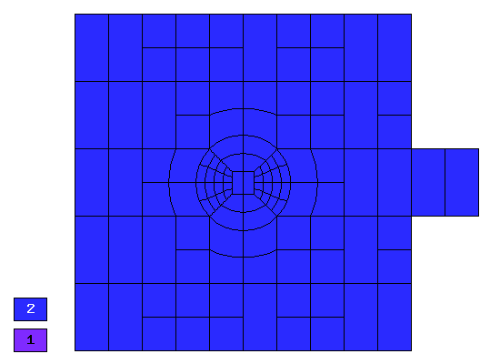
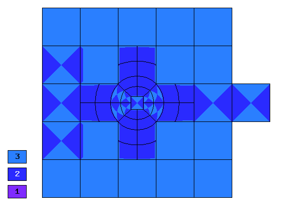
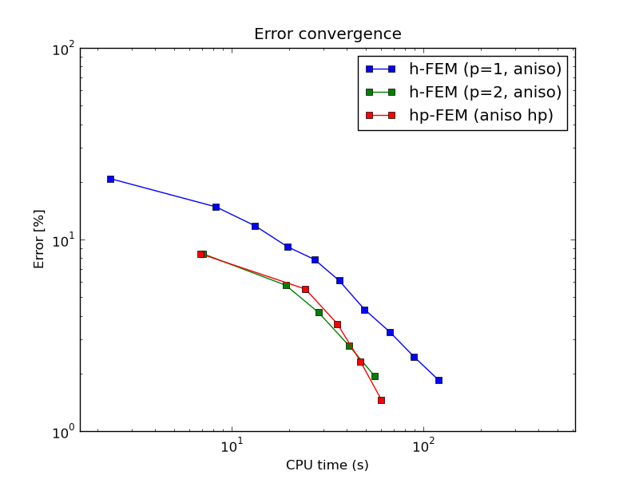

Waveguide (Maxwell's Equation - Electromagnetics)
-------------------------------------------------

**Git reference:** Example `maxwell-waveguide <http://git.hpfem.org/hermes.git/tree/HEAD:/hermes2d/examples/maxwell/maxwell-waveguide>`_.

Model problem
~~~~~~~~~~~~~

This example solves adaptively the electric field in a simplified microwave oven.
The waves are generated using a harmonic surface current on the right-most edge.
(Such small cavity is present in every microwave oven). 

.. image:: maxwell-waveguide/maxwell-waveguide.png
   :align: center
   :width: 450
   :alt: Domain.

Equation solved: time-harmonic Maxwell's equations. 

Boundary conditions are perfect conductor on the boundary except for the right-most edge of the small cavity, where a harmonic surface current is prescribed.

Domain of interest: Square cavity with another small square cavity attached from outside on the right.

Material parameters
~~~~~~~~~~~~~~~~~~~

::

    // Problem parameters.
    const double e_0   = 8.8541878176 * 1e-12;
    const double mu_0   = 1.256 * 1e-6;
    const double e_r = 1.0;
    const double mu_r = 1.0;
    const double rho = 3820.0;
    const double Cp = 7.531000;
    const double freq = 1.0*2450000000.0;
    const double omega = 2 * M_PI * freq;
    const double c = 1 / sqrt(e_0 * mu_0);
    const double kappa  = 2 * M_PI * freq * sqrt(e_0 * mu_0);
    const double J = 0.0000033333;

Sample solution
~~~~~~~~~~~~~~~

.. image:: maxwell-waveguide/solution.png
   :align: center
   :width: 600
   :height: 400
   :alt: Solution.

Comparison of h-FEM (p=1), h-FEM (p=2) and hp-FEM with anisotropic refinements
~~~~~~~~~~~~~~~~~~~~~~~~~~~~~~~~~~~~~~~~~~~~~~~~~~~~~~~~~~~~~~~~~~~~~~~~~~~~~~

Final mesh (h-FEM, p=1, anisotropic refinements):

.. image:: maxwell-waveguide/mesh_h1_aniso.png
   :align: center
   :width: 450
   :alt: Final mesh.

Final mesh (h-FEM, p=2, anisotropic refinements):

Final mesh (hp-FEM, h-anisotropic refinements):

DOF convergence graphs:

.. image:: maxwell-waveguide/conv_dof_aniso.png
   :align: center
   :width: 600
   :height: 400
   :alt: DOF convergence graph.

CPU convergence graphs:

