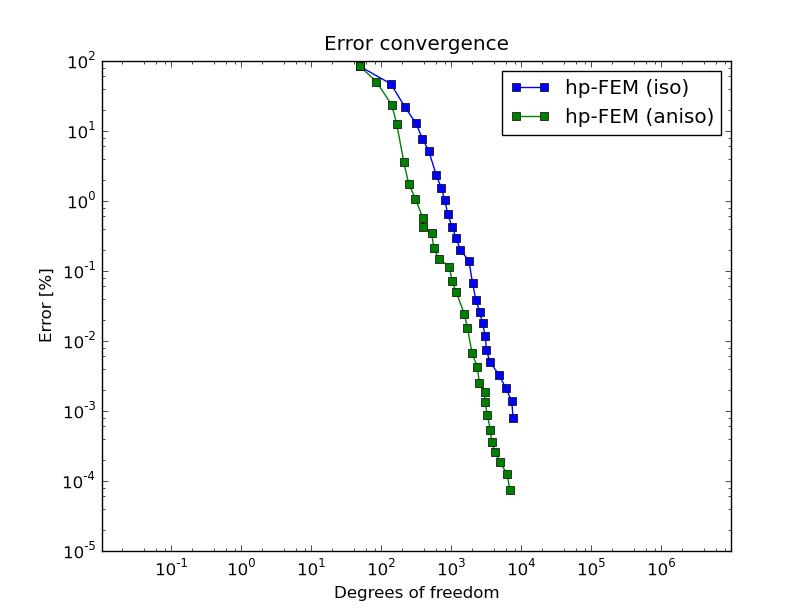

Singular Perturbation
---------------------

**Git reference:** Example `singular-perturbation <http://git.hpfem.org/hermes.git/tree/HEAD:/hermes2d/examples/miscellaneous/singular-perturbation>`_.

We solve a singularly perturbed elliptic problem that exhibits a thin anisotropic boundary layer that is 
difficult to resolve. 

The computational domain is the unit square, and the equation solved has the form

.. math::
 
    -\Delta u + K^2 u = K^2.

The boundary conditions are homogeneous Dirichlet. The right-hand side is chosen in this way 
in order to keep the solution $u(x,y) \approx 1$ inside the domain. For this presentation 
we choose $K^2 = 10^4$ but everything works for larger values of $K$ as well. We find quite 
important to perform initial refinements towards the boundary, thus providing a better 
initial mesh for adaptivity. One does not have to do this, but then the convergence is slower. 
The solution is shown in the following figure:

.. image:: example-singular-perturbation/sol_3d_view.png
   :align: center
   :width: 500
   :alt: Domain.

Below we show meshes obtained using various types of adaptivity. The meshes do not correspond to 
the same level of accuracy since the low-order methods could not achieve the same error 
as hp-FEM. Therefore, compare not only the number of DOF but also the error level. 
Convergence graphs for all cases are shown at the end of this section.

Final mesh (h-FEM, p=1, anisotropic refinements): 34833 DOF, error 0.3495973568992 %

.. image:: example-singular-perturbation/mesh-h1-aniso.png
   :align: center
   :width: 500
   :height: 400
   :alt: Final mesh

Final mesh (h-FEM, p=2, anisotropic refinements): 37097 DOF, error 0.014234904418008 %

.. image:: example-singular-perturbation/mesh-h2-aniso.png
   :align: center
   :width: 500
   :height: 400
   :alt: Final mesh

Final mesh (hp-FEM, anisotropic refinements): 6821 DOF, error 7.322784149253e-05 %

.. image:: example-singular-perturbation/mesh-hp-aniso.png
   :align: center
   :width: 500
   :height: 400
   :alt: Final mesh

DOF convergence graphs for h-FEM with linear and quadratic elements and the hp-FEM (anisotropic 
refinements enabled):

.. image:: example-singular-perturbation/conv_dof_compar.png
   :align: center
   :width: 600
   :height: 400
   :alt: DOF convergence graph.

Corresponding CPU time convergence graphs:

.. image:: example-singular-perturbation/conv_cpu_compar.png
   :align: center
   :width: 600
   :height: 400
   :alt: CPU convergence graph.

And at the end let us compare hp-FEM with isotropic and anisotropic refinements:

Corresponding CPU time convergence graphs:

.. image:: example-singular-perturbation/conv_cpu_hp.png
   :align: center
   :width: 600
   :height: 400
   :alt: CPU convergence graph.

When using h-FEM, this difference becomes much larger. This is left for the reader
to try.

