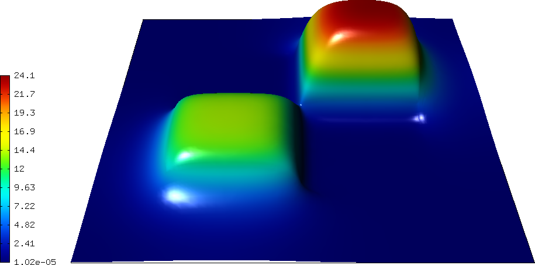
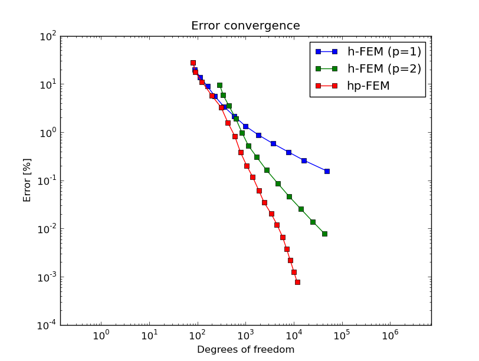

Saphir 
------

**Git reference:** Example `neutronics-saphir <http://git.hpfem.org/hermes.git/tree/HEAD:/hermes2d/examples/neutronics/neutronics-saphir>`_.

This is a standard nuclear engineering benchmark (IAEA number EIR-2) describing 
an external-force-driven configuration without fissile materials present, using one-group 
neutron diffusion approximation

.. math::
    :label: saphir

       -\nabla \cdot (D(x,y) \nabla \Phi) + \Sigma_a(x,y) \Phi = Q_{ext}(x,y).

The domain of interest is a 96 x 86 cm rectangle consisting of five regions:

.. image:: example-saphir/saphir.png
   :align: center
   :width: 400
   :height: 400
   :alt: Schematic picture for the saphir example.

The unknown is the neutron flux $\Phi(x, y)$. The values of the diffusion coefficient 
$D(x, y)$, absorption cross-section $\Sigma_a(x, y)$ and the source term $Q_{ext}(x,y)$
are constant in the subdomains. The source $Q_{ext} = 1$ in areas 1 and 3 and zero 
elsewhere. Boundary conditions for the flux $\Phi$ are zero everywhere. 

It is worth noticing that different material parameters can be handled using a separate weak form 
for each material:

::

    // Bilinear form (material 1)  
    template<typename Real, typename Scalar>
    Scalar bilinear_form_1(int n, double *wt, Func<Scalar> *u_ext[], Func<Real> *u, Func<Real> *v, Geom<Real> *e, ExtData<Scalar> *ext)
    {
      return D_1 * int_grad_u_grad_v<Real, Scalar>(n, wt, u, v) 
             + SIGMA_A_1 * int_u_v<Real, Scalar>(n, wt, u, v);
    }

    // Bilinear form (material 2)
    template<typename Real, typename Scalar>
    Scalar bilinear_form_2(int n, double *wt, Func<Scalar> *u_ext[], Func<Real> *u, Func<Real> *v, Geom<Real> *e, ExtData<Scalar> *ext)
    {
      return D_2 * int_grad_u_grad_v<Real, Scalar>(n, wt, u, v) 
             + SIGMA_A_2 * int_u_v<Real, Scalar>(n, wt, u, v);
    }

    // Bilinear form (material 3)
    template<typename Real, typename Scalar>
    Scalar bilinear_form_3(int n, double *wt, Func<Scalar> *u_ext[], Func<Real> *u, Func<Real> *v, Geom<Real> *e, ExtData<Scalar> *ext)
    {
      return D_3 * int_grad_u_grad_v<Real, Scalar>(n, wt, u, v) 
             + SIGMA_A_3 * int_u_v<Real, Scalar>(n, wt, u, v);
    }

    // Bilinear form (material 4)
    template<typename Real, typename Scalar>
    Scalar bilinear_form_4(int n, double *wt, Func<Scalar> *u_ext[], Func<Real> *u, Func<Real> *v, Geom<Real> *e, ExtData<Scalar> *ext)
    {
      return D_4 * int_grad_u_grad_v<Real, Scalar>(n, wt, u, v) 
             + SIGMA_A_4 * int_u_v<Real, Scalar>(n, wt, u, v);
    }

    // Bilinear form (material 5)
    template<typename Real, typename Scalar>
    Scalar bilinear_form_5(int n, double *wt, Func<Scalar> *u_ext[], Func<Real> *u, Func<Real> *v, Geom<Real> *e, ExtData<Scalar> *ext)
    {
      return D_5 * int_grad_u_grad_v<Real, Scalar>(n, wt, u, v) 
             + SIGMA_A_5 * int_u_v<Real, Scalar>(n, wt, u, v);
    }

Recall that this is not the only way to handle spatially-dependent material parameters. Alternatively, one can define 
a global function returning material parameters as a function of spatial coordinates. This was done, e.g., 
in the tutorial examples `P01-linear/07-general <http://git.hpfem.org/hermes.git/blob/HEAD:/hermes2d/tutorial/P01-linear/07-general>`_ 
and `P04-linear-adapt/03-general-adapt <http://git.hpfem.org/hermes.git/blob/HEAD:/hermes2d/tutorial/P04-linear-adapt/03-general-adapt>`_.

The weak forms are associated with element material flags (coming from the mesh file) as follows:

::

    // initialize the weak formulation
    WeakForm wf(1);
    wf.add_matrix_form(0, 0, bilinear_form_1, bilinear_form_ord, HERMES_SYM, 1);
    wf.add_matrix_form(0, 0, bilinear_form_2, bilinear_form_ord, HERMES_SYM, 2);
    wf.add_matrix_form(0, 0, bilinear_form_3, bilinear_form_ord, HERMES_SYM, 3);
    wf.add_matrix_form(0, 0, bilinear_form_4, bilinear_form_ord, HERMES_SYM, 4);
    wf.add_matrix_form(0, 0, bilinear_form_5, bilinear_form_ord, HERMES_SYM, 5);
    wf.add_vector_form(0, linear_form_1, linear_form_ord, 1);
    wf.add_vector_form(0, linear_form_3, linear_form_ord, 3);

Then we solve on the uniformly refined mesh and either project 
the solution on the coarse mesh, or solve on the coarse mesh,
to obtain the pair of solutions needed for error estimation:

::

    // Assemble and solve the fine mesh problem.
    info("Solving on fine mesh.");
    RefSystem rs(&ls);
    rs.assemble();
    rs.solve(&sln_fine);

    // Either solve on coarse mesh or project the fine mesh solution 
    // on the coarse mesh.
    if (SOLVE_ON_COARSE_MESH) {
      info("Solving on coarse mesh.");
      ls.assemble();
      ls.solve(&sln_coarse);
    }
    else {
      info("Projecting fine mesh solution on coarse mesh.");
      ls.project_global(&sln_fine, &sln_coarse);
    }

Sample results of this computation are shown below.

Solution:

Final mesh (h-FEM with linear elements):

.. image:: example-saphir/saphir-mesh-h1.png
   :align: center
   :width: 440
   :height: 400
   :alt: Final finite element mesh for the saphir example (h-FEM with linear elements).

Final mesh (h-FEM with quadratic elements):

.. image:: example-saphir/saphir-mesh-h2.png
   :align: center
   :width: 440
   :height: 400
   :alt: Final finite element mesh for the saphir example (h-FEM with quadratic elements).

Final mesh (hp-FEM):

.. image:: example-saphir/saphir-mesh-hp.png
   :align: center
   :width: 440
   :height: 400
   :alt: Final finite element mesh for the saphir example (hp-FEM).

DOF convergence graphs:

CPU time convergence graphs:

.. image:: example-saphir/conv_cpu.png
   :align: center
   :width: 600
   :height: 400
   :alt: CPU convergence graph for example saphir.

