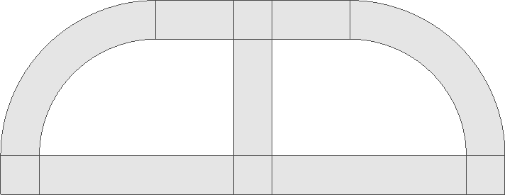
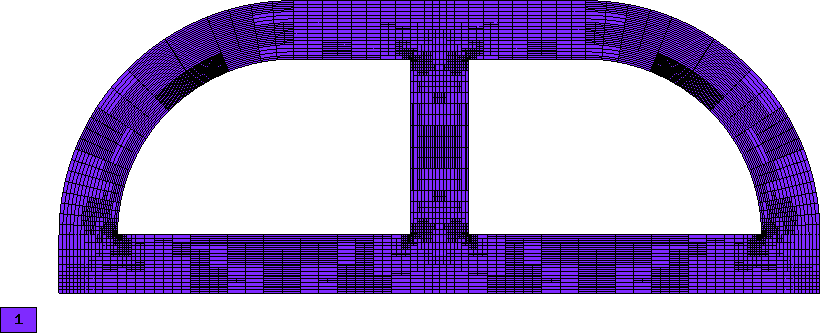

Thermoelasticity
----------------

**Git reference:** Example `thermoelasticity <http://git.hpfem.org/hermes.git/tree/HEAD:/hermes2d/examples/thermoelasticity>`_.

The example deals with a massive hollow conductor is heated by induction and 
cooled by water running inside. We will model this problem using linear thermoelasticity 
equations, where the x-displacement, y-displacement, and the temperature will be approximated 
on individual meshes equipped with mutually independent adaptivity mechanisms. 

The computational domain is shown in the following figure and the details of the geometry can be found 
in the corresponding 
`mesh file <http://git.hpfem.org/hermes.git/blob/HEAD:/hermes2d/examples/thermoelasticity/domain.mesh>`_.
It is worth mentioning how the circular arcs are defined via NURBS:

::

    curves =
    {
      { 11, 19, 90 },
      { 10, 15, 90 },
      { 16, 6, 90 },
      { 12, 7, 90 }
    }

The triplet on each line consists of two boundary vertex indices and 
the angle of the circular arc.

For the equations of linear thermoelasticity and the boundary conditions we refer to the 
paper *P. Solin, J. Cerveny, L. Dubcova, D. Andrs: Monolithic Discretization 
of Linear Thermoelasticity Problems via Adaptive Multimesh hp-FEM*,  
`doi.org/10.1016/j.cam.2009.08.092 <http://dx.doi.org/10.1016/j.cam.2009.08.092>`_.
The corresponding weak forms are:

::

    template<typename Real, typename Scalar>
    Scalar bilinear_form_0_0(int n, double *wt, Func<Scalar> *u_ext[], Func<Real> *u, Func<Real> *v, Geom<Real> *e, ExtData<Scalar> *ext)
    {
      return l2m * int_dudx_dvdx<Real, Scalar>(n, wt, u, v) +
              mu * int_dudy_dvdy<Real, Scalar>(n, wt, u, v);
    }

    template<typename Real, typename Scalar>
    Scalar bilinear_form_0_1(int n, double *wt, Func<Scalar> *u_ext[], Func<Real> *u, Func<Real> *v, Geom<Real> *e, ExtData<Scalar> *ext)
    {
      return lambda * int_dudy_dvdx<Real, Scalar>(n, wt, u, v) +
                 mu * int_dudx_dvdy<Real, Scalar>(n, wt, u, v);
    }

    template<typename Real, typename Scalar>
    Scalar bilinear_form_0_2(int n, double *wt, Func<Scalar> *u_ext[], Func<Real> *u, Func<Real> *v, Geom<Real> *e, ExtData<Scalar> *ext)
    {
      return - (3*lambda + 2*mu) * alpha * int_dudx_v<Real, Scalar>(n, wt, u, v);
    }

    template<typename Real, typename Scalar>
    Scalar bilinear_form_1_0(int n, double *wt, Func<Scalar> *u_ext[], Func<Real> *u, Func<Real> *v, Geom<Real> *e, ExtData<Scalar> *ext)
    {
      return     mu * int_dudy_dvdx<Real, Scalar>(n, wt, u, v) +
             lambda * int_dudx_dvdy<Real, Scalar>(n, wt, u, v);
    }

    template<typename Real, typename Scalar>
    Scalar bilinear_form_1_1(int n, double *wt, Func<Scalar> *u_ext[], Func<Real> *u, Func<Real> *v, Geom<Real> *e, ExtData<Scalar> *ext)
    {
      return  mu * int_dudx_dvdx<Real, Scalar>(n, wt, u, v) +
             l2m * int_dudy_dvdy<Real, Scalar>(n, wt, u, v);
    }

    template<typename Real, typename Scalar>
    Scalar bilinear_form_1_2(int n, double *wt, Func<Scalar> *u_ext[], Func<Real> *u, Func<Real> *v, Geom<Real> *e, ExtData<Scalar> *ext)
    {
      return - (3*lambda + 2*mu) * alpha * int_dudy_v<Real, Scalar>(n, wt, u, v);
    }

    template<typename Real, typename Scalar>
    Scalar bilinear_form_2_2(int n, double *wt, Func<Scalar> *u_ext[], Func<Real> *u, Func<Real> *v, Geom<Real> *e, ExtData<Scalar> *ext)
    {
      return int_grad_u_grad_v<Real, Scalar>(n, wt, u, v);
    }

    template<typename Real, typename Scalar>
    Scalar linear_form_1(int n, double *wt, Func<Scalar> *u_ext[], Func<Real> *v, Geom<Real> *e, ExtData<Scalar> *ext)
    {
      return -g * rho * int_v<Real, Scalar>(n, wt, v);
    }

    template<typename Real, typename Scalar>
    Scalar linear_form_2(int n, double *wt, Func<Scalar> *u_ext[], Func<Real> *v, Geom<Real> *e, ExtData<Scalar> *ext)
    {
      return HEAT_SRC * int_v<Real, Scalar>(n, wt, v);
    }

    template<typename Real, typename Scalar>
    Scalar linear_form_surf_2(int n, double *wt, Func<Scalar> *u_ext[], Func<Real> *v, Geom<Real> *e, ExtData<Scalar> *ext)
    {
      return HEAT_FLUX_OUTER * int_v<Real, Scalar>(n, wt, v);
    }

The multimesh discretization is initialized by creating the master mesh
via copying the xmesh into ymesh and tmesh:

::

    // Load the mesh.
    Mesh xmesh, ymesh, tmesh;
    H2DReader mloader;
    mloader.load("domain.mesh", &xmesh); // Master mesh.

    // Initialize multimesh hp-FEM.
    ymesh.copy(&xmesh);                  // Ydisp will share master mesh with xdisp.
    tmesh.copy(&xmesh);                  // Temp will share master mesh with xdisp.

Then three H1 spaces are created. Note that we do not have to provide essential 
boundary conditions functions if they are zero Dirichlet:

::

    // Create H1 spaces with default shapesets.
    H1Space xdisp(&xmesh, bc_types_x, NULL, P_INIT_DISP);
    H1Space ydisp(MULTI ? &ymesh : &xmesh, bc_types_y, NULL, P_INIT_DISP);
    H1Space temp(MULTI ? &tmesh : &xmesh, bc_types_t, essential_bc_values_temp, P_INIT_TEMP);

The weak formulation is initialized as follows:

::

    // Initialize the weak formulation.
    WeakForm wf(3);
    wf.add_matrix_form(0, 0, callback(bilinear_form_0_0));
    wf.add_matrix_form(0, 1, callback(bilinear_form_0_1), HERMES_SYM);
    wf.add_matrix_form(0, 2, callback(bilinear_form_0_2));
    wf.add_matrix_form(1, 1, callback(bilinear_form_1_1));
    wf.add_matrix_form(1, 2, callback(bilinear_form_1_2));
    wf.add_matrix_form(2, 2, callback(bilinear_form_2_2));
    wf.add_vector_form(1, callback(linear_form_1));
    wf.add_vector_form(2, callback(linear_form_2));
    wf.add_vector_form_surf(2, callback(linear_form_surf_2));

Then we solve on the uniformly refined mesh and either project 
the solution on the coarse mesh, or solve on the coarse mesh,
to obtain the pair of solutions needed for error estimation:

::

    // Solve the fine mesh problems.
    RefSystem rs(&ls);
    rs.assemble();
    rs.solve(Tuple<Solution*>(&x_sln_fine, &y_sln_fine, &t_sln_fine));

    // Either solve on coarse meshes or project the fine mesh solutions
    // on the coarse mesh.
    if (SOLVE_ON_COARSE_MESH) {
      info("Solving on coarse mesh.");
      ls.assemble();
      ls.solve(Tuple<Solution*>(&x_sln_coarse, &y_sln_coarse, &t_sln_coarse));
    }
    else {
      info("Projecting fine mesh solution on coarse mesh.");
      ls.project_global(Tuple<MeshFunction*>(&x_sln_fine, &y_sln_fine, &t_sln_fine), 
                        Tuple<Solution*>(&x_sln_coarse, &y_sln_coarse, &t_sln_coarse));
    }

The following code defines the global norm for error measurement, and 
calculates element errors. The code uses a selector which instance is created outside the adaptivity loop:

::

    // Calculate element errors and total error estimate.
    H1Adapt hp(&ls);
    hp.set_solutions(Tuple<Solution*>(&x_sln_coarse, &y_sln_coarse, &t_sln_coarse), 
                     Tuple<Solution*>(&x_sln_fine, &y_sln_fine, &t_sln_fine));
    hp.set_error_form(0, 0, bilinear_form_0_0<scalar, scalar>, bilinear_form_0_0<Ord, Ord>);
    hp.set_error_form(0, 1, bilinear_form_0_1<scalar, scalar>, bilinear_form_0_1<Ord, Ord>);
    hp.set_error_form(0, 2, bilinear_form_0_2<scalar, scalar>, bilinear_form_0_2<Ord, Ord>);
    hp.set_error_form(1, 0, bilinear_form_1_0<scalar, scalar>, bilinear_form_1_0<Ord, Ord>);
    hp.set_error_form(1, 1, bilinear_form_1_1<scalar, scalar>, bilinear_form_1_1<Ord, Ord>);
    hp.set_error_form(1, 2, bilinear_form_1_2<scalar, scalar>, bilinear_form_1_2<Ord, Ord>);
    hp.set_error_form(2, 2, bilinear_form_2_2<scalar, scalar>, bilinear_form_2_2<Ord, Ord>);
    double err_est = hp.calc_error(H2D_TOTAL_ERROR_REL | HERMES_ELEMENT_ERROR_ABS) * 100;

Sample snapshot of solutions, meshes and convergence graphs are below. 

Solution (Von Mises stress):

.. image:: example-thermoelasticity/mises.png
   :align: center
   :width: 790
   :alt: Solution.

Solution (temperature):

.. image:: example-thermoelasticity/temp.png
   :align: center
   :width: 780
   :alt: Solution.

Final meshes for $u_1$, $u_2$ and $T$ (h-FEM with linear elements):

.. image:: example-thermoelasticity/x-mesh-h1.png
   :align: center
   :width: 760
   :alt: Solution.

.. image:: example-thermoelasticity/y-mesh-h1.png
   :align: center
   :width: 760
   :alt: Solution.

Final meshes for $u_1$, $u_2$ and $T$ (h-FEM with quadratic elements):

.. image:: example-thermoelasticity/x-mesh-h2.png
   :align: center
   :width: 760
   :alt: Solution.

.. image:: example-thermoelasticity/y-mesh-h2.png
   :align: center
   :width: 760
   :alt: Solution.

.. image:: example-thermoelasticity/t-mesh-h2.png
   :align: center
   :width: 760
   :alt: Solution.

Final meshes for $u_1$, $u_2$ and $T$ (h-FEM with quadratic elements):

.. image:: example-thermoelasticity/x-mesh-hp.png
   :align: center
   :width: 760
   :alt: Solution.

.. image:: example-thermoelasticity/y-mesh-hp.png
   :align: center
   :width: 760
   :alt: Solution.

.. image:: example-thermoelasticity/t-mesh-hp.png
   :align: center
   :width: 760
   :alt: Solution.

DOF convergence graphs:

.. image:: example-thermoelasticity/conv_dof.png
   :align: center
   :width: 600
   :height: 400
   :alt: DOF convergence graph.

CPU time convergence graphs:

.. image:: example-thermoelasticity/conv_cpu.png
   :align: center
   :width: 600
   :height: 400
   :alt: CPU convergence graph.

Next let us compare, for example, multimesh h-FEM with linear elements with the standard (single-mesh)
h-FEM:

.. image:: example-thermoelasticity/conv_compar_dof.png
   :align: center
   :width: 600
   :height: 400
   :alt: DOF convergence graph.

