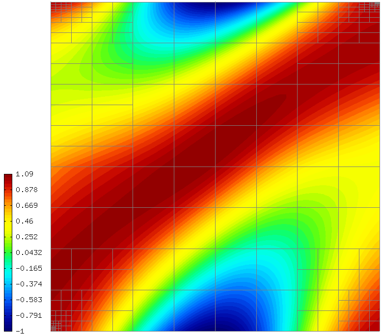
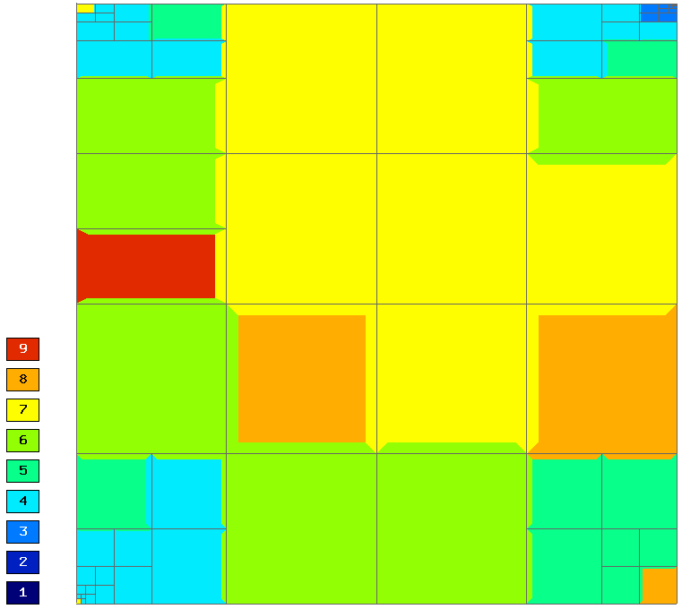

Adaptivity for General 2nd-Order Linear Equation (03-general-adapt)
-----------------------------------------------------

**Git reference:** Tutorial example `03-general-adapt <http://git.hpfem.org/hermes.git/tree/HEAD:/hermes2d/tutorial/P04-linear-adapt/03-general-adapt>`_. 

Model problem
~~~~~~~~~~~~~

This example does not bring anything substantially new and its purpose is solely to 
save you work adding adaptivity to the tutorial example 
`P01-linear/07-general <http://git.hpfem.org/hermes.git/tree/HEAD:/hermes2d/tutorial/P01-linear/07-general>`_. 
Feel free to adjust this example for your own applications.

Sample results
~~~~~~~~~~~~~~

Solution:

Final hp-mesh:

Convergence graphs of adaptive h-FEM with linear elements, h-FEM with quadratic elements
and hp-FEM.

.. image:: general-adapt/conv_dof.png
   :align: center
   :width: 600
   :height: 400
   :alt: DOF convergence graph for tutorial example 12-general-adapt.

Convergence comparison in terms of CPU time. 

.. image:: general-adapt/conv_cpu.png
   :align: center
   :width: 600
   :height: 400
   :alt: CPU convergence graph for tutorial example 12-general-adapt.

