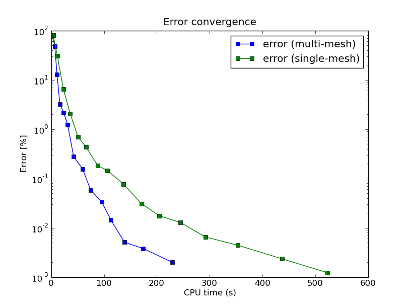

Adaptive Multimesh hp-FEM Example (02-system-adapt)
--------------------------------------

**Git reference:** Tutorial example `02-system-adapt <http://git.hpfem.org/hermes.git/tree/HEAD:/hermes2d/tutorial/P04-linear-adapt/02-system-adapt>`_. 

Model problem
~~~~~~~~~~~~~

We consider a simplified version of the Fitzhugh-Nagumo equation.
This equation is a prominent example of activator-inhibitor systems in two-component reaction-diffusion 
equations, It describes a prototype of an excitable system (e.g., a neuron) and its stationary form 
is

.. math::

    -d^2_u \Delta u - f(u) + \sigma v = g_1,\\
    -d^2_v \Delta v - u + v = g_2.

Here the unknowns $u, v$ are the voltage and $v$-gate, respectively.
The nonlinear function 

.. math::

    f(u) = \lambda u - u^3 - \kappa
 
describes how an action potential travels through a nerve. Obviously this system is nonlinear.

Exact solution
~~~~~~~~~~~~~~

In order to make it simpler for this tutorial, we replace the function $f(u)$ with just $u$:

.. math::

    f(u) = u.

Our computational domain is the square $(-1,1)^2$ and we consider zero Dirichlet conditions 
for both $u$ and $v$. In order to enable fair convergence comparisons, we will use the following 
functions as the exact solution:

.. math::

    u(x,y) = \cos\left(\frac{\pi}{2}x\right) \cos\left(\frac{\pi}{2}y\right),\\
    v(x,y) = \hat u(x) \hat u(y)

where

.. math::

    \hat u(x) = 1 - \frac{e^{kx} + e^{-kx}}{e^k + e^{-k}}

is the exact solution of the one-dimensional singularly perturbed 
problem 

.. math::

    -u'' + k^2 u - k^2 = 0

in $(-1,1)$, equipped with zero Dirichlet boundary conditions. 

The following two figures show the solutions $u$ and $v$. Notice their 
large qualitative differences: While $u$ is smooth in the entire domain, 
$v$ has a thin boundary layer along the boundary:

.. image:: multimesh-example/solution_u.png
   :align: center
   :width: 465
   :height: 400
   :alt: Solution

.. image:: multimesh-example/solution_v.png
   :align: center
   :width: 465
   :height: 400
   :alt: Solution

Manufactured right-hand side
~~~~~~~~~~~~~~~~~~~~~~~~~~~~

The source functions $g_1$ and $g_2$ are obtained by inserting $u$ and $v$ 
into the PDE system. These functions are not extremely pretty, but they 
are not too bad either::

    // Functions g_1 and g_2.
    double g_1(double x, double y) 
    {
      return (-cos(M_PI*x/2.)*cos(M_PI*y/2.) + SIGMA*(1. - (exp(K*x) + exp(-K*x))/(exp(K) + exp(-K))) 
             * (1. - (exp(K*y) + exp(-K*y))/(exp(K) + exp(-K))) + pow(M_PI,2.)*pow(D_u,2.)*cos(M_PI*x/2.)
             *cos(M_PI*y/2.)/2.);
    }

    double g_2(double x, double y) 
    {
      return ((1. - (exp(K*x) + exp(-K*x))/(exp(K) + exp(-K)))*(1. - (exp(K*y) + exp(-K*y))/(exp(K) + exp(-K))) 
             - pow(D_v,2.)*(-(1 - (exp(K*x) + exp(-K*x))/(exp(K) + exp(-K)))*(pow(K,2.)*exp(K*y) + pow(K,2.)*exp(-K*y))/(exp(K) + exp(-K)) 
             - (1. - (exp(K*y) + exp(-K*y))/(exp(K) + exp(-K)))*(pow(K,2.)*exp(K*x) + pow(K,2.)*exp(-K*x))/(exp(K) + exp(-K))) - 
             cos(M_PI*x/2.)*cos(M_PI*y/2.));

    }

The weak forms can be found in the 
file `forms.cpp <http://git.hpfem.org/hermes.git/blob/HEAD:/hermes2d/tutorial/P04-linear-adapt/02-system-adapt/forms.cpp>`_ and 
they are registered as follows::

Registering weak forms
~~~~~~~~~~~~~~~~~~~~~~

::

    // Initialize the weak formulation.
    WeakForm wf(2);
    wf.add_matrix_form(0, 0, callback(bilinear_form_0_0));
    wf.add_matrix_form(0, 1, callback(bilinear_form_0_1));
    wf.add_matrix_form(1, 0, callback(bilinear_form_1_0));
    wf.add_matrix_form(1, 1, callback(bilinear_form_1_1));
    wf.add_vector_form(0, linear_form_0, linear_form_0_ord);
    wf.add_vector_form(1, linear_form_1, linear_form_1_ord);

Beware that although each of the forms is actually symmetric, one cannot use the HERMES_SYM flag as in the 
elasticity equations, since it has a slightly different 
meaning (see example `P01-linear/08-system <http://hpfem.org/hermes/doc/src/hermes2d/linear/system.html>`_).

Computing multiple reference solutions
~~~~~~~~~~~~~~~~~~~~~~~~~~~~~~~~~~~~~~

The adaptivity workflow is the same as in example `01-adapt <http://hpfem.org/hermes/doc/src/hermes2d/linear-adapt/micromotor.html>`_: The adaptivity loop starts with a global refinement of each mesh::

    // Construct globally refined reference mesh and setup reference space.
    Tuple<Space *>* ref_spaces = construct_refined_spaces(Tuple<Space *>(&u_space, &v_space));

Then we initialize matrix solver::

    // Initialize matrix solver.
    SparseMatrix* matrix = create_matrix(matrix_solver);
    Vector* rhs = create_vector(matrix_solver);
    Solver* solver = create_linear_solver(matrix_solver, matrix, rhs);

Assemble the global stiffness matrix and right-hand side vector::

    // Assemble the reference problem.
    info("Solving on reference mesh.");
    bool is_linear = true;
    DiscreteProblem* dp = new DiscreteProblem(&wf, *ref_spaces, is_linear);
    dp->assemble(matrix, rhs);

Solve the reference problem::

    // Solve the linear system of the reference problem. If successful, obtain the solutions.
    if(solver->solve()) Solution::vector_to_solutions(solver->get_solution(), *ref_spaces, 

Projecting multiple solutions
~~~~~~~~~~~~~~~~~~~~~~~~~~~~~

Project each reference solution on the corresponding coarse mesh in order to extract 
its low-order part::

    // Project the fine mesh solution onto the coarse mesh.
    info("Projecting reference solution on coarse mesh.");
    OGProjection::project_global(Tuple<Space *>(&u_space, &v_space), Tuple<Solution *>(&u_ref_sln, &v_ref_sln), 
                   Tuple<Solution *>(&u_sln, &v_sln), matrix_solver); 

Error estimation
~~~~~~~~~~~~~~~~

Error estimate for adaptivity is calculated as follows::

    // Calculate element errors.
    info("Calculating error estimate and exact error."); 
    Adapt* adaptivity = new Adapt(Tuple<Space *>(&u_space, &v_space), Tuple<ProjNormType>(HERMES_H1_NORM, HERMES_H1_NORM));

    // Calculate error estimate for each solution component and the total error estimate.
    Tuple<double> err_est_rel;
    bool solutions_for_adapt = true;
    double err_est_rel_total = adaptivity->calc_err_est(Tuple<Solution *>(&u_sln, &v_sln), 
                               Tuple<Solution *>(&u_ref_sln, &v_ref_sln), solutions_for_adapt, 
                               HERMES_TOTAL_ERROR_REL | HERMES_ELEMENT_ERROR_ABS, &err_est_rel) * 100;

Exact error calculation and the 'solutions_for_adapt' flag
~~~~~~~~~~~~~~~~~~~~~~~~~~~~~~~~~~~~~~~~~~~~~~~~~~~~~~~~~~

Above, solutions_for_adapt=true means that these solution pairs will be used to calculate 
element errors to guide adaptivity. With solutions_for_adapt=false, just the total error 
would be calculated (not the element errors). 

We also calculate exact error for each solution component::

    // Calculate exact error for each solution component and the total exact error.
    Tuple<double> err_exact_rel;
    solutions_for_adapt = false;
    double err_exact_rel_total = adaptivity->calc_err_exact(Tuple<Solution *>(&u_sln, &v_sln), 
                                 Tuple<Solution *>(&u_exact, &v_exact), solutions_for_adapt, 
                                 HERMES_TOTAL_ERROR_REL, &err_exact_rel) * 100;

Adapting multiple meshes
~~~~~~~~~~~~~~~~~~~~~~~~

The mesh is adapted only if the error estimate exceeds the allowed tolerance ERR_STOP::

    // If err_est too large, adapt the mesh.
    if (err_est_rel_total < ERR_STOP) 
      done = true;
    else 
    {
      info("Adapting coarse mesh.");
      done = adaptivity->adapt(Tuple<RefinementSelectors::Selector *>(&selector, &selector), 
                               THRESHOLD, STRATEGY, MESH_REGULARITY);
    }
    if (Space::get_num_dofs(Tuple<Space *>(&u_space, &v_space)) >= NDOF_STOP) done = true;

Cleaning up
~~~~~~~~~~~

At the end of the adaptivity loop we release memory and increase the counter of adaptivity steps::

    // Clean up.
    delete solver;
    delete matrix;
    delete rhs;
    delete adaptivity;
    for(int i = 0; i < ref_spaces->size(); i++)
      delete (*ref_spaces)[i]->get_mesh();
    delete ref_spaces;
    delete dp;
    
    // Increase counter.
    as++;

Sample results
~~~~~~~~~~~~~~

Now we can show some numerical results. 
First let us show the resulting meshes for $u$ and $v$ obtained using 
conventional (single-mesh) hp-FEM: **9,330 DOF** (4665 for each solution component). 

.. image:: multimesh-example/mesh_single.png
   :align: left
   :width: 465
   :alt: Mesh

.. image:: multimesh-example/mesh_single.png
   :align: right
   :width: 465
   :alt: Mesh

.. raw:: html

   

Next we show the resulting meshes for $u$ and $v$ obtained using 
the multimesh hp-FEM: **1,723 DOF** (49 DOF for $u$ and $1,673$ for $v$). 

.. image:: multimesh-example/mesh_multi_u.png
   :align: left
   :width: 465
   :height: 400
   :alt: Mesh

.. image:: multimesh-example/mesh_multi_v.png
   :align: right
   :width: 465
   :height: 400
   :alt: Mesh

.. raw:: html

   

Finally let us compare the DOF and CPU convergence graphs 
for both cases:

DOF convergence graphs:

.. image:: multimesh-example/conv_dof.png
   :align: center
   :width: 600
   :height: 400
   :alt: DOF convergence graph.

CPU time convergence graphs:

