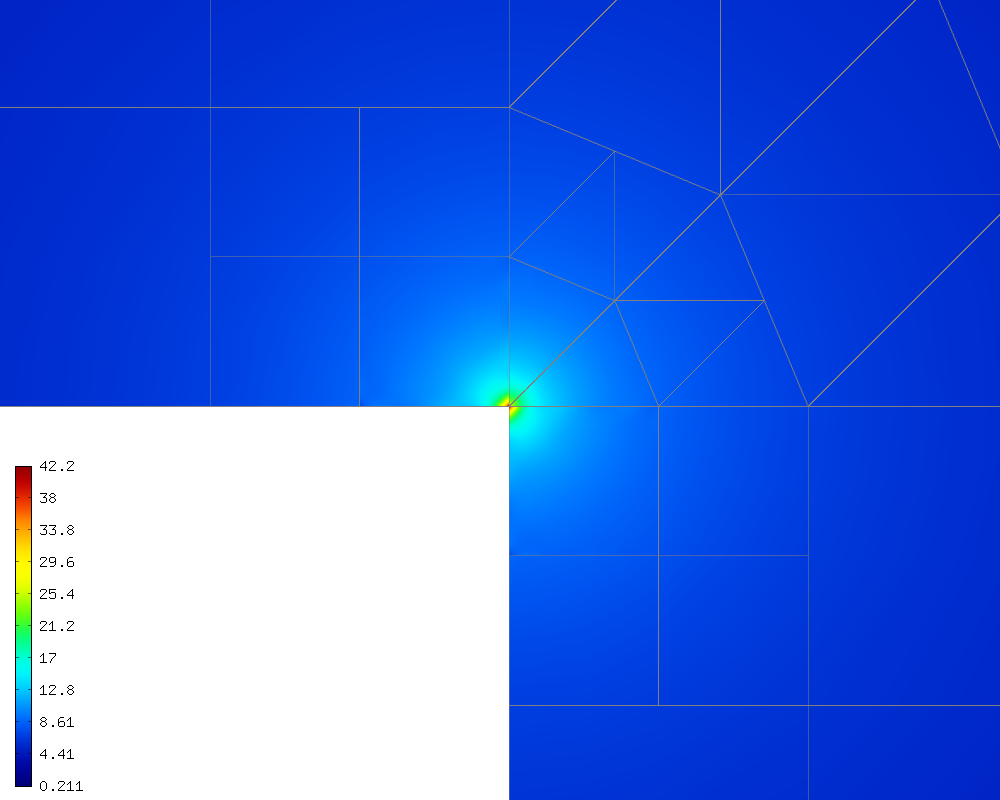

Boundary Conditions (04-bc-dirichlet, 05-bc-neumann, 06-bc-newton)
--------------------------------

Linking boundary markers with boundary condition types
~~~~~~~~~~~~~~~~~~~~~~~~~~~~~~~~~~~~~~~~~~~~~~~~~~~~~~

Hermes recognizes four types of boundary conditions. These are

* Dirichlet, such as $u = \mbox{const}$,
* Neumann, such as $\partial u/\partial n = \mbox{const}$ where $n$ is a unit outer normal vector to the boundary, 
* Newton, such as $\mbox{const}_1 u + \partial u/\partial n = \mbox{const}_2$, 
* None (solution on that part of the boundary is unknown but Hermes will not attempt to evaluate any surface integrals on it).

Nonconstant values (functions of spatial variables $x$, $y$ and time $t$) are possible for all types. 

In the code, the user has to create an instance of the class BCTypes and use its methods::
 
    void BCTypes::add_bc_dirichlet(Hermes::Tuple<int> markers);
    void BCTypes::add_bc_neumann(Hermes::Tuple<int> markers);
    void BCTypes::add_bc_newton(Hermes::Tuple<int> markers);
    void BCTypes::add_bc_none(Hermes::Tuple<int> markers);

If a marker is not linked to any type, then the default is Neumann. For a single 
marker, the Tuple reduces to a single integer::

    void BCTypes::add_bc_dirichlet(int marker);
    void BCTypes::add_bc_neumann(int marker);
    void BCTypes::add_bc_newton(int marker);
    void BCTypes::add_bc_none(int marker);

Nonzero Dirichlet BC (example 04)
~~~~~~~~~~~~~~~~~~~~~~~~~~~~~~~~~

**Git reference:** Tutorial example `04-bc-dirichlet 
<http://git.hpfem.org/hermes.git/tree/HEAD:/hermes2d/tutorial/P01-linear/04-bc-dirichlet>`_. 

Suppose that we would like to modify the boundary conditions for 
example 03-poisson as follows:

.. math::
         u(x,y) = -\frac{C}{4}(x^2 + y^2)\,\ \mbox{on}\,\ \partial \Omega.

This is done by defining a callback::

    scalar essential_bc_values(int ess_bdy_marker, double x, double y)
    {
      return (-C/4)*(x*x + y*y);
    }

The callback is registered as follows::

    // Enter Dirichlet boudnary values.
    BCValues bc_values;
    bc_values.add_function(Hermes::Tuple<int>(BDY_BOTTOM, BDY_OUTER, BDY_LEFT, BDY_INNER), essential_bc_values);

   
Defining constant, nonconstant, and time-dependent boundary values
~~~~~~~~~~~~~~~~~~~~~~~~~~~~~~~~~~~~~~~~~~~~~~~~~~~~~~~~~~~~~~~~~~

The BCValues class enables registering constants, functions of space, and 
functions of space and time::

  void BCValues::add_zero(Hermes::Tuple<int> markers);
  void BCValues::add_const(Hermes::Tuple<int> markers, scalar value);
  void BCValues::add_function(Hermes::Tuple<int> markers, value_callback callback);
  void BCValues::add_timedep_function(Hermes::Tuple<int> markers, value_callback_time callback); 

Sample results
~~~~~~~~~~~~~~

It is easy to see that the solution to this problem is the function

.. math::
         u(x,y) = -\frac{C}{4}(x^2 + y^2). 

For the values $C = -4$ and P_INIT = 5, the output is shown below:

.. image:: 04/dirichlet.png
   :align: center
   :width: 400
   :height: 350
   :alt: Solution of the Dirichlet problem.

Mathematics of nonzero Dirichlet BC
~~~~~~~~~~~~~~~~~~~~~~~~~~~~~~~~~~~

Mathematically, nonzero Dirichlet conditions in Hermes are handled 
as follows: The user defines some function (or constant) on the 
Dirichlet boundary. Hermes then creates a Dirichlet lift $G$, which is 
a continuous function that satisfies the Dirichlet boundary conditions
but descends continuously to zero within the layer of elements that 
are adjacent to the Dirichlet boundary. 

Next, the solution $u$ to the original weak problem 

.. math::
    
    a(u,v) = l(v)

is written as $u = U + G$ where $U$ satisfies zero Dirichlet
boundary conditions. Hereby the weak formulation turns into

.. math::
    
    a(U,v) + a(G, v) = l(v)

and since $a(G, v)$ is a linear form, we put it on the right-hand side:

.. math::
    
    a(U,v) = l(v) - a(G, v)

This is a new weak formulation that is solved by Hermes, and its solution 
is $U$. The user, however, does not see any of this, as he is given 
back the function $U + G$. 

For more details on the treatment of boundary conditions as well as on the
rest of the finite element technology, we refer the reader to 
P. Solin: Partial Differential Equations and the Finite Element Methods,
J. Wiley & Sons, 2005.

Neumann BC (example 05)
~~~~~~~~~~~~~~~~~~~~~~~

**Git reference:** Tutorial example `05-bc-neumann 
<http://git.hpfem.org/hermes.git/tree/HEAD:/hermes2d/tutorial/P01-linear/05-bc-neumann>`_. 

Next, let us consider Neumann boundary conditions. The new model problem
will have the form

.. math::
    :nowrap:

    \begin{eqnarray*}   -\Delta u = C,\ \ \ \ \ &&u = 0\,\ \mbox{on}\,\ \Gamma_4,\\                            &&\dd{u}{n} = C_1\,\ \mbox{on}\,\ \Gamma_1,\\                            &&\dd{u}{n} = C_2\,\ \mbox{on}\,\ \Gamma_2,\\                            &&\dd{u}{n} = C_3\,\ \mbox{on}\,\ \Gamma_3. \end{eqnarray*}

where $\Gamma_1 \dots \Gamma_4$ correspond to the edges marked $1 \dots 4$. Now, the weak formulation contains some surface integrals:

.. math::

    \int_\Omega \nabla u \cdot \nabla v \;\mbox{d\bfx} =   C\int_\Omega v \;\mbox{d\bfx}   + C_1\int_{\Gamma_1} \!v \;\mbox{d}l   + C_2\int_{\Gamma_2} \!v \;\mbox{d}l   + C_3\int_{\Gamma_3} \!v \;\mbox{d}l

In Hermes, all forms in the standard weak formulation $a(u,v) = l(v)$
are in fact defined as a sum of contributions from volume integrals and from
surface integrals. In the case of the linear form $l(v)$, this means

.. math::

    l(v) = \sum_m l_m^{\,\rm vol}(v) + \sum_n l_n^{\,\rm surf}(v).

We have already seen volumetric linear forms in example 
`03-poisson <http://hpfem.org/hermes2d/doc/src/hermes2d/linear/poisson.html>`_. 
Surface linear forms are implemented similarly. Our new right-hand side is
represented by two functions with the following prototypes::

    template<typename Real, typename Scalar>
    Scalar linear_form(int n, double *wt, Func<Scalar> *u_ext[], Func<Real> *v, Geom<Real> *e, ExtData<Scalar> *ext)
    
    template<typename Real, typename Scalar>
    Scalar linear_form_surf(int n, double *wt, Func<Scalar> *u_ext[], Func<Real> *v, Geom<Real> *e, ExtData<Scalar> *ext);

and registered as follows::

    // Initialize the weak formulation
    WeakForm wf();
    wf.add_matrix_form(callback(bilinear_form));
    wf.add_vector_form(callback(linear_form));
    wf.add_vector_form_surf(callback(linear_form_surf));

The surface linear form is defined as::

    template<typename Real, typename Scalar>
    Scalar linear_form_surf(int n, double *wt, Func<Scalar> *u_ext[], Func<Real> *v, Geom<Real> *e, ExtData<Scalar> *ext)
    {
      return CONST_GAMMA[e->marker - 1] * int_v<Real, Scalar>(n, wt, v);
    }

Here, we have used the predefined surface integral int_v (see the
file `src/integrals/integrals_h1.h <http://git.hpfem.org/hermes.git/blob/HEAD:/hermes2d/src/integrals/integrals_h1.h>`_). 
If the boundary conditions were more complicated, we could also
have used int_F_v, where F stands for an arbitrary user-supplied
function returning the value $\partial u/\partial n$.

Note that in this example, the mesh is a-priori refined towards the re-entrant corner 
to capture the singular gradient::

    mesh.refine_towards_vertex(3, CORNER_REF_LEVEL);  // '3' is the vertex index from the mesh file.

Visualizing solution gradient
~~~~~~~~~~~~~~~~~~~~~~~~~~~~~ 

The gradient magnitude can be visualized via a MagFilter::

    // Compute and show gradient magnitude
    // (note that the infinite gradient at the re-entrant
    // corner will be truncated for visualization purposes)
    ScalarView gradview("Gradient", grad_win_geom);
    MagFilter grad(Tuple<MeshFunction>(&sln, &sln), Tuple<int>(H2D_FN_DX, H2D_FN_DY));
    gradview.show(&grad);

The approximate solution for the values $C_1 = -1/2$, $C_2 = 1$, $C_3 = -1/2$,
along with the singularity of gradient at the re-entrant corner are
shown in the following figures:

.. image:: 05/neumann2.png
   :align: left
   :width: 530
   :height: 400
   :alt: Solution of the Neumann problem.

.. image:: 05/neumann3.png
   :align: right
   :width: 400
   :height: 400
   :alt: Detail of gradient singularity at the re-entrant corner.

.. raw:: html

   

Newton BC (example 06)
~~~~~~~~~~~~~~~~~~~~~~

**Git reference:** Tutorial example `06-bc-newton 
<http://git.hpfem.org/hermes.git/tree/HEAD:/hermes2d/tutorial/P01-linear/06-bc-newton>`_. 

Another common natural boundary condition is the Newton (sometimes called Robin) condition
of the form

.. math::

    \dd{u}{n} + c_1 u = c_2, \ \ \ \ c_1 \ne 0.

Analogously to Neumann conditions, also Newton conditions yield surface integrals. However,
this time they are both in the bilinear form and in the linear form,
The bilinear form is
a sum of volume and surface forms that can be added to the weak formulation using the methods
add_matrix_form() and add_matrix_form_surf(). 
The surface bilinear form must have the following prototype:
::

    template<typename Real, typename Scalar>
    Scalar bilinear_form_surf(int n, double *wt, Func<Scalar> *u_ext[], Func<Real> *u, Func<Real> *v, Geom<Real> *e, ExtData<Scalar> *ext);

Inside this function you can use predefined
forms such as int_u_v, int_F_u_v (see the
file `src/integrals/integrals_h1.h <http://git.hpfem.org/hermes.git/blob/HEAD:/hermes2d/src/integrals/integrals_h1.h>`_) or your custom forms.

The following code snippet contains the linear and bilinear forms:
::

    template<typename Real, typename Scalar>
    Scalar bilinear_form(int n, double *wt, Func<Scalar> *u_ext[], Func<Real> *u, Func<Real> *v, Geom<Real> *e, ExtData<Scalar> *ext)
    {
      return int_grad_u_grad_v<Real, Scalar>(n, wt, u, v);
    }

    template<typename Real, typename Scalar>
    Scalar bilinear_form_surf(int n, double *wt, Func<Scalar> *u_ext[], Func<Real> *u, Func<Real> *v, Geom<Real> *e, ExtData<Scalar> *ext)
    {
      return H * int_u_v<Real, Scalar>(n, wt, u, v);
    }

    template<typename Real, typename Scalar>
    Scalar linear_form_surf(int n, double *wt, Func<Scalar> *u_ext[], Func<Real> *v, Geom<Real> *e, ExtData<Scalar> *ext)
    {
      return T0 * H * int_v<Real, Scalar>(n, wt, v);
    }

Here, $T_0$ is the exterior temperature, and $H$ is the heat flux.
The above forms are registered using::

    // Initialize the weak formulation.
    WeakForm wf;
    wf.add_matrix_form(callback(bilinear_form));
    wf.add_matrix_form_surf(callback(bilinear_form_surf), NEWTON_BDY);
    wf.add_vector_form_surf(callback(linear_form_surf), NEWTON_BDY);

Here NEWTON_BDY is the boundary marker for the Newton boundary. The following figures 
show the solution and singularity of gradient at the re-entrant corner:

.. image:: 06/newton1.png
   :align: left
   :width: 530
   :height: 400
   :alt: Solution of the Newton problem.

.. raw:: html

   

