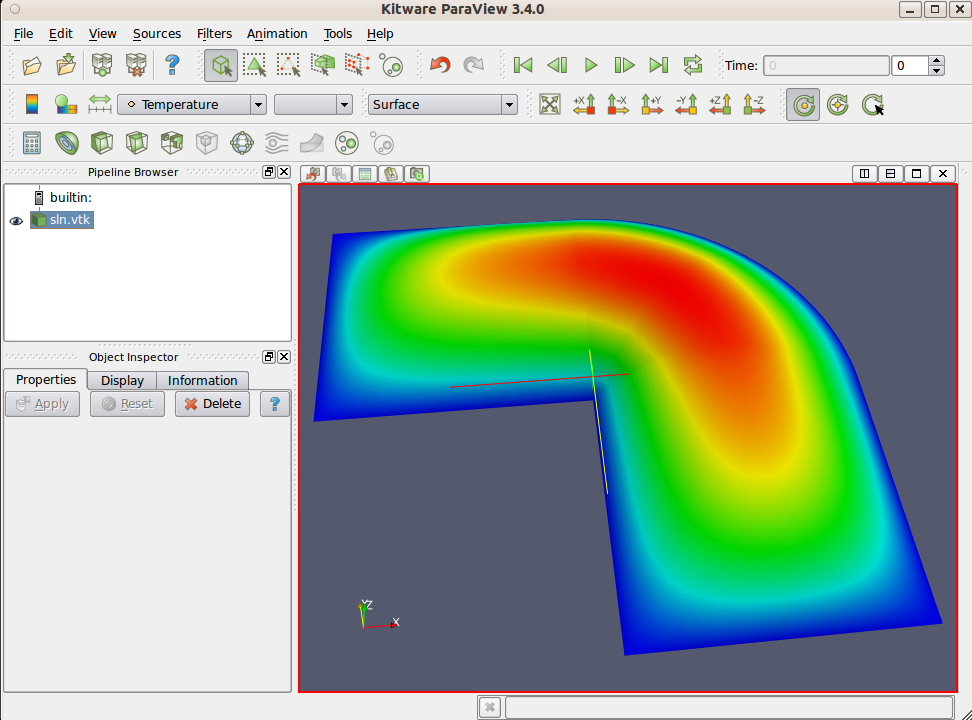
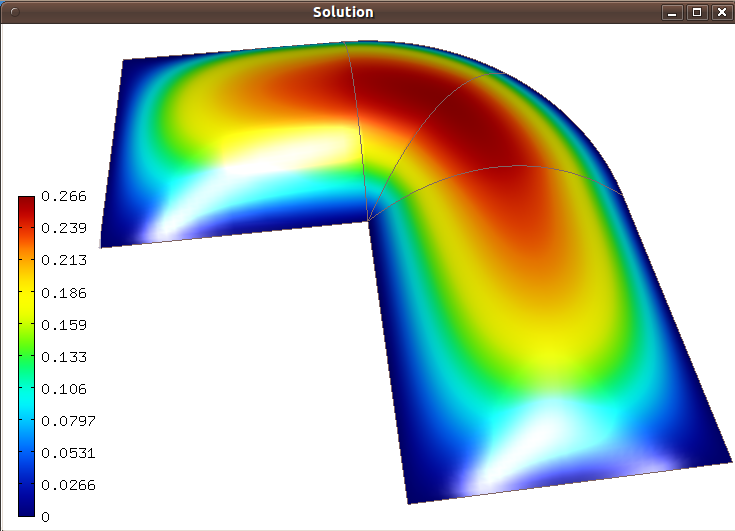

Poisson Equation (03-poisson)
---------------------

**Git reference:** Tutorial example `03-poisson <http://git.hpfem.org/hermes.git/tree/HEAD:/hermes2d/tutorial/P01-linear/03-poisson>`_. 

Model problem
~~~~~~~~~~~~~

Let us solve the Poisson equation

.. math::
    :label: poisson1

       -\Delta u = C

on the L-shaped domain $\Omega$ from the previous example,
equipped with homogeneous (zero) Dirichlet boundary conditions

.. math::
    :label: poisson2

       u = 0\ \ \  \mbox{on}\  \partial \Omega,

where $C$ is a real number. The weak formulation 
is derived in the standard way, first by multiplying equation :eq:`poisson1` with a test
function $v$, then integrating over the domain $\Omega$, and then applying the Green's
theorem (integration by parts) to the second derivatives.
Because of the homogeneous Dirichlet condition :eq:`poisson2`,
the proper space for the solution is $V = H^1_0(\Omega)$. The weak formulation reads:
Find $u \in V$ such that

.. math::
    :label: poissonweak

         \int_\Omega \nabla u \cdot \nabla v \;\mbox{d\bfx} = C \int_\Omega v \;\mbox{d\bfx} \ \ \ \mbox{for all}\ v \in V.

Equation :eq:`poissonweak` has the standard form $a(u,v) = l(v)$. 

Defining weak forms
~~~~~~~~~~~~~~~~~~~

The bilinear form $a(u,v)$ and the linear form $l(v)$ are defined using the following
callbacks::

    // Return the value \int \nabla u \cdot \nabla v dx.
    template<typename Real, typename Scalar>
    Scalar bilinear_form(int n, double *wt, Func<Scalar> *u_ext[], Func<Real> *u, Func<Real> *v, Geom<Real> *e, ExtData<Scalar> *ext)
    {
      Scalar result = 0;
      for (int i = 0; i < n; i++) result += wt[i] * (u->dx[i] * v->dx[i] + u->dy[i] * v->dy[i]);
      return result;
    }
   
    // Return the value C \int v dx.
    template<typename Real, typename Scalar>
    Scalar linear_form(int n, double *wt, Func<Scalar> *u_ext[], Func<Real> *v, Geom<Real> *e, ExtData<Scalar> *ext)
    {
      Scalar result = 0;
      for (int i = 0; i < n; i++) result += wt[i] * (v->val[i]);
      return C * result;
    }

These callbacks are called by Hermes for each element during the assembly and they must return the 
values of the bilinear and linear forms for the given arguments. 

Arguments of weak forms
~~~~~~~~~~~~~~~~~~~~~~~

The arguments of weak forms have the following meaning:

  * *n* ... the number of integration points,
  * *wt* ... array of integration weights for all integration points,
  * *u_ext* ... solution values (for nonlinear problems only, to be discussed later),
  * *u* ... basis function,
  * *v* ... test function,
  * *e* ... geometrical information such as physical positions of integration points, tangent and normal vectors to element edges, etc. (to be discussed later),
  * *ext* ... external data to be passed into the weak forms (to be discussed later).

(All is provided by Hermes automatically.) The reader does not have to worry about the 
templates for now - they are used by Hermes to 
automatically determine the number of integration points for each *u* and *v* pair (to be discussed
later). The above code also reveals how the function values and partial derivatives of the basis and 
test functions are accessed. Use
::

    u->val[i]

to access the value of the basis function at i-th integration point,
::

    v->val[i]

to access the value of the test function at i-th integration point,
::

    u->dx[i]

to access the x-derivative of the basis function at i-th integration point, etc. 
Later we will learn how to access the physical coordinates of integration points 
and other data. 

Using predefined integrals
~~~~~~~~~~~~~~~~~~~~~~~~~~

In many cases, such as in this one, one can replace the above code with predefined integrals
that can be found in the file `src/integrals/integrals_h1.h <http://git.hpfem.org/hermes.git/blob/HEAD:/hermes2d/src/integrals/integrals_h1.h>`_::

    // Return the value \int \nabla u . \nabla v dx.
    template<typename Real, typename Scalar>
    Scalar bilinear_form(int n, double *wt, Func<Scalar> *u_ext[], Func<Real> *u, Func<Real> *v, Geom<Real> *e, ExtData<Scalar> *ext)
    {
      return int_grad_u_grad_v<Real, Scalar>(n, wt, u, v);
    }
   
    // Return the value \int v dx.
    template<typename Real, typename Scalar>
    Scalar linear_form(int n, double *wt, Func<Scalar> *u_ext[], Func<Real> *v, Geom<Real> *e, ExtData<Scalar> *ext)
    {
      return C * int_v<Real, Scalar>(n, wt, v);
    }

Predefined integrals like this also exist for the Hcurl, Hdiv and L2 spaces. 

Next let us present a typical sequence of steps that are needed to solve a linear problem.

Loading the mesh
~~~~~~~~~~~~~~~~

The main.cpp file typically begins with loading the mesh::

    // Load the mesh.
    Mesh mesh;
    H2DReader mloader;
    mloader.load("domain.mesh", &mesh);

Setting zero Dirichlet boundary conditions
~~~~~~~~~~~~~~~~~~~~~~~~~~~~~~~~~~~~~~~~~~

To assign zero Dirichlet boundary conditions to the boundary, the user first has to 
say that all boundary markers, in this case BDY_BOTTOM, BDY_OUTER, BDY_LEFT, and BDY_INNER
will be Dirichlet::

    // Enter boundary markers.
    BCTypes bc_types;
    bc_types.add_bc_dirichlet(Hermes::Tuple<int>(BDY_BOTTOM, BDY_OUTER, BDY_LEFT, BDY_INNER));

Do not worry about the complicated-looking Tuple, this is just to enter a set of several
boundary markers (in fact positive integers) without using variable-length arrays.

After this, create an instance of the class BCValues 
and provide values for all Dirichlet boundary conditions. To impose
zero Dirichlet conditions, which is a default for each marker, it is enough 
to write::

    // Enter Dirichlet boundary values.
    BCValues bc_values;

The treatment of nonzero Dirichlet and other boundary conditions 
will be explained in more detail, and illustrated on examples, in 
the following tutorial examples 04, 05 and 06. Now let's proceed
to the finite element space. 

Initializing finite element space
~~~~~~~~~~~~~~~~~~~~~~~~~~~~~~~~~

As a next step, we initialize the FE space in the same way as in the previous tutorial 
example 02::

    // Create an H1 space with default shapeset.
    H1Space space(&mesh, &bc_types, &bc_values, P_INIT);
    int ndof = Space::get_num_dofs(&space);
    info("ndof = %d", ndof);

Initializing weak formulation
~~~~~~~~~~~~~~~~~~~~~~~~~~~~~

Weak forms need to be registered as follows::

    // Initialize the weak formulation.
    WeakForm wf();
    wf.add_matrix_form(callback(bilinear_form));
    wf.add_vector_form(callback(linear_form));

The reader does not have to worry about the macro *callback()* for the moment, this is 
related to automatic determination of integration order.
For more complicated PDE and PDE systems one can add multiple matrix and vector forms.
One can optimize assembling by indicating that a matrix form is symmetric, associate
different weak forms with different element material markers, etc. All this will be 
discussed later.

Initializing discrete problem
~~~~~~~~~~~~~~~~~~~~~~~~~~~~~

The weak formulation and space(s) constitute a finite element problem.
To define it, one needs to create an instance of the DiscreteProblem 
class::

    // Initialize the FE problem.
    bool is_linear = true;
    DiscreteProblem dp(&wf, &space, is_linear);

The third argument "is_linear" is optional. If it is left out, Hermes 
assumes that the problem is nonlinear. In the nonlinear case, the 
matrix and vector weak forms are interpreted differently, we will 
learn about this later. 

Initializing matrix solver
~~~~~~~~~~~~~~~~~~~~~~~~~~

Next one needs to choose a matrix solver::

    MatrixSolverType matrix_solver = SOLVER_UMFPACK;  

Besides UMFPACK, one can use SOLVER_AMESOS, SOLVER_MUMPS, SOLVER_PETSC, and
SOLVER_SUPERLU (and matrix-free SOLVER_NOX for nonlinear problems. this will be discussed
later). 

After that one needs to create instances of a matrix, vector, and matrix solver 
as follows:: 

    // Set up the solver, matrix, and rhs according to the solver selection.
    SparseMatrix* matrix = create_matrix(matrix_solver);
    Vector* rhs = create_vector(matrix_solver);
    Solver* solver = create_linear_solver(matrix_solver, matrix, rhs);

Assembling the matrix and vector
~~~~~~~~~~~~~~~~~~~~~~~~~~~~~~~~

The stiffness matrix and load vector are assembled as follows::

    // Assemble the stiffness matrix and right-hand side vector.
    info("Assembling the stiffness matrix and right-hand side vector.");
    dp.assemble(matrix, rhs);

Solving the matrix problem
~~~~~~~~~~~~~~~~~~~~~~~~~~

Finally, the matrix problem is solved via::

    // Solve the linear system and if successful, obtain the solution.
    info("Solving the matrix problem.");
    if(solver->solve())
      Solution::vector_to_solution(solver->get_solution(), &space, &sln);
    else
      error ("Matrix solver failed.\n");

The matrix solver can fail for various reasons -- direct solvers (UMFPACK,
SUPERLU, MUMPS) may run out of memory if the number of equations is large,
iterative solvers may fail to converge if the matrix is ill-conditioned.  

Saving solution in VTK format
~~~~~~~~~~~~~~~~~~~~~~~~~~~~~

The solution can be saved in the VTK format to be visualized, for example,
using `Paraview <http://www.paraview.org/>`_. To do this, one uses the 
Linearizer class that has the ability to approximate adaptively a higher-order
polynomial solution using linear triangles::

  // Output solution in VTK format.
  Linearizer lin;
  bool mode_3D = true;
  lin.save_solution_vtk(&sln, "sln.vtk", "Temperature", mode_3D);
  info("Solution in VTK format saved to file %s.", "sln.vtk");

The function save_solution_vtk() can be found in hermes2d/src/linearizer/ and its 
complete header is::

  // Saves a MeshFunction (Solution, Filter) in VTK format.
  virtual void save_solution_vtk(MeshFunction* meshfn, const char* file_name, const char* quantity_name,
                                 bool mode_3D = true, int item = H2D_FN_VAL_0, 
                                 double eps = HERMES_EPS_NORMAL, double max_abs = -1.0,
                                 MeshFunction* xdisp = NULL, MeshFunction* ydisp = NULL,
                                 double dmult = 1.0);

Only the first three arguments are mandatory, the remaining ones are optional.
Their meaning is as follows:

 * mode_3D ... select either 2D or 3D rendering (default is 3D).
 * item:
   H2D_FN_VAL_0 ... show function values, 
   H2D_FN_DX_0  ... show x-derivative,
   H2D_FN_DY_0  ... show y-derivative,
   H2D_FN_DXX_0 ... show xx-derivative,
   H2D_FN_DXY_0 ... show xy-derivative,
   H2D_FN_DYY_0 ... show yy-derivative,
 * eps:
   HERMES_EPS_LOW      ... low resolution (small output file),
   HERMES_EPS_NORMAL   ... normal resolution (medium output file),
   HERMES_EPS_HIGH     ... high resolution (large output file),
   HERMES_EPS_VERYHIGH ... high resolution (very large output file).
 * max_abs: technical parameter, see file src/linearizer/linear.h.
 * xdisp, ydisp, dmult: Can be used to deform the domain. Typical applications are elasticity, plasticity, etc.
 
The following figure shows the corresponding Paraview visualization:

Visualizing the solution using OpenGL (optional)
~~~~~~~~~~~~~~~~~~~~~~~~~~~~~~~~~~~~~~~~~~~~~~~~

The solution can also be visualized via the ScalarView class::

    // Visualize the solution.
    ScalarView view("Solution", new WinGeom(0, 0, 440, 350));
    view.show(&sln);
    View::wait();

Hermes' built-in OpenGL visualization looks as follows:

Cleaning up
~~~~~~~~~~~

We finish the main.cpp file with::

    // Clean up.
    delete solver;
    delete matrix;
    delete rhs;

