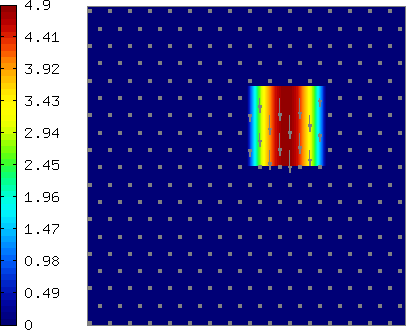
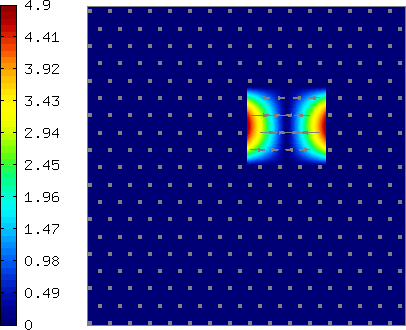
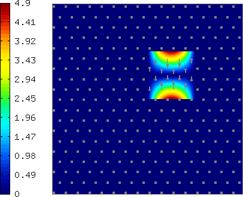

Space H(curl) (05-space-hcurl)
------------------

**Git reference:** Tutorial example `05-space-hcurl <http://git.hpfem.org/hermes.git/tree/HEAD:/hermes2d/tutorial/P10-miscellaneous/05-space-hcurl>`_. 

In `P01-linear/02-space <http://hpfem.org/hermes/doc/src/hermes2d/linear/space.html>`_ we first saw how a finite element space over a mesh is created. That was an $H^1$ space suitable for continuous approximations. Another widely used Sobolev space, H(curl), is typically present in Maxwell's problems of electromagnetics. H(curl) approximations are discontinuous, elementwise polynomial vector fields that behave like gradients of $H^1$ functions. (Recall that in electrostatics $E = - \nabla \varphi$.) In particular, H(curl) functions have continuous tangential components along all mesh edges. For the application of the H(curl) space check examples related to Maxwell's equations in the previous sections. Below is a simple code that shows how to set up an H(curl) space and visualize its finite element basis functions:

::

    int INIT_REF_NUM = 2;      // Initial uniform mesh refinement.
    int P_INIT = 3;            // Polynomial degree of mesh elements.

    int main(int argc, char* argv[])
    {
      // Load the mesh.
      Mesh mesh;
      H2DReader mloader;
      mloader.load("square.mesh", &mesh);

      // Initial mesh refinement.
      for (int i = 0; i < INIT_REF_NUM; i++) mesh.refine_all_elements();

      // Enter boundary markers (default is Neumann boundary).
      BCTypes bc_types;

      // Enter Dirichlet boundary values (not relevant here).
      BCValues bc_values;

      HcurlSpace space(&mesh, &bc_types, &bc_values, P_INIT);

      // Visualize FE basis.
      VectorBaseView bview("VectorBaseView", new WinGeom(0, 0, 700, 600));
      bview.show(&space);

      // Wait for all views to be closed.
      View::wait();
      return 0;
    }

The class VectorBaseView allows the user to browse through 
the finite element basis functions using the left and right 
arrows. A few 
sample basis functions (higher-order bubble functions) are 
shown below. The color shows magnitude of the vector field, 
arrows show its direction.

.. image:: 30/fn3.png
   :align: center
   :width: 300
   :alt: Sample basis function

The space H(curl) is implemented for both quadrilateral and triangular 
elements, and both elements types can be combined in one mesh. 
