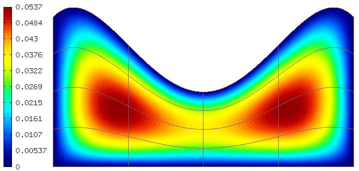

Using NURBS (35-nurbs)
----------------

**Git reference:** Tutorial example `35-nurbs <http://git.hpfem.org/hermes.git/tree/HEAD:/hermes2d/tutorial/P10-miscellaneous/35-nurbs>`_. 

This example illustrates how to use full-featured NURBS
to define curved boundary edges. Recall that simplified 
format is available for circular arcs, as was shown 
in example 03-poisson. 

Solved is a simple Poisson equation with constant right-hand
side and homogeneous Dirichlet boundary conditions.

The domain is a rectangle (0,2) x (0, 1) whose upper
edge is a NURBS curve. There are three mesh files
in this example: domain-1.mesh (one control point),
domain-2.mesh (two control points), and domain-3.mesh
(three control points). One of these files needs to be 
selected on line 15 in main.cpp::

    const char* mesh_file = "domain-1.mesh";          // One control point.
    //const char* mesh_file = "domain-2.mesh";          // Two control points.
    //const char* mesh_file = "domain-3.mesh";          // Three control points.

General description of NURBS
~~~~~~~~~~~~~~~~~~~~~~~~~~~~

Every NURBS curve is defined by its degree, control points with weights and the
knot vector. The degree $d$ is a positive integer, usually 1, 2, 3 or 5. Lines
and polylines are of degree 1, circles have degree 2 and free-form curves are
of degree 3 or 5. The control points $p_i$, $i = 0 \ldots n$, are the main tool for changing the
shape of the curve. A curve of degree $d$ must have at least $d+1$ control
points. In Hermes, the endpoints of the edge are always assumed to be the
first and last control points and therefore only the inner control points are
listed in the mesh file. There is a weight $w_i \geq 0$ for every control point,
that influences the shape of the curve in its vicinity. If $w_i = 0$ then 
$p_i$ has no effect on the shape.  As $w_i$ increases, the curve is pulled 
towards $p_i$.

The knot vector is a sequence of $m+1$ values that determines how much and
where the control points influence the shape. The relation $m = n+d+1$ must
hold. The sequence is nondecreasing, $t_i \leq t_{i+1}$, and divides the whole
interval $[0,1]$ into smaller intervals which determine the area of influence
of the control points. Since the curve has to start and end at the edge
vertices, the knot vector in Hermes always starts with $d+1$ zeros and ends
with $d+1$ ones. Only the inner knots are listed in the above definition of the
variable ``curves``, where $knots$ is a simple list of real values. 

Examples
~~~~~~~~

**One inner control point**

Snippet from the file domain-1.mesh::

    degree = 2                # Degree should be equal to the 
    num_inner_points = 1      # number of inner points plus one.
                              
    inner_points =
    {
      { 1.5, 2.0, 2.0 }       # x, y, weight
    } 
    knots = 
    {
      0, 0, 0, 1, 1, 1        
    }
    curves =
    {
      {2, 3, degree, inner_points, knots} 
    }

Result:

.. image:: 37/1.png
   :align: center
   :width: 500
   :alt: NURBS with one control point.

**Two inner control points**

Snippet from the file domain-3.mesh::

    degree = 3
    num_inner_points = 2
    inner_points =
    {
      { 1.5, 1.5, 1.0 },
      { 0.5, 0.5, 1.0 }
    } 
    knots = 
    {
      0, 0, 0, 1, 1, 1
    }
    curves =
    {
      {2, 3, degree, inner_points, knots} 
    }

Result:

.. image:: 37/2.png
   :align: center
   :width: 500
   :alt: NURBS with two control points.

**Three inner control points**

Snippet from the file domain-2.mesh::

    degree = 4
    num_inner_points = 3
    inner_points =
    {
      { 1.5, 1.5, 1.0 },
      { 1.0, -1.0, 1.0 },
      { 0.5, 1.5, 1.0 }
    } 
    knots = 
    {
      0, 0, 0, 1, 1, 1
    }
    curves =
    {
      {2, 3, degree, inner_points, knots} 
    }

Result:

