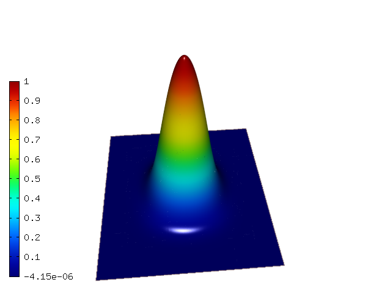
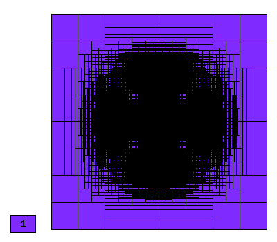
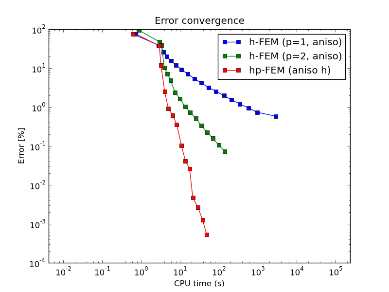
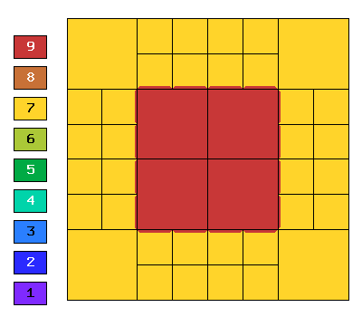
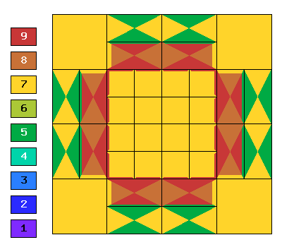
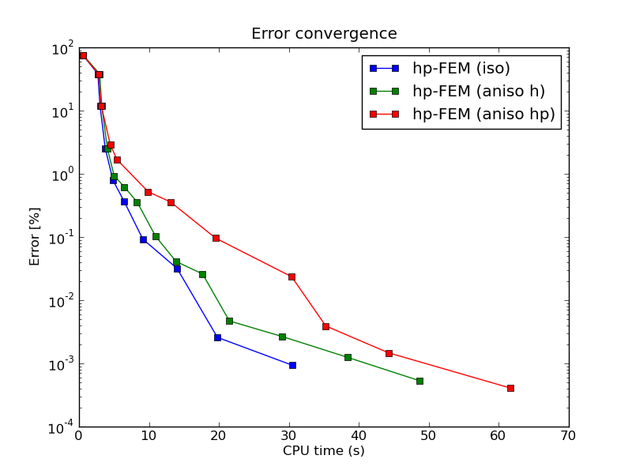

NIST-01 (Analytic Solution)
------------------

**Git reference:** Benchmark `nist-01 <http://git.hpfem.org/hermes.git/tree/HEAD:/hermes2d/benchmarks/nist-01>`_.

This is a well behaved problem with a smooth solution that is suitable for testing 
adaptive algorithm where adaptivity isn't really needed.

Model problem
~~~~~~~~~~~~~

Equation solved: Poisson equation 

.. math::
    :label: line-sing

       -\Delta u = f.

Domain of interest: Square $(0, 1)^2$.

Boundary conditions: Dirichlet given by the exact solution.

Exact solution
~~~~~~~~~~~~~~

.. math::

    u(x,y) = 2^{4p}x^{p}(1-x)^{p}y^{p}(1-y)^p

where $p$ determines the degree of the polynomial solution. 

Right-hand side: Obtained by inserting the exact solution into the equation.
The corresponding code snippet is shown below::

    template<typename Real>
    Real rhs(Real x, Real y)
    {
      Real a = pow(2.0, 4.0*EXACT_SOL_P);
      Real b = pow(x-1.0, 8.0);
      Real c = (38.0*pow(x, 2.0) - 38.0*x + 9.0);
      Real d = pow(y-1.0, EXACT_SOL_P);
      Real e = pow(y-1.0, 8.0);
      Real f = (38.0*pow(y, 2.0) - 38.0*y + 9.0);
      Real g = pow(x-1.0, EXACT_SOL_P);

      return EXACT_SOL_P*a*pow(x, 8.0)*b*c*pow(y, EXACT_SOL_P)*d + EXACT_SOL_P*a*pow(y, 8.0)*e*f*pow(x,EXACT_SOL_P)*g;
    }

Sample solution
~~~~~~~~~~~~~~~

Solution for $p = 10$:

Comparison of h-FEM (p=1), h-FEM (p=2) and hp-FEM with anisotropic refinements
~~~~~~~~~~~~~~~~~~~~~~~~~~~~~~~~~~~~~~~~~~~~~~~~~~~~~~~~~~~~~~~~~~~~~~~~~~~~~~

Final mesh (h-FEM, p=1, anisotropic refinements):

Final mesh (h-FEM, p=2, anisotropic refinements):

.. image:: nist-01/mesh_h2_aniso.png
   :align: center
   :width: 450
   :alt: Final mesh.

Final mesh (hp-FEM, h-anisotropic refinements):

.. image:: nist-01/mesh_hp_anisoh.png
   :align: center
   :width: 450
   :alt: Final mesh.

DOF convergence graphs:

.. image:: nist-01/conv_dof_aniso.png
   :align: center
   :width: 600
   :height: 400
   :alt: DOF convergence graph.

CPU convergence graphs:

hp-FEM with iso, h-aniso and hp-aniso refinements
~~~~~~~~~~~~~~~~~~~~~~~~~~~~~~~~~~~~~~~~~~~~~~~~~

Final mesh (hp-FEM, isotropic refinements):

Final mesh (hp-FEM, h-anisotropic refinements):

.. image:: nist-01/mesh_hp_anisoh.png
   :align: center
   :width: 450
   :alt: Final mesh.

Final mesh (hp-FEM, hp-anisotropic refinements):

DOF convergence graphs:

.. image:: nist-01/conv_dof_hp.png
   :align: center
   :width: 600
   :height: 400
   :alt: DOF convergence graph.

CPU convergence graphs:

