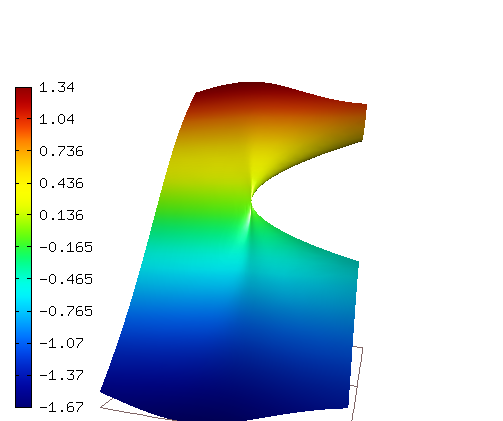
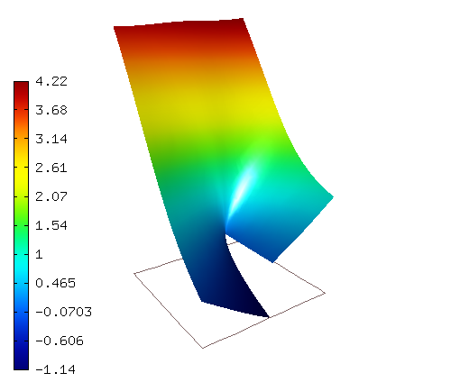
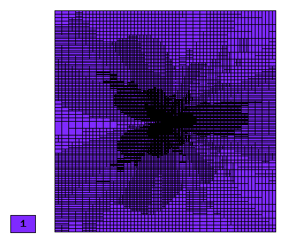
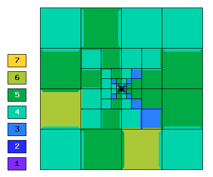
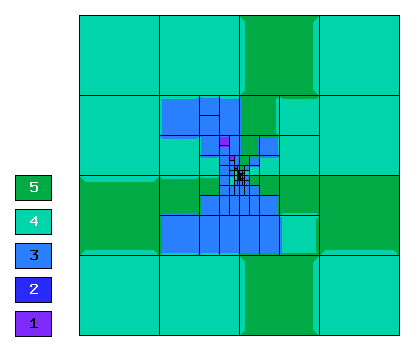
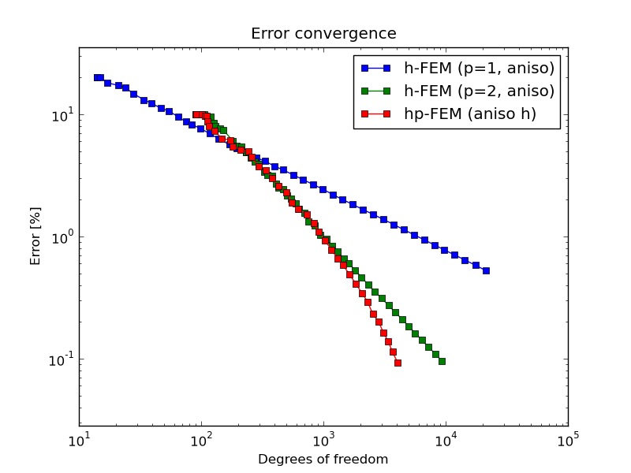
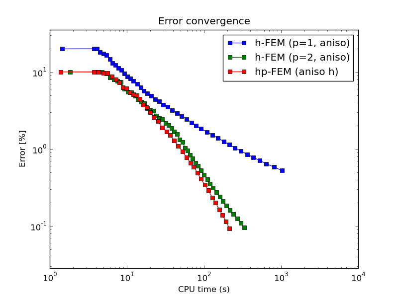
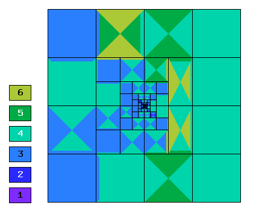
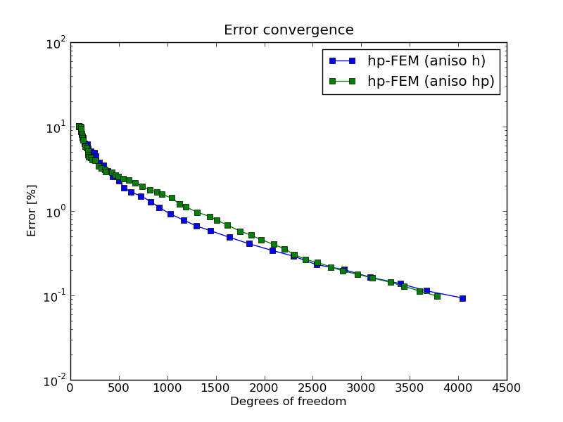

NIST-03 (Linear Elasticity)
------------------

**Git reference:** Benchmark `nist-03 <http://git.hpfem.org/hermes.git/tree/HEAD:/hermes2d/benchmarks/nist-03>`_.

This is a coupled system of two equations with a mixed derivative for linear elasticity in the coupling term.

Model problem
~~~~~~~~~~~~~

Equation solved: Linear elasticity coupled system of two equations

.. math::

        -E \frac{1-nu^2}{1-2*nu} \frac{\partial^{2} u}{\partial x^{2}} - E\frac{1-nu^2}{2-2*nu} \frac{\partial^{2} u}{\partial y^{2}} 
        -E \frac{1-nu^2}{(1-2*nu)(2-2*nu)} \frac{\partial^{2} v}{\partial x \partial y} = F_{x}.

.. math::

        -E \frac{1-nu^2}{2-2*nu} \frac{\partial^{2} v}{\partial x^{2}} - E\frac{1-nu^2}{1-2*nu} \frac{\partial^{2} v}{\partial y^{2}} 
        -E \frac{1-nu^2}{(1-2*nu)(2-2*nu)} \frac{\partial^{2} u}{\partial x \partial y} = F_{y}.

where $F_{x} = F_{y} = 0$, $u$ and $v$ are the $x$ and $y$ displacements, $E$ is Young's Modulus, and $\nu$ is Poisson's ratio.

Domain of interest: Square $(-1, 1)^2$ with a slit from $(0, 0)$ to $(1, 0)$.

Boundary conditions: Dirichlet given by exact solution. 

Exact solution
~~~~~~~~~~~~~~
Known exact solution for mode 1: 

.. math::

    u(x, y) = \frac{1}{2G} r^{\lambda}[(k - Q(\lambda + 1))cos(\lambda \theta) - \lambda cos((\lambda - 2) \theta)].

.. math::

    v(x, y) = \frac{1}{2G} r^{\lambda}[(k + Q(\lambda + 1))sin(\lambda \theta) + \lambda sin((\lambda - 2) \theta)].

here \lambda = 0.5444837367825, Q = 0.5430755788367.

Known exact solution for mode 2: 

.. math::

    u(x, y) =  \frac{1}{2G} r^{\lambda}[(k - Q(\lambda + 1))sin(\lambda \theta) - \lambda sin((\lambda - 2) \theta)].

.. math::

    v(x, y) = -\frac{1}{2G} r^{\lambda}[(k + Q(\lambda + 1))cos(\lambda \theta) + \lambda cos((\lambda - 2) \theta)].

here \lambda = 0.9085291898461, Q = -0.2189232362488.
Both in mode 1 and mode 2, $k = 3 - 4 \nu$, $G = E / (2(1 + \nu))$.

Sample solution
~~~~~~~~~~~~~~~

Solution for mode 1: 

Comparison of h-FEM (p=1), h-FEM (p=2) and hp-FEM with anisotropic refinements
~~~~~~~~~~~~~~~~~~~~~~~~~~~~~~~~~~~~~~~~~~~~~~~~~~~~~~~~~~~~~~~~~~~~~~~~~~~~~~

Final mesh (h-FEM, p=1, anisotropic refinements):

.. image:: nist-03/mesh_v_h1_aniso.png
   :align: center
   :width: 450
   :alt: Final mesh.

Final mesh (h-FEM, p=2, anisotropic refinements):

.. image:: nist-03/mesh_u_h2_aniso.png
   :align: center
   :width: 450
   :alt: Final mesh.

.. image:: nist-03/mesh_v_h2_aniso.png
   :align: center
   :width: 450
   :alt: Final mesh.

Final mesh (hp-FEM, h-anisotropic refinements):

DOF convergence graphs:

CPU convergence graphs:

hp-FEM with h-aniso and hp-aniso refinements
~~~~~~~~~~~~~~~~~~~~~~~~~~~~~~~~~~~~~~~~~~~~~~~~~

Final mesh (hp-FEM, h-anisotropic refinements):

Final mesh (hp-FEM, hp-anisotropic refinements):

.. image:: nist-03/mesh_u_hp_aniso.png
   :align: center
   :width: 450
   :alt: Final mesh.

DOF convergence graphs:

CPU convergence graphs:

.. image:: nist-03/conv_cpu_hp.png
   :align: center
   :width: 600
   :height: 400
   :alt: CPU convergence graph.

