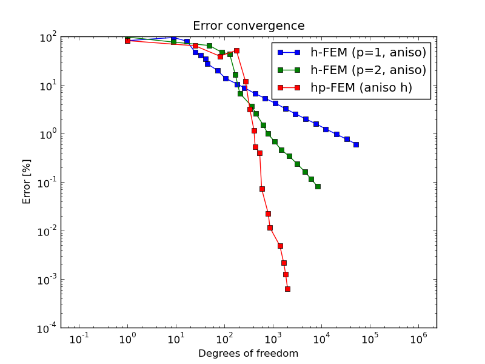
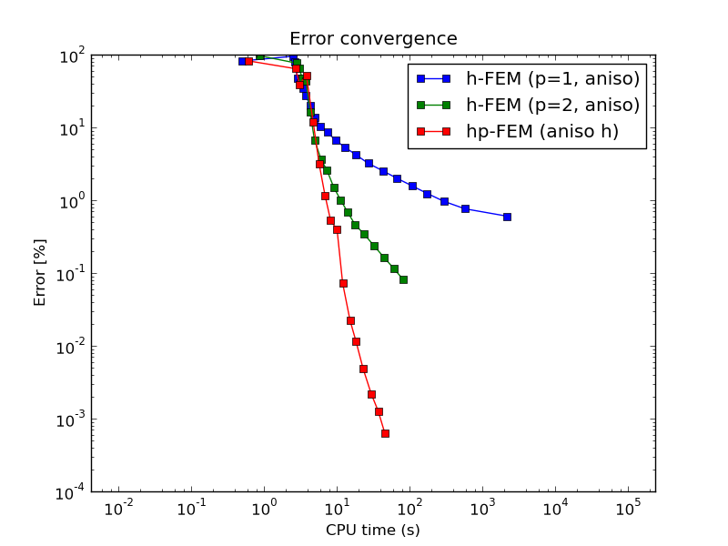
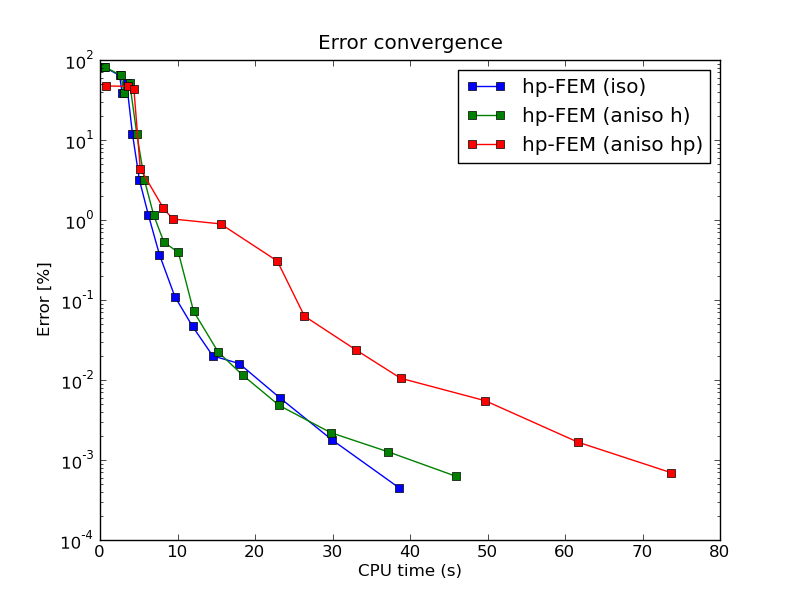

NIST-04 (Peak)
------------------

**Git reference:** Benchmark `nist-04 <http://git.hpfem.org/hermes.git/tree/HEAD:/hermes2d/benchmarks/nist-04>`_.

This problem has an exponential peak in the interior of the domain. 

Model problem
~~~~~~~~~~~~~

Equation solved: Poisson equation 

.. math::
    :label: Poisson

       -\Delta u = f.

Domain of interest: Square $(0, 1)^2$.

Boundary conditions: Dirichlet given by the exact solution.

Exact solution
~~~~~~~~~~~~~~

.. math::

    u(x,y) = e^{-\alpha ((x - x_{loc})^{2} + (y - y_{loc})^{2})}

where $(x_{loc}, y_{loc})$ is the location of the peak, 
$\alpha$ determines the strength of the peak. 

Right-hand side: Obtained by inserting the exact solution into the equation.
The corresponding code snippet is shown below::

    template<typename Real>
    Real rhs(Real x, Real y)
    {
      Real a = (-ALPHA * pow((x - X_LOC), 2) - ALPHA*pow((y - Y_LOC), 2));
      Real b = (2 * ALPHA * x - ALPHA);
      Real c = (2 * ALPHA * y - ALPHA);

      return exp(a) * pow(b,2) - 2 * ALPHA * exp(a) + exp(a) * pow(c,2) - 2 * ALPHA * exp(a);
    }

Sample solution
~~~~~~~~~~~~~~~

Solution for $\alpha = 1000$, $(x_{loc}, y_{loc}) = (0.5, 0.5)$:

.. image:: nist-04/solution.png
   :align: center
   :width: 600
   :height: 400
   :alt: Solution.

Comparison of h-FEM (p=1), h-FEM (p=2) and hp-FEM with anisotropic refinements
~~~~~~~~~~~~~~~~~~~~~~~~~~~~~~~~~~~~~~~~~~~~~~~~~~~~~~~~~~~~~~~~~~~~~~~~~~~~~~

Final mesh (h-FEM, p=1, anisotropic refinements):

.. image:: nist-04/mesh_h1_aniso.png
   :align: center
   :width: 450
   :alt: Final mesh.

Final mesh (h-FEM, p=2, anisotropic refinements):

.. image:: nist-04/mesh_h2_aniso.png
   :align: center
   :width: 450
   :alt: Final mesh.

Final mesh (hp-FEM, h-anisotropic refinements):

.. image:: nist-04/mesh_hp_anisoh.png
   :align: center
   :width: 450
   :alt: Final mesh.

DOF convergence graphs:

CPU convergence graphs:

hp-FEM with iso, h-aniso and hp-aniso refinements
~~~~~~~~~~~~~~~~~~~~~~~~~~~~~~~~~~~~~~~~~~~~~~~~~

Final mesh (hp-FEM, isotropic refinements):

.. image:: nist-04/mesh_hp_iso.png
   :align: center
   :width: 450
   :alt: Final mesh.

Final mesh (hp-FEM, h-anisotropic refinements):

.. image:: nist-04/mesh_hp_anisoh.png
   :align: center
   :width: 450
   :alt: Final mesh.

Final mesh (hp-FEM, hp-anisotropic refinements):

.. image:: nist-04/mesh_hp_aniso.png
   :align: center
   :width: 450
   :alt: Final mesh.

DOF convergence graphs:

.. image:: nist-04/conv_dof_hp.png
   :align: center
   :width: 600
   :height: 400
   :alt: DOF convergence graph.

CPU convergence graphs:

