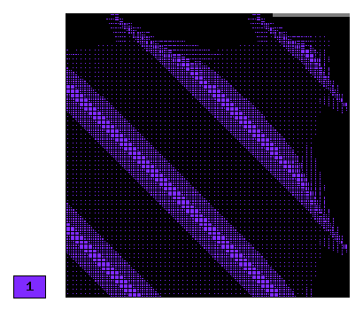

NIST-06 (Boundary Layer)
-----------------

**Git reference:** Benchmark `nist-06 <http://git.hpfem.org/hermes.git/tree/HEAD:/hermes2d/benchmarks/nist-06>`_.

This problem has an boundary layer along the right and top sides of the domain.

Model problem
~~~~~~~~~~~~~

Equation solved: Convection-diffusion equation with first order terms. 

.. math::

       -\epsilon \nabla^{2} u + 2\frac{\partial u}{\partial x} + \frac{\partial u}{\partial y}= f.

Domain of interest: Square $(-1, 1)^2$.

Boundary conditions: Dirichlet given by the exact solution.

Exact solution
~~~~~~~~~~~~~~

.. math::

    u(x,y) = (1 - e^{-(1 - x) / \epsilon})(1 - e^{-(1 - y) / \epsilon})cos(\pi (x + y))

where $\epsilon$ determines the strength of the boundary layer. 

Right-hand side: Obtained by inserting the exact solution into the equation.
The corresponding code snippet is shown below::

    template<typename Real>
    Real rhs(Real x, Real y)
    {
      return -EPSILON*(-2*pow(M_PI,2)*(1 - exp(-(1 - x)/EPSILON))*(1 - exp(-(1 - y)/EPSILON))*cos(M_PI*(x + y)) + 
             2*M_PI*(1 - exp(-(1 - x)/EPSILON))*exp(-(1 - y)/EPSILON)*sin(M_PI*(x + y))/EPSILON + 
             2*M_PI*(1 - exp(-(1 - y)/EPSILON))*exp(-(1 - x)/EPSILON)*sin(M_PI*(x + y))/EPSILON - 
             (1 - exp(-(1 - y)/EPSILON))*cos(M_PI*(x + y))*exp(-(1 - x)/EPSILON)/pow(EPSILON,2) - 
             (1 - exp(-(1 - x)/EPSILON))*cos(M_PI*(x + y))*exp(-(1 - y)/EPSILON)/pow(EPSILON,2)) 
             - 3*M_PI*(1 - exp(-(1 - x)/EPSILON))*(1 - exp(-(1 - y)/EPSILON))*sin(M_PI*(x + y)) - 
             2*(1 - exp(-(1 - y)/EPSILON))*cos(M_PI*(x + y))*exp(-(1 - x)/EPSILON)/EPSILON - 
             (1 - exp(-(1 - x)/EPSILON))*cos(M_PI*(x + y))*exp(-(1 - y)/EPSILON)/EPSILON;
    }

Sample solution
~~~~~~~~~~~~~~~

Solution for $\epsilon = 10^{-1}$:

.. image:: nist-06/solution.png
   :align: center
   :width: 600
   :height: 400
   :alt: Solution.

Comparison of h-FEM (p=1), h-FEM (p=2) and hp-FEM with anisotropic refinements
~~~~~~~~~~~~~~~~~~~~~~~~~~~~~~~~~~~~~~~~~~~~~~~~~~~~~~~~~~~~~~~~~~~~~~~~~~~~~~

Final mesh (h-FEM, p=1, anisotropic refinements):

Final mesh (h-FEM, p=2, anisotropic refinements):

.. image:: nist-06/mesh_h2_aniso.png
   :align: center
   :width: 450
   :alt: Final mesh.

Final mesh (hp-FEM, h-anisotropic refinements):

.. image:: nist-06/mesh_hp_anisoh.png
   :align: center
   :width: 450
   :alt: Final mesh.

DOF convergence graphs:

.. image:: nist-06/conv_dof_aniso.png
   :align: center
   :width: 600
   :height: 400
   :alt: DOF convergence graph.

CPU convergence graphs:

.. image:: nist-06/conv_cpu_aniso.png
   :align: center
   :width: 600
   :height: 400
   :alt: CPU convergence graph.

hp-FEM with iso, h-aniso and hp-aniso refinements
~~~~~~~~~~~~~~~~~~~~~~~~~~~~~~~~~~~~~~~~~~~~~~~~~

Final mesh (hp-FEM, isotropic refinements):

.. image:: nist-06/mesh_hp_iso.png
   :align: center
   :width: 450
   :alt: Final mesh.

Final mesh (hp-FEM, h-anisotropic refinements):

.. image:: nist-06/mesh_hp_anisoh.png
   :align: center
   :width: 450
   :alt: Final mesh.

Final mesh (hp-FEM, hp-anisotropic refinements):

.. image:: nist-06/mesh_hp_aniso.png
   :align: center
   :width: 450
   :alt: Final mesh.

DOF convergence graphs:

.. image:: nist-06/conv_dof_hp.png
   :align: center
   :width: 600
   :height: 400
   :alt: DOF convergence graph.

CPU convergence graphs:

.. image:: nist-06/conv_cpu_hp.png
   :align: center
   :width: 600
   :height: 400
   :alt: CPU convergence graph.

