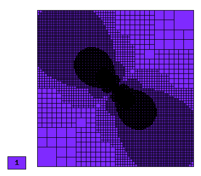
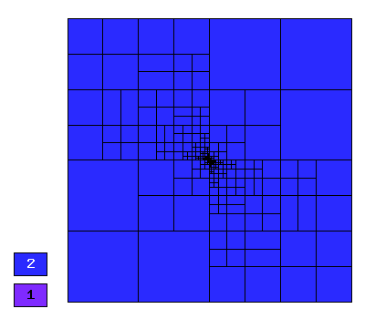
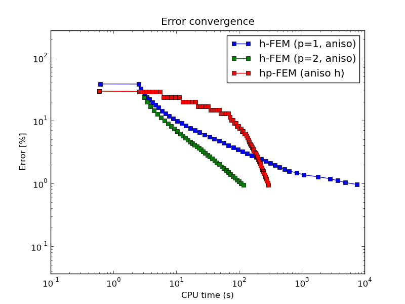

NIST-11 (Intersecting Interfaces)
------------------

**Git reference:** Benchmark `nist-11 <http://git.hpfem.org/hermes.git/tree/HEAD:/hermes2d/benchmarks/nist-11>`_.

The solution to this elliptic problems contains a severe singularity that poses a challenge to 
adaptive methods. 

Model problem
~~~~~~~~~~~~~

Equation solved:

.. math::

       -\nabla \cdot (a(x,y) \nabla u) = 0,

where the parameter $a$ is piecewise-constant, $a(x,y) = R$ in the first and third quadrants and $a(x,y) = 1$ 
in the remaining two quadrants. 

Domain of interest: Square $(-1, 1)^2$.

Right-hand side: $f(x,y) = 0$.

Boundary conditions: Dirichlet given by exact solution. 

Exact solution
~~~~~~~~~~~~~~

Quite complicated, see the code below::

    // Problem constants.
    const double R = 161.4476387975881;      // Equation parameter.
    const double TAU = 0.1;                  // Equation parameter.
    const double RHO = M_PI/4.;              // Equation parameter
    const double SIGMA = -14.92256510455152; // Equation parameter

    // Exact solution.
    static double fn(double x, double y)
    {
      double theta = atan2(y,x);
      if (theta < 0) theta = theta + 2.*M_PI;
      double r = sqrt(x*x + y*y);

      double mu;
      if (theta <= M_PI/2.) {
        mu = cos((M_PI/2. - SIGMA)*TAU) * cos((theta - M_PI/2. + RHO)*TAU);
      }
      else {
        if (theta <= M_PI) {
          mu = cos(RHO*TAU) * cos((theta - M_PI + SIGMA)*TAU);
        }
        else {
          if (theta <= 3.*M_PI/2.) {
            mu = cos(SIGMA*TAU) * cos((theta - M_PI - RHO)*TAU);
          }
          else {
            mu = cos((M_PI/2. - RHO)*TAU) * cos((theta - 3.*M_PI/2. - SIGMA)*TAU);
          }
        }
      }

      return pow(r, TAU) * mu;
    }

Weak forms
~~~~~~~~~~

::

    // Weak forms
    template<typename Real, typename Scalar>
    Scalar bilinear_form_I_III(int n, double *wt, Func<Scalar> *u_ext[], Func<Real> *u, Func<Real> *v, Geom<Real> *e, ExtData<Scalar> *ext)
    {
      return R*int_grad_u_grad_v<Real, Scalar>(n, wt, u, v);
    }

    template<typename Real, typename Scalar>
    Scalar bilinear_form_II_IV(int n, double *wt, Func<Scalar> *u_ext[], Func<Real> *u, Func<Real> *v, Geom<Real> *e, ExtData<Scalar> *ext)
    {
      return 1.*int_grad_u_grad_v<Real, Scalar>(n, wt, u, v);
    }

Sample solution
~~~~~~~~~~~~~~~

.. image:: nist-11/solution.png
   :align: center
   :width: 600
   :alt: Solution.

Comparison of h-FEM (p=1), h-FEM (p=2) and hp-FEM with anisotropic refinements
~~~~~~~~~~~~~~~~~~~~~~~~~~~~~~~~~~~~~~~~~~~~~~~~~~~~~~~~~~~~~~~~~~~~~~~~~~~~~~

Final mesh (h-FEM, p=1, anisotropic refinements):

Final mesh (h-FEM, p=2, anisotropic refinements):

Final mesh (hp-FEM, h-anisotropic refinements):

.. image:: nist-11/mesh_hp_anisoh.png
   :align: center
   :width: 450
   :alt: Final mesh.

DOF convergence graphs:

.. image:: nist-11/conv_dof_aniso.png
   :align: center
   :width: 600
   :height: 400
   :alt: DOF convergence graph.

CPU convergence graphs:

