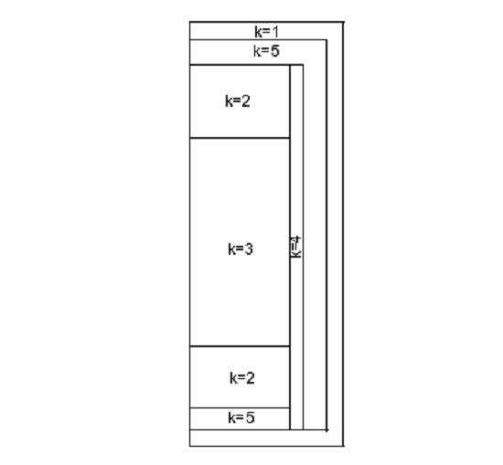
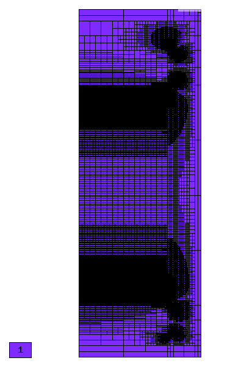
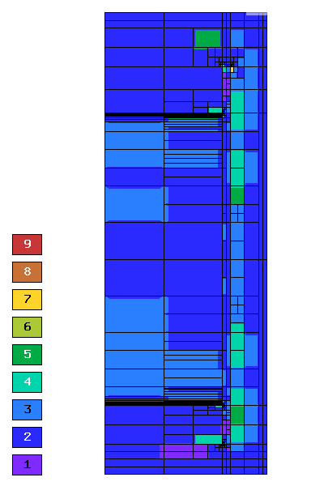
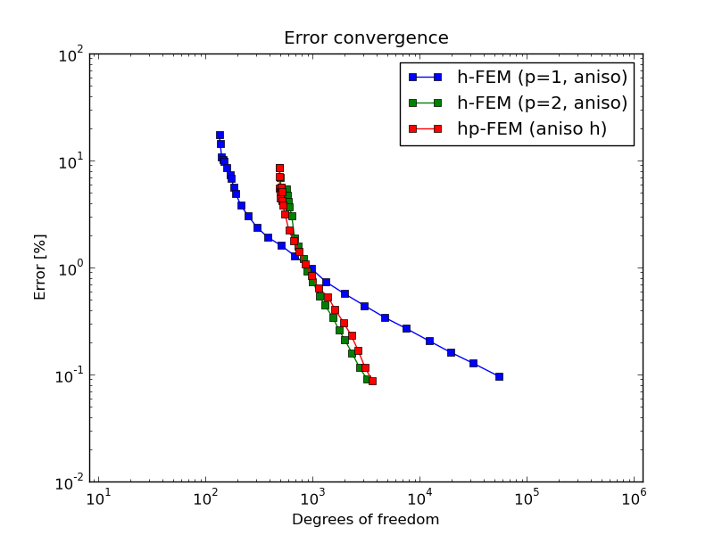
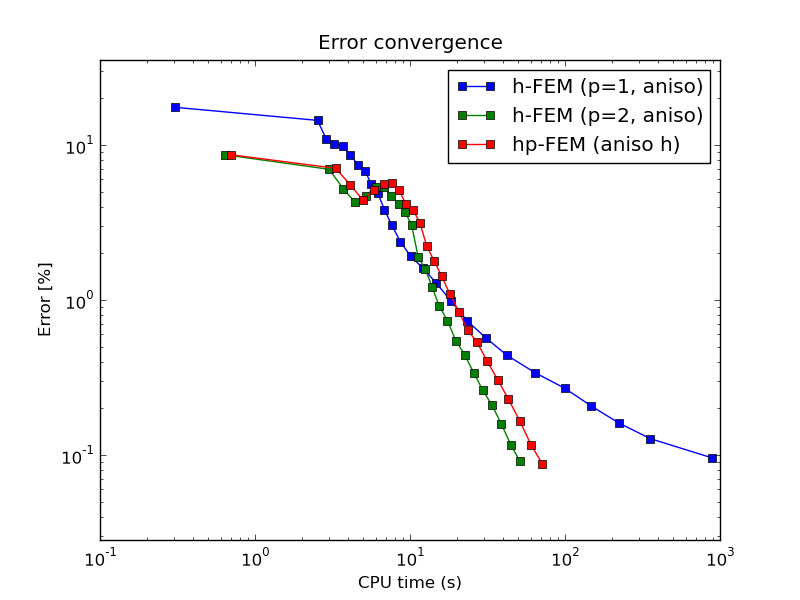
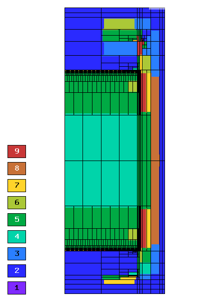
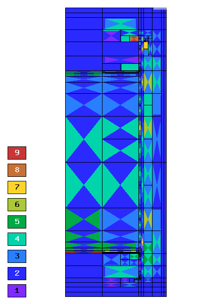
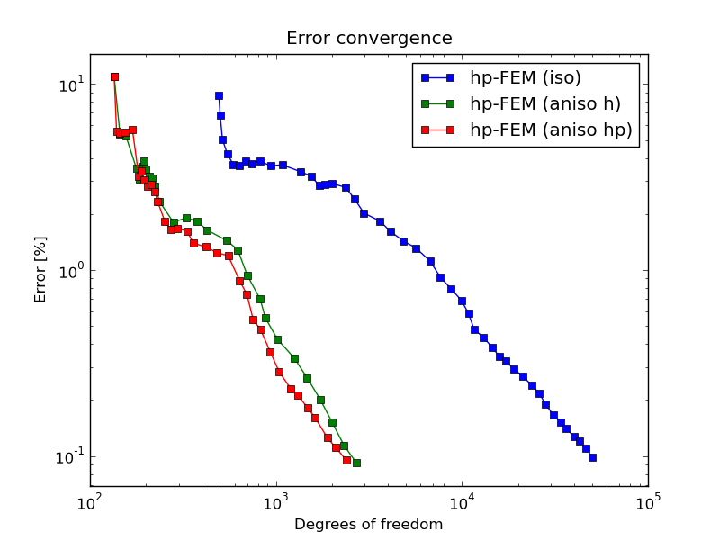
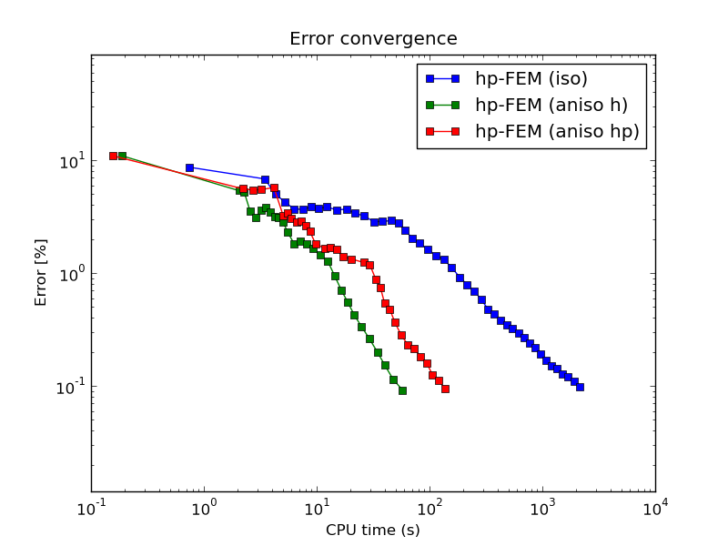

NIST-5 (Elliptic)
------------------

**Git reference:** Benchmark `nist-5 <http://git.hpfem.org/hermes.git/tree/HEAD:/hermes2d/benchmarks/nist-5>`_.

Model problem
~~~~~~~~~~~~~

This is a heat conduction problem in nonhomogeneous materials. This example with anisotropic solution that is suitable for testing 
anisotropic element refinements. The geometry is shown below:

Equation solved: 

.. math::

    -\frac{\partial }{\partial x}(p(x, y)\frac{\partial u}{\partial x})
    -\frac{\partial }{\partial y}(q(x, y)\frac{\partial u}{\partial y}) = f(x, y), 

.. math::

    p(x, y)\frac{\partial u}{\partial x} - q(x, y)\frac{\partial u}{\partial y} = g_{left}(x, y) on \Gamma_{left},

.. math::

    p(x, y)\frac{\partial u}{\partial x} - q(x, y)\frac{\partial u}{\partial y} + c(x, y)u = g_{right}(x, y) on \Gamma_{right},

.. math::

    p(x, y)\frac{\partial u}{\partial x} - q(x, y)\frac{\partial u}{\partial y} + c(x, y)u = g_{top}(x, y) on \Gamma_{top},

.. math::

    p(x, y)\frac{\partial u}{\partial x} - q(x, y)\frac{\partial u}{\partial y} + c(x, y)u = g_{bottom}(x, y) on \Gamma_{bottom}.

Here $p(x, y)$, $q(x, y)$ and right hand side f(x, y) are constant coefficient functions in different materials.

Domain of interest: Square $(0, 8.4) x (0, 24)$.

Boundary conditions: Zero Neumann on left edge, Newton(mixed) on the rest of the boundary.

Exact solution: Unknown. 

Weak forms
~~~~~~~~~~

::

    // Weak forms
    template<typename Real, typename Scalar>
    Scalar biform1(int n, double *wt, Func<Real> *u_ext[], Func<Real> *u, Func<Real> *v,
               Geom<Real> *e, ExtData<Scalar> *ext)
    {
      Scalar result = 0;
      for (int i = 0; i < n; i++)
        result += wt[i] * (P_1 * u->dx[i] * v->dx[i] + Q_1 * u->dy[i] * v->dy[i]);
      return result;
    }

    template<typename Real, typename Scalar>
    Scalar biform2(int n, double *wt, Func<Real> *u_ext[], Func<Real> *u, Func<Real> *v,
                   Geom<Real> *e, ExtData<Scalar> *ext)
    {
      Scalar result = 0;
      for (int i = 0; i < n; i++)
        result += wt[i] * (P_2 * u->dx[i] * v->dx[i] + Q_2 * u->dy[i] * v->dy[i]);
      return result;
    }

    template<typename Real, typename Scalar>
    Scalar biform3(int n, double *wt, Func<Real> *u_ext[], Func<Real> *u, Func<Real> *v,
                   Geom<Real> *e, ExtData<Scalar> *ext)
    {
      Scalar result = 0;
      for (int i = 0; i < n; i++)
        result += wt[i] * (P_3 * u->dx[i] * v->dx[i] + Q_3 * u->dy[i] * v->dy[i]);
      return result;
    }

    template<typename Real, typename Scalar>
    Scalar biform4(int n, double *wt, Func<Real> *u_ext[], Func<Real> *u, Func<Real> *v,
                   Geom<Real> *e, ExtData<Scalar> *ext)
    {
      Scalar result = 0;
      for (int i = 0; i < n; i++)
        result += wt[i] * (P_4 * u->dx[i] * v->dx[i] + Q_4 * u->dy[i] * v->dy[i]);
      return result;
    }
    template<typename Real, typename Scalar>
    Scalar biform5(int n, double *wt, Func<Real> *u_ext[], Func<Real> *u, Func<Real> *v,
                   Geom<Real> *e, ExtData<Scalar> *ext)
    {
      Scalar result = 0;
      for (int i = 0; i < n; i++)
        result += wt[i] * (P_5 * u->dx[i] * v->dx[i] + Q_5 * u->dy[i] * v->dy[i]);
      return result;
    }

    template<typename Real, typename Scalar>
    Scalar linear_form_1(int n, double *wt, Func<Scalar> *u_ext[], Func<Real> *v, Geom<Real> *e, ExtData<Scalar> *ext)
    {
      return F_1 * int_v<Real, Scalar>(n, wt, v);
    }

    template<typename Real, typename Scalar>
    Scalar linear_form_2(int n, double *wt, Func<Scalar> *u_ext[], Func<Real> *v, Geom<Real> *e, ExtData<Scalar> *ext)
    {
      return F_2 * int_v<Real, Scalar>(n, wt, v);
    }

    template<typename Real, typename Scalar>
    Scalar linear_form_3(int n, double *wt, Func<Scalar> *u_ext[], Func<Real> *v, Geom<Real> *e, ExtData<Scalar> *ext)
    {
      return F_3 * int_v<Real, Scalar>(n, wt, v);
    }

    template<typename Real, typename Scalar>
    Scalar linear_form_4(int n, double *wt, Func<Scalar> *u_ext[], Func<Real> *v, Geom<Real> *e, ExtData<Scalar> *ext)
    {
      return F_4 * int_v<Real, Scalar>(n, wt, v);
    }

    template<typename Real, typename Scalar>
    Scalar linear_form_5(int n, double *wt, Func<Scalar> *u_ext[], Func<Real> *v, Geom<Real> *e, ExtData<Scalar> *ext)
    {
      return F_5 * int_v<Real, Scalar>(n, wt, v);
    }

    template<typename Real, typename Scalar>
    Scalar bilinear_form_surf_right(int n, double *wt, Func<Real> *u_ext[], Func<Real> *u, Func<Real> *v,
                                    Geom<Real> *e, ExtData<Scalar> *ext)
    {
      Scalar result = 0;
      for (int i = 0; i < n; i++)
      {
        double P = 25.0;
        double Q = 25.0;
        result += wt[i] * (P * u->dx[i] * v->val[i] - Q * u->dy[i] * v->val[i] + C_RIGHT * u->val[i] * v->val[i]);
      }
      return result;
    }

    template<typename Real, typename Scalar>
    Scalar bilinear_form_surf_top(int n, double *wt, Func<Real> *u_ext[], Func<Real> *u, Func<Real> *v,
                                  Geom<Real> *e, ExtData<Scalar> *ext)
    {
      Scalar result = 0;
      for (int i = 0; i < n; i++)
      {
        double P = 25.0;
        double Q = 25.0;
        result += wt[i] * (P * u->dx[i] * v->val[i] - Q * u->dy[i] * v->val[i] + C_TOP * u->val[i] * v->val[i]);
      }
      return result;
    }

    template<typename Real, typename Scalar>
    Scalar bilinear_form_surf_bottom(int n, double *wt, Func<Real> *u_ext[], Func<Real> *u, Func<Real> *v,
                                     Geom<Real> *e, ExtData<Scalar> *ext)
    {
      Scalar result = 0;
      for (int i = 0; i < n; i++)
      {
        double P = 25.0;
        double Q = 25.0;
        result += wt[i] * (P * u->dx[i] * v->val[i] - Q * u->dy[i] * v->val[i] + C_BOTTOM * u->val[i] * v->val[i]);
      }
      return result;
    }

    template<typename Real, typename Scalar>
    Scalar linear_form_surf_left(int n, double *wt, Func<Real> *u_ext[], Func<Real> *v, Geom<Real> *e, ExtData<Scalar> *ext)
    {
      return G_N_LEFT * int_v<Real, Scalar>(n, wt, v);
    }

    template<typename Real, typename Scalar>
    Scalar linear_form_surf_right(int n, double *wt, Func<Real> *u_ext[], Func<Real> *v, Geom<Real> *e, ExtData<Scalar> *ext)
    {
      return G_N_RIGHT * int_v<Real, Scalar>(n, wt, v);
    }

    template<typename Real, typename Scalar>
    Scalar linear_form_surf_top(int n, double *wt, Func<Real> *u_ext[], Func<Real> *v, Geom<Real> *e, ExtData<Scalar> *ext)
    {
      return G_N_TOP * int_v<Real, Scalar>(n, wt, v);
    }

    template<typename Real, typename Scalar>
    Scalar linear_form_surf_bottom(int n, double *wt, Func<Real> *u_ext[], Func<Real> *v, Geom<Real> *e, ExtData<Scalar> *ext)
    {
      return G_N_BOTTOM * int_v<Real, Scalar>(n, wt, v);
    }

Sample solution
~~~~~~~~~~~~~~~

.. image:: nist-5/solution-2d.png
   :align: center
   :width: 340
   :height: 400

.. image:: nist-5/solution-3d.png
   :align: center
   :width: 600
   :height: 400
   :alt: Solution.

Comparison of h-FEM (p=1), h-FEM (p=2) and hp-FEM with anisotropic refinements
~~~~~~~~~~~~~~~~~~~~~~~~~~~~~~~~~~~~~~~~~~~~~~~~~~~~~~~~~~~~~~~~~~~~~~~~~~~~~~

Final mesh (h-FEM, p=1, anisotropic refinements):

Final mesh (h-FEM, p=2, anisotropic refinements):

.. image:: nist-5/mesh_h2_aniso.png
   :align: center
   :width: 450
   :alt: Final mesh.

Final mesh (hp-FEM, h-anisotropic refinements):

DOF convergence graphs:

CPU convergence graphs:

hp-FEM with iso, h-aniso and hp-aniso refinements
~~~~~~~~~~~~~~~~~~~~~~~~~~~~~~~~~~~~~~~~~~~~~~~~~

Final mesh (hp-FEM, isotropic refinements):

Final mesh (hp-FEM, h-anisotropic refinements):

Final mesh (hp-FEM, hp-anisotropic refinements):

DOF convergence graphs:

CPU convergence graphs:

