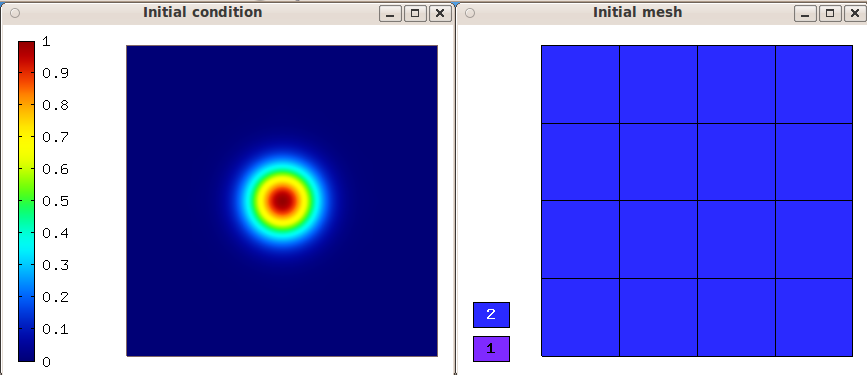
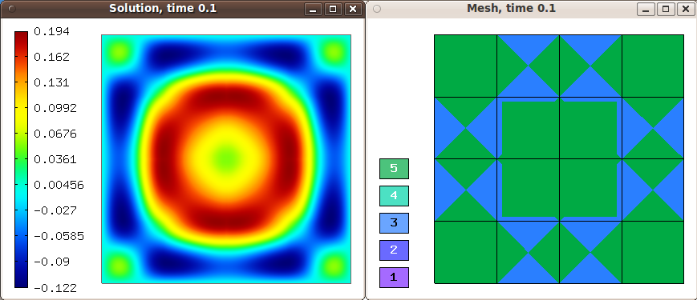

Gross-Pitaevski Equation (04-heat-and-moisture-adapt)
-----------------------------

**Git reference:** Tutorial example `04-newton-timedep-gp-adapt 
<http://git.hpfem.org/hermes.git/tree/HEAD:/hermes2d/tutorial/P06-timedep-adapt/04-newton-timedep-gp-adapt>`_.

Model problem
~~~~~~~~~~~~~

The problem solved here is the same as in `P03-timedep/gross-pitaevski <http://hpfem.org/hermes/doc/src/hermes2d/timedep/gross-pitaevski.html>`_. The source code of the main.cpp function is an identical copy of the one in 
`P03-timedep/parab <http://hpfem.org/hermes/doc/src/hermes2d/timedep-adapt/parab.html>`_.

Sample results
~~~~~~~~~~~~~~

Initial condition and initial mesh:

Solution and mesh at t = 0.025:

.. image:: 25/1.png
   :align: center
   :width: 800
   :alt: Sample screenshot

Solution and mesh at t = 0.05:

.. image:: 25/2.png
   :align: center
   :width: 800
   :alt: Sample screenshot

Solution and mesh at t = 0.075:

.. image:: 25/3.png
   :align: center
   :width: 800
   :alt: Sample screenshot

Solution and mesh at t = 0.01:

