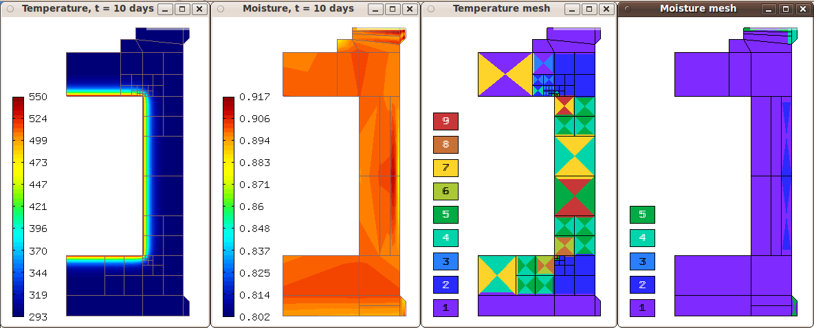

Heat and Moisture Transfer in Concrete (04-heat-and-moisture-adapt)
-------------------------------------------

**Git reference:** Tutorial example `04-heat-and-moisture-adapt 
<http://git.hpfem.org/hermes.git/tree/HEAD:/hermes2d/tutorial/P06-timedep-adapt/04-heat-and-moisture-adapt>`_.

Model problem
~~~~~~~~~~~~~

We solve a coupled system of linear second-order PDE describing the 
transfer of heat and moisture in concrete. The equations are lengthy 
and thus we refer to the corresponding article

    P. Solin, L. Dubcova, J. Kruis: Adaptive hp-FEM with Dynamical 
    Meshes for Transient Heat and Moisture Transfer Problems, J. Comput. Appl. Math. 233 (2010) 3103-3112.

Activation of multimesh assembling
~~~~~~~~~~~~~~~~~~~~~~~~~~~~~~~~~~

::

    // Load the mesh.
    Mesh basemesh, T_mesh, M_mesh;
    H2DReader mloader;
    mloader.load("domain2.mesh", &basemesh);

    // Create temperature and moisture meshes.
    // This also initializes the multimesh hp-FEM.
    T_mesh.copy(&basemesh);
    M_mesh.copy(&basemesh);

Definition of time-dependent boundary conditions
~~~~~~~~~~~~~~~~~~~~~~~~~~~~~~~~~~~~~~~~~~~~~~~~~

This problem combines Dirichlet, Neumann, and Newton boundary conditions.
In particular, notice the time-dependent Neumann condition at the reactor
wall::

  // Enter boundary markers.
  BCTypes temp_bc_type, moist_bc_type;
  temp_bc_type.add_bc_dirichlet(BDY_REACTOR_WALL);
  temp_bc_type.add_bc_neumann(BDY_SYMMETRY);
  temp_bc_type.add_bc_newton(BDY_EXTERIOR_WALL);
  moist_bc_type.add_bc_neumann(Hermes::Tuple<int>(BDY_SYMMETRY, BDY_REACTOR_WALL));
  moist_bc_type.add_bc_newton(BDY_EXTERIOR_WALL);

  // Enter Dirichlet boundary values.
  BCValues bc_values(&CURRENT_TIME);
  bc_values.add_timedep_function(BDY_REACTOR_WALL, essential_bc_values_T);

The time-dependent callback is defined as follows::

    // Essential (Dirichlet) boundary condition values for T.
    scalar essential_bc_values_T(double x, double y, double time)
    {
      double current_reactor_temperature = TEMP_REACTOR_MAX;
      if (time < REACTOR_START_TIME) {
        current_reactor_temperature = TEMP_INITIAL +
          (time/REACTOR_START_TIME)*(TEMP_REACTOR_MAX - TEMP_INITIAL);
      }
      return current_reactor_temperature;
    }

Initialization of spaces
~~~~~~~~~~~~~~~~~~~~~~~~

::

    // Create H1 spaces with default shapesets.
    H1Space T_space(&T_mesh, &temp_bc_type, &bc_values, P_INIT);
    H1Space M_space(MULTI ? &M_mesh : &T_mesh, &moist_bc_type, (BCValues *) NULL, P_INIT);

Definition of constant initial conditions
~~~~~~~~~~~~~~~~~~~~~~~~~~~~~~~~~~~~~~~~~

::

    // Define constant initial conditions.
    info("Setting initial conditions.");
    Solution T_prev, M_prev;
    T _prev.set_const(&T_mesh, TEMP_INITIAL);
    M_prev.set_const(&M_mesh, MOIST_INITIAL);

Registration of weak forms
~~~~~~~~~~~~~~~~~~~~~~~~~~

Some weak forms require the moisture and temperature at the previous 
time level. Also note that both matrix and vector surface forms are
hooked to the Newton marker BDY_EXTERIOR_WALL::

  // Initialize the weak formulation.
  WeakForm wf(2);
  wf.add_matrix_form(0, 0, callback(bilinear_form_sym_0_0));
  wf.add_matrix_form(0, 1, callback(bilinear_form_sym_0_1));
  wf.add_matrix_form(1, 1, callback(bilinear_form_sym_1_1));
  wf.add_matrix_form(1, 0, callback(bilinear_form_sym_1_0));
  wf.add_vector_form(0, callback(linear_form_0), HERMES_ANY, &T_prev);
  wf.add_vector_form(1, callback(linear_form_1), HERMES_ANY, &M_prev);
  wf.add_matrix_form_surf(0, 0, callback(bilinear_form_surf_0_0_ext), BDY_EXTERIOR_WALL);
  wf.add_matrix_form_surf(1, 1, callback(bilinear_form_surf_1_1_ext), BDY_EXTERIOR_WALL);
  wf.add_vector_form_surf(0, callback(linear_form_surf_0_ext), BDY_EXTERIOR_WALL);
  wf.add_vector_form_surf(1, callback(linear_form_surf_1_ext), BDY_EXTERIOR_WALL);

Time stepping loop and periodic global derefinement
~~~~~~~~~~~~~~~~~~~~~~~~~~~~~~~~~~~~~~~~~~~~~~~~~~~

The time stepping loop begins with a periodic global derefinement 
that occurs every UNREF_FREQ steps::

    // Uniform mesh derefinement.
    if (ts > 1 && ts % UNREF_FREQ == 0) {
      info("Global mesh derefinement.");
      T_mesh.copy(&basemesh);
      M_mesh.copy(&basemesh);
      T_space.set_uniform_order(P_INIT);
      M_space.set_uniform_order(P_INIT);
    }

Creating globally refined reference meshes
~~~~~~~~~~~~~~~~~~~~~~~~~~~~~~~~~~~~~~~~~~

::

    // Construct globally refined reference mesh and setup reference space.
    Hermes::Tuple<Space *>* ref_spaces = construct_refined_spaces(Hermes::Tuple<Space *>(&T_space, &M_space));

Initializing matrix solver
~~~~~~~~~~~~~~~~~~~~~~~~~~

::

    // Initialize matrix solver.
    SparseMatrix* matrix = create_matrix(matrix_solver);
    Vector* rhs = create_vector(matrix_solver);
    Solver* solver = create_linear_solver(matrix_solver, matrix, rhs);

Assembling and solving the reference mesh problem
~~~~~~~~~~~~~~~~~~~~~~~~~~~~~~~~~~~~~~~~~~~~~~~~~

::

    // Assemble the reference problem.
    info("Solving on reference mesh.");
    bool is_linear = true;
    DiscreteProblem* dp = new DiscreteProblem(&wf, *ref_spaces, is_linear);
    dp->assemble(matrix, rhs);

    // Now we can deallocate the previous fine meshes.
    if(as > 1){ delete T_fine.get_mesh(); delete M_fine.get_mesh(); }

    // Solve the linear system of the reference problem. If successful, obtain the solutions.
    if(solver->solve()) Solution::vector_to_solutions(solver->get_solution(), *ref_spaces, 
                                            Hermes::Tuple<Solution *>(&T_fine, &M_fine));
    else error ("Matrix solver failed.\n");

Projecting reference solution on coarse meshes
~~~~~~~~~~~~~~~~~~~~~~~~~~~~~~~~~~~~~~~~~~~~~~

::

    // Project the fine mesh solution onto the coarse mesh.
    info("Projecting reference solution on coarse mesh.");
    OGProjection::project_global(Hermes::Tuple<Space *>(&T_space, &M_space), 
                   Hermes::Tuple<Solution *>(&T_fine, &M_fine), 
                   Hermes::Tuple<Solution *>(&T_coarse, &M_coarse), matrix_solver); 

Registering custom forms for error calculation
~~~~~~~~~~~~~~~~~~~~~~~~~~~~~~~~~~~~~~~~~~~~~~

We could base the adaptivity on $H^1$-norm errors in the temperature
and the moisture fields. However, this does not work well since the
two fields depend on each other. Therefore we use for adaptivity 
a custom energy norm that reflects this::  

    // Registering custom forms for error calculation.
    Adapt* adaptivity = new Adapt(Hermes::Tuple<Space *>(&T_space, &M_space), 
                        Hermes::Tuple<ProjNormType>(HERMES_H1_NORM, HERMES_H1_NORM));
    adaptivity->set_error_form(0, 0, callback(bilinear_form_sym_0_0));
    adaptivity->set_error_form(0, 1, callback(bilinear_form_sym_0_1));
    adaptivity->set_error_form(1, 0, callback(bilinear_form_sym_1_0));
    adaptivity->set_error_form(1, 1, callback(bilinear_form_sym_1_1));

Calculating element errors and a global error estimate
~~~~~~~~~~~~~~~~~~~~~~~~~~~~~~~~~~~~~~~~~~~~~~~~~~~~~~

::

    // Calculate element errors and total error estimate.
    info("Calculating error estimate."); 
    bool solutions_for_adapt = true;
    double err_est_rel_total = adaptivity->calc_err_est(Hermes::Tuple<Solution *>(&T_coarse, &M_coarse), 
                               Hermes::Tuple<Solution *>(&T_fine, &M_fine), solutions_for_adapt,
                               HERMES_TOTAL_ERROR_REL | HERMES_ELEMENT_ERROR_REL) * 100;

Refining the meshes
~~~~~~~~~~~~~~~~~~~

For adaptivity, Hermes considers all elements of both meshes at once, and 
those with largest errors are selected for refinement::

    // If err_est too large, adapt the mesh.
    if (err_est_rel_total < ERR_STOP) 
      done = true;
    else 
    {
      info("Adapting coarse mesh.");
      done = adaptivity->adapt(Hermes::Tuple<RefinementSelectors::Selector *>(&selector, &selector), 
                               THRESHOLD, STRATEGY, MESH_REGULARITY);
      if (Space::get_num_dofs(Hermes::Tuple<Space *>(&T_space, &M_space)) >= NDOF_STOP) 
        done = true;
      else
        // Increase the counter of performed adaptivity steps.
        as++;
    }

End of time step: saving solutions for the next time step
~~~~~~~~~~~~~~~~~~~~~~~~~~~~~~~~~~~~~~~~~~~~~~~~~~~~~~~~~

::

    // Save fine mesh solutions for the next time step.
    T_prev.copy(&T_fine);
    M_prev.copy(&M_fine);

Sample results
~~~~~~~~~~~~~~

This problem exhibits multi-scale behavior in time -- while temperature takes 
weeks to reach a stady state, moisture takes years. Therefore adaptive time stepping 
is very useful (see the above paper). Adaptive time stepping is not part of this 
tutorial example. 

In the results below, notice that the moisture is not resolved with great accuracy at the beginning of computation.
This is due to the fact that the resolution of moisture 
does not have a significant influence on the overall accuracy in the energy norm. 

Solution and mesh at t = 10 days:

Solution and mesh at t = 20 days:

.. image:: heat-and-moisture-adapt/2.png
   :align: center
   :width: 800
   :alt: Sample screenshot

Solution and mesh at t = 50 days:

.. image:: heat-and-moisture-adapt/3.png
   :align: center
   :width: 800
   :alt: Sample screenshot

