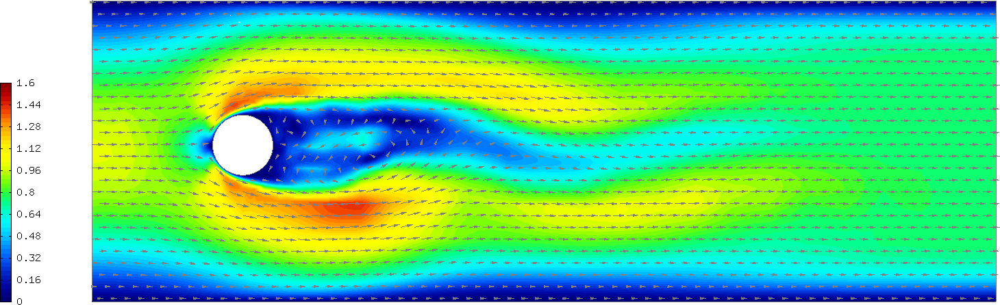

Navier-Stokes Equations (07-navier-stokes)
----------------------------

**Git reference:** Tutorial example `07-navier-stokes 
<http://git.hpfem.org/hermes.git/tree/HEAD:/hermes2d/tutorial/P03-timedep/07-navier-stokes>`_.

Model problem
~~~~~~~~~~~~~

In this example, the time-dependent laminar incompressible Navier-Stokes equations are
discretized in time via the implicit Euler method. If NEWTON == true,
the Newton's method is used to solve the nonlinear problem at each time 
step. If NEWTON == false, the convective term only is linearized using the 
velocities from the previous time step. Obviously the latter approach is wrong, 
but people do this frequently because it is faster and simpler to implement. 
Therefore we include this case for comparison purposes. We also show how 
to use discontinuous ($L^2$) elements for pressure and thus make the 
velocity discreetely divergence free. Comparison to approximating the 
pressure with the standard (continuous) Taylor-Hood elements is shown.  

The computational domain is a rectangular channel containing a 
circular obstacle: 

.. image:: navier-stokes/domain.png
   :align: center
   :width: 760
   :alt: computational domain

The circle is defined via NURBS. Its radius and position, as well as some additional 
geometry parameters can be changed in the mesh file "domain.mesh":

::

    L = 15            # domain length (should be a multiple of 3)
    H = 5             # domain height
    S1 = 5/2          # x-center of circle
    S2 = 5/2          # y-center of circle
    R = 1             # circle radius
    A = 1/(2*sqrt(2)) # helper length
    EPS = 0.10        # vertical shift of the circle

The Navier-Stokes equations are assumed in the standard form

.. math::

    \frac{\partial \bfv}{\partial t} - \frac{1}{Re}\Delta \bfv + (\bfv \cdot \nabla) \bfv + \nabla p = 0,\\
    \mbox{div} \bfv = 0,

where $\bfv = (u, v)$ is the velocity vector, $Re$ the Reynolds number, $p$ the pressure,
and $(\bfv \cdot \nabla) \bfv$ the nonlinear convective term. We prescribe a parabolic 
velocity profile at inlet (the left-most edge). The inlet velocity is time-dependent, it 
increases linearly in time from zero to a user-defined value during an initial time period, 
and then it stays constant. Standard no-slip velocity boundary conditions are prescribed 
on the rest of the boundary with the exception of the outlet (right-most edge) where the 
standard "do nothing" boundary conditions are prescribed. No boundary conditions are 
prescribed for pressure - being an $L^2$-function, the pressure does not 
admit any boundary conditions. 

Role of pressure in Navier-Stokes equations
~~~~~~~~~~~~~~~~~~~~~~~~~~~~~~~~~~~~~~~~~~~

The role of the pressure in the Navier-Stokes equations 
is interesting and worth a brief discussion. Since the equations only contain its gradient, 
it is determined up to a constant. This does not mean that the problem is ill-conditioned 
though, since the pressure only plays the role of a Lagrange multiplier that keeps 
the velocity divergence-free. More precisely, the better the pressure is resolved, 
the closer the approximate velocity to being divergence free. The best one can do
is to approximate the pressure in $L^2$ (using discontinuous elements). Not only because
it is more meaningful from the point of view of the weak formulation, but also because
the approximate velocity automatically becomes discreetely divergence-free (integral 
of its divergence over every element in the mesh is zero). The standard Taylor-Hood 
elements approximating both the velocity and pressure with $H^1$-conforming (continuous)
elements do not have this property and thus are less accurate. We will compare these
two approaches below. Last, the pressure needs to be approximated by elements of 
a lower polynomial degree than the velocity in order to satisfy the inf-sup condition.

The time derivative is approximated using the implicit Euler method:

.. math::

    \frac{\bfv^{n+1}}{\tau} - \frac{\bfv^n}{\tau} - \frac{1}{Re}\Delta \bfv^{n+1} + (\bfv^{n+1} \cdot \nabla) \bfv^{n+1} + \nabla p^{n+1} = 0,\\
    \mbox{div} \bfv^{n+1} = 0,

where $\tau$ is the time step. This is a nonlinear problem that involves three equations (two 
for velocity components and the continuity equation). 

Defining spaces
~~~~~~~~~~~~~~~

We define three spaces for the two velocity components and pressure.
This is either [H1, H1, H1] or [H1, H1, L2]:: 

      // Spaces for velocity components and pressure.
      H1Space xvel_space(&mesh, xvel_bc_type, essential_bc_values_xvel, P_INIT_VEL);
      H1Space yvel_space(&mesh, yvel_bc_type, NULL, P_INIT_VEL);
    #ifdef PRESSURE_IN_L2
      L2Space p_space(&mesh, P_INIT_PRESSURE);
    #else
      H1Space p_space(&mesh, NULL, NULL, P_INIT_PRESSURE);
    #endif

Defining projection norms
~~~~~~~~~~~~~~~~~~~~~~~~~

We need to define the proper projection norms in these spaces::

      // Define projection norms.
      ProjNormType vel_proj_norm = HERMES_H1_NORM;
    #ifdef PRESSURE_IN_L2
      ProjNormType p_proj_norm = HERMES_L2_NORM;
    #else
      ProjNormType p_proj_norm = HERMES_H1_NORM;
    #endif

Calculating initial coefficient vector for the Newton's method
~~~~~~~~~~~~~~~~~~~~~~~~~~~~~~~~~~~~~~~~~~~~~~~~~~~~~~~~~~~~~~

After registering weak forms and initializing the DiscreteProblem, if NEWTON == true 
we calculate the initial coefficient vector $\bfY_0$ for the Newton's method::

    // Project the initial condition on the FE space to obtain initial
    // coefficient vector for the Newton's method.
    scalar* coeff_vec = new scalar[Space::get_num_dofs(Tuple<Space *>(&xvel_space, &yvel_space, &p_space))];
    if (NEWTON) {
      info("Projecting initial condition to obtain initial vector for the Newton's method.");
      OGProjection::project_global(Tuple<Space *>(&xvel_space, &yvel_space, &p_space), 
                     Tuple<MeshFunction *>(&xvel_prev_time, &yvel_prev_time, &p_prev_time), 
                     coeff_vec, 
                     matrix_solver, 
                     Tuple<ProjNormType>(vel_proj_norm, vel_proj_norm, p_proj_norm));
    }

Note that when projecting multiple functions, we can use different projection 
norms for each. 

Time stepping
~~~~~~~~~~~~~

The time stepping loop incorporates a Newton's loop, and it looks as follows::

    // Time-stepping loop:
    char title[100];
    int num_time_steps = T_FINAL / TAU;
    for (int ts = 1; ts <= num_time_steps; ts++)
    {
      TIME += TAU;
      info("---- Time step %d, time = %g:", ts, TIME);

      // Update time-dependent essential BC are used.
      if (TIME <= STARTUP_TIME) {
        info("Updating time-dependent essential BC.");
        update_essential_bc_values(Tuple<Space *>(&xvel_space, &yvel_space, &p_space));
      }

      if (NEWTON) 
      {
        // Perform Newton's iteration.
        info("Solving nonlinear problem:");
        bool verbose = true;
        if (!solve_newton(coeff_vec, &dp, solver, matrix, rhs, 
            NEWTON_TOL, NEWTON_MAX_ITER, verbose)) error("Newton's iteration failed.");
  
        // Update previous time level solutions.
        Solution::vector_to_solutions(coeff_vec, Tuple<Space *>(&xvel_space, &yvel_space, &p_space), Tuple<Solution *>(&xvel_prev_time, &yvel_prev_time, &p_prev_time));
      }
      else {
        // Linear solve.
        info("Assembling and solving linear problem.");
        dp.assemble(matrix, rhs, false);
        if(solver->solve()) 
          Solution::vector_to_solutions(solver->get_solution(), Tuple<Space *>(&xvel_space, &yvel_space, &p_space), Tuple<Solution *>(&xvel_prev_time, &yvel_prev_time, &p_prev_time));
        else 
          error ("Matrix solver failed.\n");
      }

Sample results
~~~~~~~~~~~~~~

The following comparisons demonstrate the effect of using the Newton's method, and of using 
continuous vs. discontinuous 
elements for the pressure. There are three triplets of velocity snapshots. In each one, the images 
were obtained with (1) NEWTON == false && PRESSURE_IN_L2 undefined, (2) NEWTON == true && PRESSURE_IN_L2 
undefined, and (3) NEWTON == true && PRESSURE_IN_L2 defined. It follows from these comparisons that one 
should definitely use the option (3).

Time t = 10 s:

.. image:: navier-stokes/sol_no_newton_10.png
   :align: center
   :width: 840
   :alt: solution

.. image:: navier-stokes/sol_newton_10.png
   :align: center
   :width: 840
   :alt: solution

.. image:: navier-stokes/sol_l2_newton_10.png
   :align: center
   :width: 840
   :alt: solution

Time t = 15 s:

.. image:: navier-stokes/sol_no_newton_15.png
   :align: center
   :width: 840
   :alt: solution

.. image:: navier-stokes/sol_l2_newton_15.png
   :align: center
   :width: 840
   :alt: solution

Time t = 21 s:

.. image:: navier-stokes/sol_no_newton_20.png
   :align: center
   :width: 840
   :alt: solution

.. image:: navier-stokes/sol_newton_20.png
   :align: center
   :width: 840
   :alt: solution

.. image:: navier-stokes/sol_l2_newton_20.png
   :align: center
   :width: 840
   :alt: solution

Snapshot of a continuous pressure approximation (t = 20 s):

.. image:: navier-stokes/p_no_newton_20.png
   :align: center
   :width: 840
   :alt: solution

Snapshot of a discontinuous pressure approximation (t = 20 s):

.. image:: navier-stokes/p_l2_newton_20.png
   :align: center
   :width: 840
   :alt: solution
