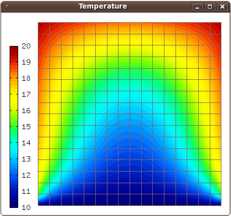

Trilinos - Timedep (03-trilinos-timedep)
-----------------------

**Git reference:** Example `03-trilinos-timedep 
<http://git.hpfem.org/hermes.git/tree/HEAD:/hermes2d/tutorial/P09-trilinos/03-trilinos-timedep>`_.

This  example shows how to use Trilinos for time-dependent PDE problems.
The NOX solver is employed, either using Newton's method or JFNK, and with or without 
preconditioning,

Model problem
~~~~~~~~~~~~~

We solve a linear heat transfer equation 

.. math::
    c \varrho \frac{\partial u}{\partial t} - \nabla \cdot(\lambda \nabla u) = 0

in a square domain where a Dirichlet boundary condition is prescribed on the bottom 
edge and the rest of the boundary has a Newton boundary condition

.. math::
    \frac{\partial u}{\partial n} = \alpha(T_{ext} - u).

Here $c$ is heat capacity, $\varrho$ material density, $\lambda$ thermal conductivity of the 
material, $T_{ext}$ exterior temperature, and $\alpha$ heat transfer coefficient. 

Defining constant initial condition
~~~~~~~~~~~~~~~~~~~~~~~~~~~~~~~~~~~

After creating the finite element space as usual, we define a constant initial 
condition::

    // Define constant initial condition. 
    Solution t_prev_time;
    t_prev_time.set_const(&mesh, TEMP_INIT);

Registering weak forms
~~~~~~~~~~~~~~~~~~~~~~

Next we register weak forms for the Jacobian and residual::

    // Initialize the weak formulation.
    WeakForm wf(1, JFNK ? true : false);
    wf.add_matrix_form(callback(jacobian));
    wf.add_matrix_form_surf(callback(jacobian_surf));
    wf.add_vector_form(callback(residual), HERMES_ANY, &t_prev_time);
    wf.add_vector_form_surf(callback(residual_surf));

Initializations
~~~~~~~~~~~~~~~

Then we initialize the DiscreteProblem class, obtain initial coefficient vector
coeff_vec by projecting the initial condition on the finite element space, 
initialize the NOX solver, and set preconditioner::

    // Initialize the finite element problem.
    DiscreteProblem dp(&wf, &space);

    // Project the function "t_prev_time" on the FE space 
    // in order to obtain initial vector for NOX. 
    info("Projecting initial solution on the FE mesh.");
    scalar* coeff_vec = new scalar[ndof];
    OGProjection::project_global(&space, &t_prev_time, coeff_vec);

    // Initialize NOX solver.
    NoxSolver solver(&dp);

    // Select preconditioner.
    RCP<Precond> pc = rcp(new MlPrecond("sa"));
    if (PRECOND)
    {
      if (JFNK) solver.set_precond(pc);
      else solver.set_precond("ML");
    }

Time stepping
~~~~~~~~~~~~~

Note that the initial coefficient vector was not provided to NOX yet, 
this needs to be done in each time step. The time stepping loop is as follows::

    // Time stepping loop:
    double total_time = 0.0;
    for (int ts = 1; total_time <= 2000.0; ts++)
    {
      info("---- Time step %d, t = %g s", ts, total_time += TAU);

      info("Assembling by DiscreteProblem, solving by NOX.");
      solver.set_init_sln(coeff_vec);
      if (solver.solve())
        Solution::vector_to_solution(solver.get_solution(), &space, &t_prev_time);
      else
        error("NOX failed.");

      // Show the new solution.
      Tview.show(&t_prev_time);

      info("Number of nonlin iterations: %d (norm of residual: %g)", 
        solver.get_num_iters(), solver.get_residual());
      info("Total number of iterations in linsolver: %d (achieved tolerance in the last step: %g)", 
        solver.get_num_lin_iters(), solver.get_achieved_tol());
    }

Sample results
~~~~~~~~~~~~~~

You should see the following result:

