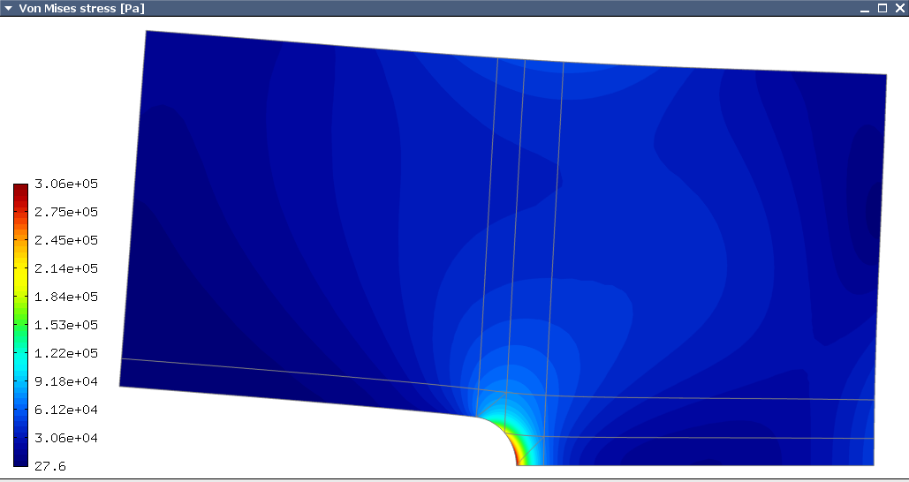

Visualization and Filters
-------------------------

In elasticity problems one often wants to see the material
stress, which is obtained by a formula that combines the derivatives 
of the two displacement components.
Hermes implements postprocessing through Filters. Filter is a special class
which takes up to three Solutions, performs some computation and in the end acts
as another Solution (which can be visualized, passed into another Filter,
passed into a weak form, etc.). More advanced usage of Filters will be discussed 
later. In elasticity examples we typically use the predefined VonMisesFilter::

    VonMisesFilter stress(Tuple<MeshFunction*>(u_sln, v_sln), lambda, mu);
    view.show_mesh(false);
    view.show(&stress, HERMES_EPS_HIGH);

Flags HERMES_EPS_LOW, HERMES_EPS_NORMAL, and HERMES_EPS_HIGH
~~~~~~~~~~~~~~~~~~~~~~~~~~~~~~~~~~~~~~~~~~~~~~~~~~~~~~~~~~~~

The second line tells Hermes not to display mesh edges.
The second parameter of show() is the visualization accuracy. It can have the 
values HERMES_EPS_LOW, HERMES_EPS_NORMAL (default) and HERMES_EPS_HIGH. This parameter 
influences the number of linear triangles that Hermes uses to approximate 
higher-order polynomial solutions within finite elements. Using linear 
triangles is required by OpenGL, so Hermes at least performs automatic 
adaptivity to reduce their number to a minimum. The above parameters
are used to set the accuracy of this piecewise-linear approximation. 

The method show() has an optional third parameter to indicate whether 
function values or partial derivatives should be displayed. For example,
HERMES_FN_VAL_0 stands for the function value of solution component 0
(first solution component which in this case is the VonMises stress).
HERMES_FN_VAL_1 would mean the function value of the second solution component
(relevant for vector-valued $Hcurl$ or $Hdiv$ elements only), 
HERMES_FN_DX_0 means the x-derivative of the first solution component, etc.

Visualizing deformed computational domain (in elasticity) 
~~~~~~~~~~~~~~~~~~~~~~~~~~~~~~~~~~~~~~~~~~~~~~~~~~~~~~~~~

Finally, in elasticity problems it may be desirable to deform the computational
domain according to the calculated displacements. The method View::show() has
additional three optional parameters for this::

    VonMisesFilter stress(Tuple<MeshFunction*>(&u_sln, &v_sln), lambda, mu);
    view.show(&stress, HERMES_EPS_HIGH, HERMES_FN_VAL_0, &u_sln, &v_sln, 1.5e5);

Here the fourth and fifth parameters are the displacement components used to 
distort the domain geometry, and the sixth parameter is a scaling factor to multiply the 
displacements. Of course, the color map still shows the Von Mises stress as before. 

