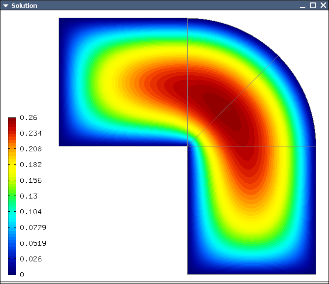

Poisson Equation (03)
---------------------

**Git reference:** Tutorial example `03-poisson <http://git.hpfem.org/hermes.git/tree/HEAD:/hermes2d/tutorial/03-poisson>`_. 

Let us solve the Poisson equation

.. math::
    :label: poisson1

       -\Delta u = CONST_F

on the L-shaped domain $\Omega$ from the previous example,
equipped with homogeneous (zero) Dirichlet boundary conditions

.. math::
    :label: poisson2

       u = 0\ \ \  \mbox{on}\  \partial \Omega,

where $CONST_F$ is a real number. The weak formulation 
is derived in the standard way, first by multiplying equation :eq:`poisson1` with a test
function $v$, then integrating over the domain $\Omega$, and then applying the Green's
theorem (integration by parts) to the second derivatives.
Because of the homogeneous Dirichlet condition :eq:`poisson2`,
the proper space for the solution is $V = H^1_0(\Omega)$. The weak formulation reads:
Find $u \in V$ such that

.. math::
    :label: poissonweak

         \int_\Omega \nabla u \cdot \nabla v \;\mbox{d\bfx} = CONST_F \int_\Omega v \;\mbox{d\bfx} \ \ \ \mbox{for all}\ v \in V.

Equation :eq:`poissonweak` has the standard form $a(u,v) = l(v)$. The bilinear form $a(u,v)$ 
and the linear form $l(v)$ are defined as follows::

    // Return the value \int \nabla u \cdot \nabla v dx.
    template<typename Real, typename Scalar>
    Scalar bilinear_form(int n, double *wt, Func<Scalar> *u_ext[], Func<Real> *u, Func<Real> *v, Geom<Real> *e, ExtData<Scalar> *ext)
    {
      Scalar result = 0;
      for (int i = 0; i < n; i++) result += wt[i] * (u->dx[i] * v->dx[i] + u->dy[i] * v->dy[i]);
      return result;
    }
   
    // Return the value CONST_F \int v dx.
    template<typename Real, typename Scalar>
    Scalar linear_form(int n, double *wt, Func<Scalar> *u_ext[], Func<Real> *v, Geom<Real> *e, ExtData<Scalar> *ext)
    {
      Scalar result = 0;
      for (int i = 0; i < n; i++) result += wt[i] * (v->val[i]);
      return CONST_F * result;
    }

These functions are called for each element during the assembly and they must return the 
values of the bilinear and linear forms for the given arguments. The arguments have the 
following meaning:

  * *n* ... the number of integration points (provided by Hermes automatically),
  * *wt* ... array of integration weights for all integration points,
  * *u_ext* ... solution values (for nonlinear problems only, to be discussed later),
  * *u* ... basis function,
  * *v* ... test function,
  * *e* ... geometrical information such as physical positions of integration points, tangent and normal vectors to element edges, etc. (to be discussed later),
  * *ext* ... external data to be passed into the weak forms (to be discussed later).

The reader does not have to worry about the templates for now - they are used by Hermes to 
automatically determine the number of integration points for each *u* and *v* pair (to be discussed
later). The code also reveals how the function values and partial derivatives of the basis and 
test functions are accessed.

In many cases, such as in this one, one can replace the above code with simple predefined functions
that can be found in the file `integrals_h1.h <http://git.hpfem.org/hermes.git/blob/HEAD:/hermes2d/src/integrals_h1.h>`_::

    // Return the value \int \nabla u . \nabla v dx.
    template<typename Real, typename Scalar>
    Scalar bilinear_form(int n, double *wt, Func<Scalar> *u_ext[], Func<Real> *u, Func<Real> *v, Geom<Real> *e, ExtData<Scalar> *ext)
    {
      return int_grad_u_grad_v<Real, Scalar>(n, wt, u, v);
    }
   
    // Return the value \int v dx.
    template<typename Real, typename Scalar>
    Scalar linear_form(int n, double *wt, Func<Scalar> *u_ext[], Func<Real> *v, Geom<Real> *e, ExtData<Scalar> *ext)
    {
      return CONST_F * int_v<Real, Scalar>(n, wt, v);
    }

Predefined functions like this also exist for the Hcurl, Hdiv and L2 spaces. The weak forms are registered as follows::

    // Initialize the weak formulation.
    WeakForm wf();
    wf.add_matrix_form(callback(bilinear_form));
    wf.add_vector_form(callback(linear_form));

The reader does not have to worry about the macro *callback()* for the moment, this is 
related to automatic determination of integration order (to be discussed later).
For more complicated PDE and PDE systems one can add multiple matrix and vector forms.
With the space and weak formulation in hand, the problem can be solved simply via::

    // Solve the linear problem.
    Solution sln;
    solve_linear(&space, &wf, SOLVER_UMFPACK, &sln);

The parameter SOLVER_UMFPACK indicates that we are using the direct sparse matrix solver UMFpack. Other options include SOLVER_PETSC, SOLVER_MUMPS, SOLVER_PARDISO, a variety of SciPy matrix solvers and others (to be discussed later).

The solution can be visualized via the ScalarView class::

    // Visualize the solution.
    ScalarView view("Solution", new WinGeom(0, 0, 440, 350));
    view.show(&sln);

The following figure shows the output of this example (again, press '3' for 3D view).

