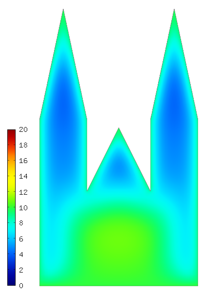

Time-Dependent Problems (09)
----------------------------

**Git reference:** Tutorial example `09-timedep <http://git.hpfem.org/hermes.git/tree/HEAD:/hermes2d/tutorial/09-timedep>`_. 

This section describes the implementation of a simple time-dependent
heat transfer model that describes, in a naive approximation, how the St. Vitus cathedral
in Prague responds to changes in the surrounding air temperature
during one 24-hour cycle. The geometry is shown below:

We will solve the standard heat transfer equation

.. math::
    :label: eqvit1

       c \varrho\frac{\partial T}{\partial t} - \lambda \Delta T = 0

equipped with a Dirichlet condition

.. math::

     T = T_{init}

on the bottom edge $\Gamma_{ground}$ and a Newton condition

.. math::

     \frac{\partial T}{\partial \nu} = \alpha(T_{ext}(t) - T)

on the rest of the boundary $\Gamma_{air}$. Here, $c$ is the heat capacity of the material,
$\varrho$ the material density, $\lambda$ the thermal conductivity,
$T_{init}$ the fixed temperature on the
ground (same as the initial temperature of the building), and $\alpha$
the heat transfer coefficient 
between the building and the surrounding air. The surrounding air temperature
$T_{ext}$ is time-dependent of the form

.. math::

     T_{ext}(t) = T_{init} + 10\sin(2\pi t/T_{final}),

where $T_{final}$ is 24 hours (translated into seconds).

Equation :eq:`eqvit1` is also equipped with an initial condition of the
form

.. math::

     T(x,y,0) = T_{init}(x,y) \ \ \ \mbox{in} \ \Omega.

For simplicity we will use the implicit Euler method with a constant
time step $\tau$, which transforms equation :eq:`eqvit1` into

.. math::

     c \varrho\frac{T^{n+1} - T^n}{\tau} - \lambda \Delta T^{n+1} = 0.

The corresponding weak formulation is

.. math::

     \int_{\Omega} c \varrho\frac{T^{n+1}}{\tau} + \int_{\Omega} \lambda \nabla T^{n+1}\cdot \nabla v + \int_{\Gamma_{air}} \alpha \lambda T^{n+1}v = \int_{\Omega} c \varrho\frac{T^{n}}{\tau} + \int_{\Gamma_{air}} \alpha \lambda T_{ext}(t^{n+1})v.

The implementation starts by defining the
boundary condition types::

    BCType bc_types(int marker)
    {
      if (marker == bdy_ground) return BC_ESSENTIAL;
      else return BC_NATURAL;
    }

and values::

    scalar essential_bc_values(int ess_bdy_marker, double x, double y)
    {
      if (ess_bdy_marker == bdy_ground) return T_INIT;
    }

Then the space for the temperature $T$ is set up::

    // Initialize an H1 space with default shepeset.
    H1Space space(&mesh, bc_types, essential_bc_values, P_INIT);
    int ndof = get_num_dofs(&space);

Bilinear and linear forms are defined as follows::

    template<typename Real, typename Scalar>
    Scalar bilinear_form(int n, double *wt, Func<Scalar> *u_ext[], Func<Real> *u, Func<Real> *v, Geom<Real> *e, ExtData<Scalar> *ext)
    {
      return HEATCAP * RHO * int_u_v<Real, Scalar>(n, wt, u, v) / TAU +
             LAMBDA * int_grad_u_grad_v<Real, Scalar>(n, wt, u, v);
    }
  
    template<typename Real, typename Scalar>
    Scalar linear_form(int n, double *wt, Func<Scalar> *u_ext[], Func<Real> *v, Geom<Real> *e, ExtData<Scalar> *ext)
    {
      return HEATCAP * RHO * int_u_v<Real, Scalar>(n, wt, ext->fn[0], v) / TAU;
    }
  
    template<typename Real, typename Scalar>
    Scalar bilinear_form_surf(int n, double *wt, Func<Scalar> *u_ext[], Func<Real> *u, Func<Real> *v, Geom<Real> *e, ExtData<Scalar> *ext)
    {
      return LAMBDA * ALPHA * int_u_v<Real, Scalar>(n, wt, u, v);
    }
  
    template<typename Real, typename Scalar>
    Scalar linear_form_surf(int n, double *wt, Func<Scalar> *u_ext[], Func<Real> *v, Geom<Real> *e, ExtData<Scalar> *ext)
    {
      return LAMBDA * ALPHA * temp_ext(TIME) * int_v<Real, Scalar>(n, wt, v);
    }

Next we need to initialize the previous solution tsln with the initial condition $T_{init}$.
Besides holding the finite element solution, the Solution class
can be forced to return zero, to return a constant, or to return an arbitrary function
using the methods set_zero(), set_const() and set_exact(), respectively.
Here we simply call set_const() and supply the initial temperature::

    // Set constant initial condition.
    Solution tsln;
    tsln.set_const(&mesh, T_INIT);

The weak forms are registered as follows::

    // Initialize weak formulation.
    WeakForm wf();
    wf.add_matrix_form(bilinear_form<double, double>, bilinear_form<Ord, Ord>);
    wf.add_matrix_form_surf(bilinear_form_surf<double, double>, bilinear_form_surf<Ord, Ord>, bdy_air);
    wf.add_vector_form(linear_form<double, double>, linear_form<Ord, Ord>, H2D_ANY, &tsln);
    wf.add_vector_form_surf(linear_form_surf<double, double>, linear_form_surf<Ord, Ord>, bdy_air);

Next, the LinearProblem class and the matrix solver structures are initialized::

    // Initialize the linear problem.
    LinearProblem lp(&wf, &space);

    // Initialize matrix solver.
    Matrix* mat; Vector* rhs; CommonSolver* solver;  
    init_matrix_solver(matrix_solver, ndof, mat, rhs, solver);

We are now ready to start the iterative process. Since the stiffness matrix does
not depend on the solution, it only needs to be assembled once in the first time
step. For all remaining time steps it will be the same, and we just need to
re-construct the load vector. This is done via the Boolean variable rhsonly
which is set to false before the time stepping begins. For completeness, we show 
the entire time stepping loop below::

    bool rhsonly = false;
    for(int ts = 1; ts <= nsteps; ts++)
    {
      info("---- Time step %d, time %3.5f, ext_temp %g", ts, TIME, temp_ext(TIME));

      // Assemble stiffness matrix and rhs.
      lp.assemble(mat, rhs, rhsonly);
      rhsonly = true;

      // Solve the matrix problem.
      if (!solver->solve(mat, rhs)) error ("Matrix solver failed.\n");

      // Update tsln.
      tsln.set_coeff_vector(&space, rhs);

      // Update the time variable.
      TIME += TAU;

      // Visualize the solution.
      sprintf(title, "Time %3.2f, exterior temperature %3.5f", TIME, temp_ext(TIME));
      Tview.set_title(title);
      Tview.show(&tsln);
    }
