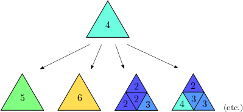

Adaptive h-FEM and hp-FEM
-------------------------

In traditional low-order FEM, refining an element is not algorithmically complicated,
and so the most difficult part is to find out what elements should be
refined. To do this, people employ various techniques ranging from rigorous
guaranteed a-posteriori error estimates to heuristic criteria such as residual
error indicators, error indicators based on steep gradients, etc. Unfortunately,
none of these approaches is suitable for real-life multiphysics coupled problems 
or higher-order finite element methods: Rigorous guaranteed error
estimates only exist for very simple problems (such as linear elliptic PDE),
and moreover only for low-order finite elements (such as piecewise linear 
approximations). Note that virtually no a-posteriori error estimates capable of 
guiding automatic hp-adaptivity are available even for simplest elliptic problems,
this will be discussed in a moment. 
The heuristic techniques listed above are not employed in Hermes since they may fail 
in non-standard situations, and because they lack a transparent relation to the 
true approximation error.

Adaptive low-order FEM is known to be notoriously inefficient, and practitioners
are rightfully skeptical of it. The reason is its extremely slow convergence 
that makes large computations virtually freeze without getting anywhere. 
This is illustrated in the following graph that compares a typical convergence of 
adaptive FEM with linear elements, adaptive FEM with quadratic elements, and 
adaptive hp-FEM:

.. image:: conv_dof.png
   :align: center
   :width: 600
   :height: 400
   :alt: Typical convergence curves for adaptive linear FEM, quadratic FEM, and *hp*-FEM.

Note that the linear FEM would need in the order of 1,000,000,000,000,000,000 degrees of freedom 
(DOF) to reach a level of accuracy where the hp-FEM is with less than 10,000 DOF. 
These convergence curves are typical representative examples, confirmed with
many numerical experiments of independent researchers, and supported with
theory. The horizontal axis shows (in linear scale) the number of degrees of freedom
(= size of the stiffness matrix) that increases during automatic adaptivity. The
vertical one shows the approximation error (in logarithmic scale). Note that in all
three cases, the convergence is similar during a short initial phase. However, with 
the hp-FEM the convergence becomes faster and faster as the adaptivity progresses. Note that 
low-order FEM is doomed to such slow convergence by its poor approximation properties -
this cannot be fixed no matter how smart the adaptivity algorithm might be. 

In order to obtain fast, usable adaptivity (the red curve), one
has to resort to adaptive *hp*-FEM. The *hp*-FEM takes advantage of 
the following facts:

* Large high-degree elements approximate smooth parts of solution *much* better than small linear ones. 
  The benchmark `smooth-iso <http://hpfem.org/hermes/doc/src/hermes2d/benchmarks.html#smooth-iso-elliptic>`_ 
  illustrates this - spend a few minutes to check it out, the results are truly impressive. In the 
  Hermes2D repository, it can be found in the directory 
  `benchmarks/ <http://git.hpfem.org/hermes.git/tree/HEAD:/hermes2d/benchmarks>`_.
* This holds the other way where the solution is not smooth, i.e., singularities,
  steep gradients, oscillations and such are approximated best using locally small 
  low-order elements.
* In order to capture efficiently anisotropic solution behavior, one needs adaptivity algorithms 
  that can refine meshes anisotropically both in $h$ and $p$. Often this is the case with 
  boundary layers (viscous flows, singularly perturbed problems, etc.). This is illustrated 
  in  benchmarks 
  `smooth-aniso-x <http://hpfem.org/hermes/doc/src/hermes2d/benchmarks.html#smooth-aniso-x-elliptic>`_ and
  `boundary layer <http://hpfem.org/hermes/doc/src/hermes2d/benchmarks.html#boundary-layer-elliptic>`_. However, 
  solutions without boundary layers can have significant anisotropic behavior too, as illustrated
  in benchmark  `line singularity <http://hpfem.org/hermes/doc/src/hermes2d/benchmarks.html#line-singularity-elliptic>`_.

Large number of possible element refinements in hp-FEM
~~~~~~~~~~~~~~~~~~~~~~~~~~~~~~~~~~~~~~~~~~~~~~~~~~~~~~~~

Automatic adaptivity in the *hp*-FEM is substantially different from adaptivity
in low-order FEM, since every element can be refined in many different ways.
The following figure shows several illustrative refinement candidates for a fourth-order element.

Of course, the number of possible element refinements is implementation-dependent.
In general it is very low in $h$ or $p$ adaptivity, much higher in $hp$ adaptivity, 
and it rises even more when anisotropic refinements are enabled. This is why Hermes 
has eight different adaptivity options P_ISO, P_ANISO, H_ISO, H_ANISO,
HP_ISO, HP_ANISO_P, HP_ANISO_H, HP_ANISO. In this ordering, usually P_ISO yields the 
worst results and HP_ANISO the best. In the most general HP_ANISO 
option, around 100 refinement candidates for each element are considered. 
Naturally, the adaptivity algorithm takes progressively more time as more 
refinement candidates are considered. The difference between the HP_ANISO_H
option (next best to HP_ANISO) and HP_ANISO is quite significant. So, this is 
where the user has to make a choice based on his a-priori knowledge of the 
solution behavior. 

Due to the large number of refinement options, classical error estimators (that
provide a constant error estimate per element) cannot be used to guide automatic 
*hp*-adaptivity. For this, one needs to know the *shape* of the
approximation error.

In analogy to the most successful adaptive ODE solvers,
Hermes uses a pair of approximations with different orders of accuracy to obtain
this information: *coarse mesh solution* and 
*fine mesh solution*. The initial coarse mesh is read from the mesh file,
and the initial fine mesh is created through its global refinement both in
$h$ and $p$.
The fine mesh solution is the approximation of interest both during the adaptive
process and at the end of computation. The coarse mesh solution represents its 
low-order part. In all adaptivity examples in Hermes, the coarse mesh solution
can be turned off and a global orthogonal projection of the fine mesh solution 
on the coarse mesh can be used instead. In most cases, this yields a better 
convergence behavior than using the coarse mesh solve (and the projection 
problem is always linear and better conditioned than solving on the coarse mesh). 

Note that this approach is PDE independent, which is truly great for multiphysics
coupled problems. Currently, Hermes does not use a single analytical error estimate 
or any other technique that would narrow down its applicability to just some 
equations or just low-order FEM. 

The obvious disadvantage of the Hermes approach to automatic adaptivity is its higher 
computational cost, especially in 3D. We are aware of this fact and would not mind 
at all replacing it with some cheaper technique (as long as it also is PDE-independent, 
works for elements of high orders, and can be successfully used to guide *hp*-adaptivity).
So far, however, no alternatives meeting these criteria exist yet to our best knowledge.
