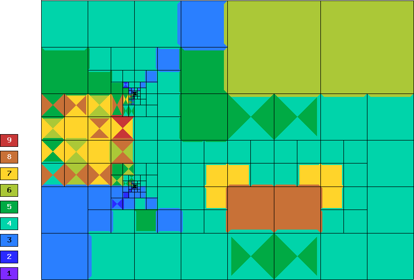

Complex-Valued Problem (13)
---------------------------

**Git reference:** Tutorial example `13-complex-adapt <http://git.hpfem.org/hermes.git/tree/HEAD:/hermes2d/tutorial/13-complex-adapt>`_. 

This example solves a complex-valued vector potential problem

.. math::

    -\Delta A + j \omega \gamma \mu A = \mu J_{ext}

in a two-dimensional cross-section containing a conductor and an iron object.
Note: in 2D this is a scalar problem. A scheme is shown in the following picture:

.. image:: 13/domain.png
   :align: center
   :height: 500
   :alt: Domain.

The computational domain is a rectangle of height 0.003 and width 0.004. 
Different material markers are used for the wire, air, and iron 
(see mesh file `domain2.mesh <http://git.hpfem.org/hermes.git/blob/HEAD:/hermes2d/tutorial/13-complex-adapt/domain2.mesh>`_).

Boundary conditions are zero Dirichlet on the top and right edges, and zero Neumann
elsewhere.

Solution:

.. image:: 13/solution.png
   :align: center
   :height: 400
   :alt: Solution.

Complex-valued weak forms::

    template<typename Real, typename Scalar>
    Scalar bilinear_form_iron(int n, double *wt, Func<Scalar> *u_ext[], Func<Real> *u, Func<Real> *v, Geom<Real> *e, ExtData<Scalar> *ext)
    {
      scalar ii = cplx(0.0, 1.0);
      return 1./mu_iron * int_grad_u_grad_v<Real, Scalar>(n, wt, u, v) + ii*omega*gamma_iron*int_u_v<Real, Scalar>(n, wt, u, v);
    }

    template<typename Real, typename Scalar>
    Scalar bilinear_form_wire(int n, double *wt, Func<Scalar> *u_ext[], Func<Real> *u, Func<Real> *v, Geom<Real> *e, ExtData<Scalar> *ext)
    {
      return 1./mu_0 * int_grad_u_grad_v<Real, Scalar>(n, wt, u, v);
    }

    template<typename Real, typename Scalar>
    Scalar bilinear_form_air(int n, double *wt, Func<Scalar> *u_ext[], Func<Real> *u, Func<Real> *v, Geom<Real> *e, ExtData<Scalar> *ext)
    {
      return 1./mu_0 * int_grad_u_grad_v<Real, Scalar>(n, wt, u, v); // conductivity gamma is zero
    }

    template<typename Real, typename Scalar>
    Scalar linear_form_wire(int n, double *wt, Func<Scalar> *u_ext[], Func<Real> *v, Geom<Real> *e, ExtData<Scalar> *ext)
    {
      return J_wire * int_v<Real, Scalar>(n, wt, v);
    }

Otherwise everything works in the same way as in example `10-adapt <file:///home/pavel/hermes/doc/_build/html/src/hermes2d/tutorial-2/micromotor.html>`_. A few differences:

We use the matrix solver AztecOO from the Trilinos package. It is initialized as follows::

    // Initialize matrix solver.
    initialize_solution_environment(matrix_solver, argc, argv);
    SparseMatrix* matrix = create_matrix(matrix_solver);
    Vector* rhs = create_vector(matrix_solver);
    Solver* solver = create_linear_solver(matrix_solver, matrix, rhs);

Next we select an iterative solver and precosditioner::

    if (matrix_solver == SOLVER_AZTECOO) {
      ((AztecOOSolver*) solver)->set_solver(iterative_method);
      ((AztecOOSolver*) solver)->set_precond(preconditioner);
      // Using default iteration parameters (see solver/aztecoo.h).
    }

At the end, after the adaptivity loop is finished, we clean up::

    // Clean up.
    delete solver;
    delete matrix;
    delete rhs;
    finalize_solution_environment(matrix_solver);

Let us compare adaptive $h$-FEM with linear and quadratic elements and the $hp$-FEM.

Final mesh for $h$-FEM with linear elements: 18694 DOF, error = 1.02 \%

.. image:: 13/mesh-h1.png
   :align: center
   :height: 400
   :alt: Mesh.

Final mesh for $h$-FEM with quadratic elements: 46038 DOF, error = 0.018 \%

.. image:: 13/mesh-h2.png
   :align: center
   :height: 400
   :alt: Mesh.

Final mesh for $hp$-FEM: 4787 DOF, error = 0.00918 \%

Convergence graphs of adaptive h-FEM with linear elements, h-FEM with quadratic elements
and hp-FEM are shown below.

.. image:: 13/conv_compar_dof.png
   :align: center
   :width: 600
   :height: 400
   :alt: DOF convergence graph.
