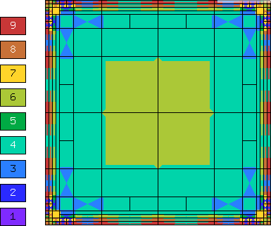
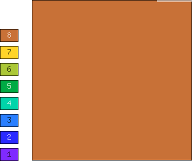
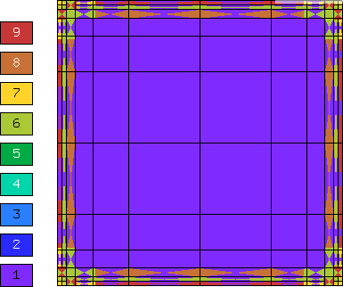
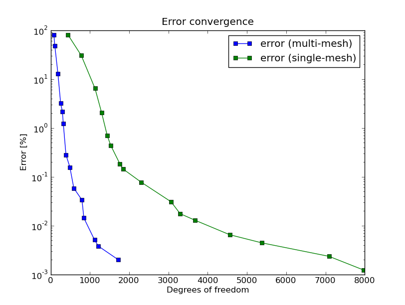

Simplified Fitzhugh-Nagumo System (11)
--------------------------------------

**Git reference:** Tutorial example `11-system-adapt <http://git.hpfem.org/hermes.git/tree/HEAD:/hermes2d/tutorial/11-system-adapt>`_. 

We consider a simplified version of the Fitzhugh-Nagumo equation.
This equation is a~prominent example of activator-inhibitor systems in two-component reaction-diffusion 
equations, It describes a prototype of an excitable system (e.g., a neuron) and its stationary form 
is

.. math::

    -d^2_u \Delta u - f(u) + \sigma v = g_1,\\
    -d^2_v \Delta v - u + v = g_2.

Here the unknowns $u, v$ are the voltage and $v$-gate, respectively, 
The nonlinear function 

.. math::

    f(u) = \lambda u - u^3 - \kappa
 
describes how an action potential travels through a nerve. Obviously this system is nonlinear.
In order to make it simpler for this tutorial, we replace the function $f(u)$ with just $u$:

.. math::

    f(u) = u.

Our computational domain is the square $(-1,1)^2$ and we consider zero Dirichlet conditions 
for both $u$ and $v$. In order to enable fair convergence comparisons, we will use the following 
functions as the exact solution:

.. math::

    u(x,y) = \cos\left(\frac{\pi}{2}x\right) \cos\left(\frac{\pi}{2}y\right),\\
    v(x,y) = \hat u(x) \hat u(y)

where

.. math::

    \hat u(x) = 1 - \frac{e^{kx} + e^{-kx}}{e^k + e^{-k}}

is the exact solution of the one-dimensional singularly perturbed 
problem 

.. math::

    -u'' + k^2 u - k^2 = 0

in $(-1,1)$, equipped with zero Dirichlet boundary conditions. The functions $u$ 
and $v$ defined above evidently satisfy the given boundary conditions, and 
they also satisfy the equation, since we inserted them into the PDE system 
and calculated the source functions $g_1$ and $g_2$ from there. These functions 
are not extremely pretty, but they are not too bad either:

::

    // Functions g_1 and g_2.
    double g_1(double x, double y) 
    {
      return (-cos(M_PI*x/2.)*cos(M_PI*y/2.) + SIGMA*(1. - (exp(K*x) + exp(-K*x))/(exp(K) + exp(-K))) 
             * (1. - (exp(K*y) + exp(-K*y))/(exp(K) + exp(-K))) + pow(M_PI,2.)*pow(D_u,2.)*cos(M_PI*x/2.)
             *cos(M_PI*y/2.)/2.);
    }

    double g_2(double x, double y) 
    {
      return ((1. - (exp(K*x) + exp(-K*x))/(exp(K) + exp(-K)))*(1. - (exp(K*y) + exp(-K*y))/(exp(K) + exp(-K))) 
             - pow(D_v,2.)*(-(1 - (exp(K*x) + exp(-K*x))/(exp(K) + exp(-K)))*(pow(K,2.)*exp(K*y) + pow(K,2.)*exp(-K*y))/(exp(K) + exp(-K)) 
             - (1. - (exp(K*y) + exp(-K*y))/(exp(K) + exp(-K)))*(pow(K,2.)*exp(K*x) + pow(K,2.)*exp(-K*x))/(exp(K) + exp(-K))) - 
             cos(M_PI*x/2.)*cos(M_PI*y/2.));

    }

The weak forms can be found in the 
file `forms.cpp <http://git.hpfem.org/hermes.git/blob/HEAD:/hermes2d/tutorial/11-system-adapt/forms.cpp>`_ and 
they are registered as follows::

    // Initialize the weak formulation.
    WeakForm wf(2);
    wf.add_matrix_form(0, 0, callback(bilinear_form_0_0));
    wf.add_matrix_form(0, 1, callback(bilinear_form_0_1));
    wf.add_matrix_form(1, 0, callback(bilinear_form_1_0));
    wf.add_matrix_form(1, 1, callback(bilinear_form_1_1));
    wf.add_vector_form(0, linear_form_0, linear_form_0_ord);
    wf.add_vector_form(1, linear_form_1, linear_form_1_ord);

Beware that although each of the forms is actually symmetric, one cannot use the H2D_SYM flag as in the 
elasticity equations, since it has a slightly different 
meaning (see example `08-system <http://hpfem.org/hermes/doc/src/hermes2d/tutorial-1.html#systems-of-equations-08>`_).

The adaptivity workflow is the same as in example 10-adapt: First we perform 
global refinement of each mesh::

    // Construct globally refined reference mesh
    // and setup reference space.
    Mesh *u_ref_mesh = new Mesh();
    u_ref_mesh->copy(u_space->get_mesh());
    u_ref_mesh->refine_all_elements();
    Space* u_ref_space = u_space->dup(u_ref_mesh);
    int order_increase = 1;
    u_ref_space->copy_orders(u_space, order_increase);
    Mesh *v_ref_mesh = new Mesh();
    v_ref_mesh->copy(v_space->get_mesh());
    v_ref_mesh->refine_all_elements();
    Space* v_ref_space = v_space->dup(v_ref_mesh);
    v_ref_space->copy_orders(v_space, order_increase);

Then we calculate the reference solutions::

    // Solve the reference problem.
    // The NULL pointer means that we do not want the resulting coefficient vector. 
    solve_linear(Tuple<Space *>(u_ref_space, v_ref_space), &wf, matrix_solver,
                 Tuple<Solution *>(u_ref_sln, v_ref_sln), NULL);

Next we project each reference solutions on the corresponding coarse mesh in order to extract 
their low-order parts::

    // Project the reference solution on the coarse mesh.
    info("Projecting reference solution on coarse mesh.");
    // NULL means that we do not want to know the resulting coefficient vector.
    project_global(Tuple<Space *>(u_space, v_space), 
                   Tuple<int>(H2D_H1_NORM, H2D_H1_NORM), 
                   Tuple<MeshFunction *>(u_ref_sln, v_ref_sln), 
                   Tuple<Solution *>(u_sln, v_sln), NULL); 

The error estimate for adaptivity is calculated as follows::

    // Calculate element errors.
    info("Calculating error (est).");
    Adapt hp(Tuple<Space *>(u_space, v_space), 
             Tuple<int>(H2D_H1_NORM, H2D_H1_NORM));
    hp.set_solutions(Tuple<Solution *>(u_sln, v_sln), 
                     Tuple<Solution *>(u_ref_sln, v_ref_sln));
    hp.calc_elem_errors(H2D_TOTAL_ERROR_REL | H2D_ELEMENT_ERROR_REL);
 
    // Calculate error estimate for each solution component.
    double u_err_est_abs = calc_abs_error(u_sln, u_ref_sln, H2D_H1_NORM);
    double u_norm_est = calc_norm(u_ref_sln, H2D_H1_NORM);
    double v_err_est_abs = calc_abs_error(v_sln, v_ref_sln, H2D_H1_NORM);
    double v_norm_est = calc_norm(v_ref_sln, H2D_H1_NORM);
    double err_est_abs_total = sqrt(u_err_est_abs*u_err_est_abs + v_err_est_abs*v_err_est_abs);
    double norm_est_total = sqrt(u_norm_est*u_norm_est + v_norm_est*v_norm_est);
    double err_est_rel_total = err_est_abs_total / norm_est_total * 100.;

We also calculate exact error for each solution component::

    // Calculate exact error for each solution component.   
    double err_exact_abs_total = 0;
    double norm_exact_total = 0;
    double u_err_exact_abs = calc_abs_error(u_sln, &u_exact, H2D_H1_NORM);
    double u_norm_exact = calc_norm(&u_exact, H2D_H1_NORM);
    err_exact_abs_total += u_err_exact_abs * u_err_exact_abs;
    norm_exact_total += u_norm_exact * u_norm_exact;
    double v_err_exact_abs = calc_abs_error(v_sln, &v_exact, H2D_H1_NORM);
    double v_norm_exact = calc_norm(&v_exact, H2D_H1_NORM);
    err_exact_abs_total += v_err_exact_abs * v_err_exact_abs;
    norm_exact_total += v_norm_exact * v_norm_exact;
    err_exact_abs_total = sqrt(err_exact_abs_total);
    norm_exact_total = sqrt(norm_exact_total);
    double err_exact_rel_total = err_exact_abs_total / norm_exact_total * 100.;

The mesh adaptation step comes last, if the error estimate exceeds the 
allowed tolerance ERR_STOP::

    // If err_est too large, adapt the mesh.
    if (err_est_rel_total < ERR_STOP) done = true;
    else {
      info("Adapting the coarse mesh.");
      done = hp.adapt(Tuple<RefinementSelectors::Selector *>(&selector, &selector), 
                      THRESHOLD, STRATEGY, MESH_REGULARITY);

      if (get_num_dofs(Tuple<Space *>(u_space, v_space)) >= NDOF_STOP) done = true;
    }

    // Free reference meshes and spaces.
    u_ref_space->free();
    v_ref_space->free();

    as++;

The following two figures show the solutions $u$ and $v$. Notice their 
large qualitative differences: While $u$ is smooth in the entire domain, 
$v$ has a thin boundary layer along the boundary:

.. image:: 11/solution_u.png
   :align: center
   :width: 465
   :height: 400
   :alt: Solution

.. image:: 11/solution_v.png
   :align: center
   :width: 465
   :height: 400
   :alt: Solution

Resulting mesh for $u$ and $v$ obtained using conventional (single-mesh) hp-FEM: 12026 DOF
(6013 for each solution). 

Resulting mesh for $u$ obtained using the multimesh hp-FEM: 169 DOF

Resulting mesh for $v$ obtained using the multimesh hp-FEM: 3565 DOF

DOF convergence graphs:

CPU time convergence graphs:

.. image:: 11/conv_cpu.png
   :align: center
   :width: 600
   :height: 400
   :alt: CPU convergence graph.
