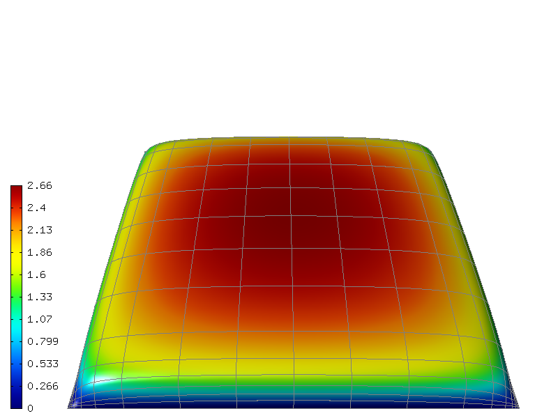

Constant Initial Condition (15)
-------------------------------

**Git reference:** Tutorial example `15-newton-elliptic-1 
<http://git.hpfem.org/hermes.git/tree/HEAD:/hermes2d/tutorial/15-newton-elliptic-1>`_.

Let us solve the nonlinear model problem from the previous section,

.. math::

    -\nabla \cdot (\lambda(u)\nabla u) - f(x,y) = 0, \ \ \ u = 0 \ \mbox{on}\ \partial \Omega.

One possible interpretation of this equation is stationary heat transfer where the thermal
conductivity $\lambda$ depends on the temperature $u$.
Our domain is a square $\Omega = (-10,10)^2$, $f(x,y) = 1$, and the nonlinearity $\lambda$ has the form 

.. math::

    \lambda(u) = 1 + u^\alpha.

Recall that $\lambda$ must be entirely positive or entirely negative for the problem to be solvable, so it is safe 
to restrict $\alpha$ to be an even nonnegative integer. Recall from the previous section that 

.. math::

    F_i(\bfY) =  \int_{\Omega} \lambda(u)\nabla u \cdot \nabla v_i 
    - f v_i \, \mbox{d}x\mbox{d}y.

and

.. math::

    J_{ij}(\bfY) =
    \int_{\Omega} \left[ \frac{\partial \lambda}{\partial u}(u) v_j 
    \nabla u + \lambda(u)\nabla v_j \right] \cdot \nabla v_i \, \mbox{d}x\mbox{d}y.

In the code, this becomes

::

    // Heat sources (can be a general function of 'x' and 'y').
    template<typename Real>
    Real heat_src(Real x, Real y)
    {
      return 1.0;
    }

    // Jacobian matrix.
    template<typename Real, typename Scalar>
    Scalar jac(int n, double *wt, Func<Scalar> *u_ext[], Func<Real> *u, Func<Real> *v, Geom<Real> *e, ExtData<Scalar> *ext)
    {
      Scalar result = 0;
      Func<Scalar>* u_prev = ext->fn[0];
      for (int i = 0; i < n; i++)
        result += wt[i] * (dlam_du(u_prev->val[i]) * u->val[i] * (u_prev->dx[i] * v->dx[i] + u_prev->dy[i] * v->dy[i])
                           + lam(u_prev->val[i]) * (u->dx[i] * v->dx[i] + u->dy[i] * v->dy[i]));
                       
      return result;
    }

    // Residual vector.
    template<typename Real, typename Scalar>
    Scalar res(int n, double *wt, Func<Scalar> *u_ext[], Func<Real> *v, Geom<Real> *e, ExtData<Scalar> *ext)
    {
      Scalar result = 0;
      Func<Scalar>* u_prev = ext->fn[0];
      for (int i = 0; i < n; i++)
        result += wt[i] * (lam(u_prev->val[i]) * (u_prev->dx[i] * v->dx[i] + u_prev->dy[i] * v->dy[i])
	    	           - heat_src(e->x[i], e->y[i]) * v->val[i]);
      return result;
    }

Notice that the basis function $v_j$ and the test function 
$v_i$ are entering the weak forms via the parameters u and v, respectively (same as for linear 
problems). The user does not have to 
take care about their indices $i$ and $j$, this is handled by Hermes outside the weak forms. 

The code snippet above also shows how values and derivatives of the solution $u$ can be accessed via 
the ExtData structure, and the coordinates of the integration points via the Geom structure. 
The contents of ExtData is user-defined and the Geom structure contains geometrical information 
including the unit normal and tangential vectors to the boundary at the integration points 
(also for curved boundaries). See the file 
`src/forms.h <http://git.hpfem.org/hermes.git/blob/HEAD:/hermes2d/src/forms.h>`_ for more details. 

The Newton's method always has to start from an initial condition, and in this example 
this is 

::

    // Initial condition. It will be projected on the FE mesh 
    // to obtain initial coefficient vector for the Newton's method.
    scalar init_cond(double x, double y, double& dx, double& dy)
    {
      dx = 0;
      dy = 0;
      return INIT_COND_CONST;
    }

The weak forms are registered as usual, except that the previous solution u_prev 
is passed into the form as an extra argument::

    // Previous solution for the Newton's iteration.
    Solution u_prev;

    // Initialize the weak formulation.
    WeakForm wf;
    wf.add_matrix_form(callback(jac), H2D_UNSYM, H2D_ANY, &u_prev);
    wf.add_vector_form(callback(res), H2D_ANY, &u_prev);

Recall that by H2D_UNSYM we declare that the Jacobian bilinear form is not symmetric,
and by H2D_ANY that the form should be used for elements with any material marker.

The NonlinSystem class is initialized in the same way as LinSystem::

    // Initialize the linear system.
    NonlinSystem nls(&wf, &space);

An important step in the Newton's method that cannot be skipped is the projection 
of the initial condition on the FE space. This is where the initial coefficient 
vector $\bfY_0$ for the Newton's iteration is created::

    // Project the function init_cond() on the FE space
    // to obtain initial coefficient vector for the Newton's method.
    info("Projecting initial condition to obtain initial vector for the Newton'w method.");
    nls.project_global(init_cond, &u_prev);  

The method project_global() has an optional third argument which is the projection 
norm. Its default value is H2D_DEFAULT_PROJ_NORM = 1 ($H^1$ norm). Other 
admissible values are 0 ($L^2$ norm), 2 ($Hcurl$ norm) and 3 ($Hdiv$ norm) whose 
use will be shown later. Later we'll also see how to handle the projection for PDE systems.

The Newton's iteration is done using the method solve_newton()::

  // Perform Newton's iteration.
  info("Performing Newton's iteration.");
  bool verbose = true; // Default is false.
  if (!nls.solve_newton(&u_prev, NEWTON_TOL, NEWTON_MAX_ITER, verbose)) 
    error("Newton's method did not converge.");

If the optional parameter "verbose" is set to "true", convergence 
information is printed. 

Note that arbitrary Filters can be passed as additional optional parameters. 
This will be shown in the tutorial example 
`19-timedep-flame <http://hpfem.org/hermes2d/doc/src/tutorial-3.html#flame-propagation-problem-19>`_.
Results for this example are shown below.

Approximate solution $u$ for $\alpha = 2$: 

.. image:: 15/newton-ellipt-1-2.png
   :align: center
   :width: 600
   :height: 400
   :alt: result for alpha = 2

Approximate solution $u$ for $\alpha = 4$: 

